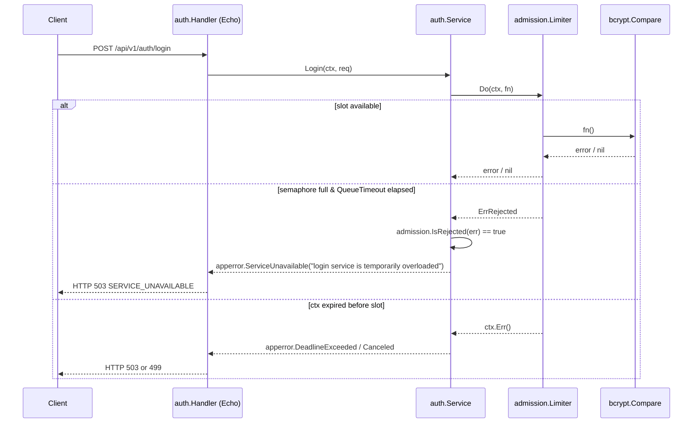
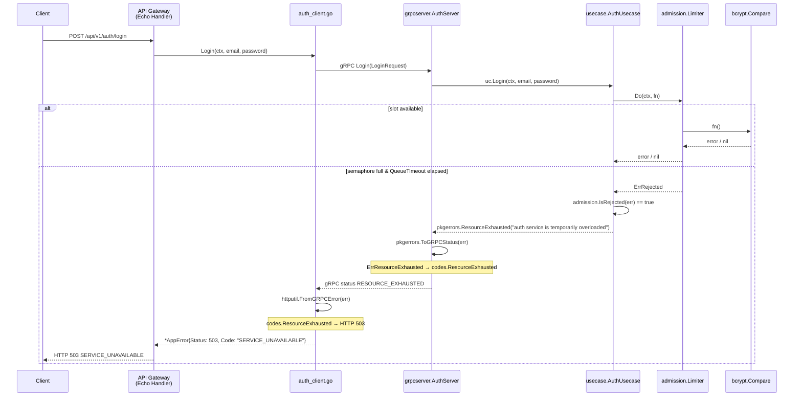

# Admission Limiter

## 1. Purpose

This document describes the design, implementation, and usage of the
`pkg/admission` package — a shared admission control component used by both
the monolith and the microservices auth-service to prevent CPU oversubscription
from bcrypt password comparison during login.

The admission limiter is a cross-cutting infrastructure concern. It is defined
once in the shared `pkg/` layer and consumed by both runtime variants. This
keeps the behavioral contract identical and ensures benchmark fairness: both
architectures apply the same limiter semantics and rejection behavior, while
the calibrated concurrency ceiling varies by deployment.

---

## 2. Problem Statement

The `POST /api/v1/auth/login` endpoint performs a bcrypt password comparison
before issuing a JWT token. Bcrypt is intentionally designed to be slow and
CPU-bound. At the default cost factor of 10, a single bcrypt comparison
consumes approximately 50 ms to 200 ms of CPU time depending on the host.

Under high request rates, every concurrent login request schedules a goroutine
that calls `bcrypt.CompareHashAndPassword`. Without any concurrency control,
the following failure modes emerge:

1. **CPU thrashing** — hundreds of goroutines compete for CPU time on bcrypt,
   causing all of them to slow down proportionally. A request that normally
   completes in 100 ms may take 2–5 s when 100 concurrent bcrypt operations
   are running.

2. **Cascading latency** — the slower bcrypt makes the request context more
   likely to expire before the comparison finishes, producing timeout errors
   that are surfaced as `503 SERVICE_UNAVAILABLE` (or `499` on client cancel)
   and are harder to attribute to the real cause.

3. **Tail latency spikes** — p99 and p999 latency blow up because of CPU
   contention, even if median latency remains low.

The solution is to bound the number of concurrent bcrypt operations using a
semaphore. Requests that cannot acquire a slot within a configurable timeout
are rejected immediately with HTTP 503, rather than waiting indefinitely and
degrading the quality of service for all concurrent requests.

---

## 3. Design

### 3.1 Mechanism

The `Limiter` uses a **buffered channel as a semaphore**. A buffered channel
of capacity `N` can hold at most `N` items at a time. Sending to the channel
represents acquiring a slot; receiving from the channel represents releasing it.

```
semaphore := make(chan struct{}, MaxConcurrency)

acquire:
    select {
    case semaphore <- struct{}{}:  // slot available, proceed
    case <-timer.C:                // no slot within QueueTimeout → reject
    case <-ctx.Done():             // caller context expired → propagate
    }

release:
    <-semaphore
```

This is the canonical Go pattern for a counting semaphore. It is safe for
concurrent use because channel operations are goroutine-safe.

### 3.2 Key Properties

| Property | Behavior |
|---|---|
| **Bounded concurrency** | At most `MaxConcurrency` goroutines execute the guarded function simultaneously |
| **Bounded queue wait** | A caller that cannot acquire a slot within `QueueTimeout` receives `ErrRejected` immediately |
| **Context-aware** | If the caller's context expires while waiting for a slot, the context error is returned instead of `ErrRejected` |
| **Zero overhead when disabled** | When `Enabled = false`, the guarded function is called directly with no channel operations |
| **Generic value support** | `DoValue[T]` allows functions returning `(T, error)` to be wrapped without type erasure |

### 3.3 Public API

```go
// Package-level sentinel error.
var ErrRejected = fmt.Errorf("login admission rejected / overloaded")

// IsRejected returns true if err is or wraps ErrRejected.
func IsRejected(err error) bool

// Config is the static configuration for a Limiter.
type Config struct {
    Enabled        bool
    MaxConcurrency int
    QueueTimeout   time.Duration
}

// NewLimiter creates a Limiter from Config.
// Returns an error if Enabled=true and MaxConcurrency<=0 or QueueTimeout<=0.
func NewLimiter(cfg Config) (*Limiter, error)

// Do acquires a slot, calls fn, releases the slot.
// Returns ErrRejected or ctx.Err() if the slot cannot be acquired.
func (l *Limiter) Do(ctx context.Context, fn func() error) error

// DoValue is the generic version of Do for functions returning (T, error).
func DoValue[T any](l *Limiter, ctx context.Context, fn func() (T, error)) (T, error)
```

---

## 4. Component Diagram

The admission limiter sits inside the auth business logic layer of both
runtime variants. It is initialized at startup and injected via constructor
dependency injection.

```
┌─────────────────────────────────────────────────────────────────────┐
│                        pkg/admission/                                │
│                                                                      │
│   Config ──────────► NewLimiter() ──────────► *Limiter              │
│   ├ Enabled                                      │                  │
│   ├ MaxConcurrency                               ├ Do(ctx, fn)      │
│   └ QueueTimeout                                 └ DoValue[T](...)  │
│                                                                      │
│   ErrRejected  ◄──── acquire() timeout                              │
│   IsRejected()                                                       │
└─────────────────────────────────────────────────────────────────────┘
                │ shared by both runtime variants
      ┌─────────┴──────────┐
      │                    │
      ▼                    ▼
┌──────────────┐   ┌──────────────────────────┐
│   Monolith   │   │   Microservices          │
│              │   │   (auth-service only)    │
│ auth.Service │   │ usecase.AuthUsecase      │
└──────────────┘   └──────────────────────────┘
```

---

## 5. Configuration

Both runtime variants read the same environment variables. The variables are
loaded at startup by the respective config package and used to build an
`admission.Config` struct before the limiter is constructed.

| Environment Variable | Type | Default (Monolith) | Default (Auth-Service) | Description |
|---|---|---|---|---|
| `LOGIN_ADMISSION_ENABLED` | bool | `true` | `true` | Enable/disable the limiter. When `false`, all login requests bypass the semaphore |
| `LOGIN_MAX_CONCURRENCY` | int | `8` | `2` fixed / `1` HPA overlay | Maximum number of concurrent bcrypt comparisons |
| `LOGIN_QUEUE_TIMEOUT` | duration | `2s` | `2s` | Maximum time a request waits for a semaphore slot before being rejected |

### 5.1 Why Different Defaults for MaxConcurrency?

The monolith is a single process that owns all modules (auth, item,
transaction) and is typically provisioned with more CPU resources than any
single microservice. A default of 8 concurrent bcrypt operations is reasonable
for a multi-core node running the full application.

The auth-service is a dedicated single-responsibility pod with a smaller
resource allocation. In fixed mode, the auth-service pod receives `1950m` CPU
and uses `LOGIN_MAX_CONCURRENCY=2`. In the supplemental HPA overlay, each
auth-service pod receives `975m` CPU and the overlay reduces
`LOGIN_MAX_CONCURRENCY` to `1` so the slot-per-CPU policy remains consistent.

Both defaults can be overridden per deployment via environment variables
without rebuilding the binary.

---

## 6. Lifecycle

### 6.1 Startup

```
main() / bootstrap.Run()
    │
    ├── config.Load()              → reads LOGIN_ADMISSION_* env vars
    │       └── admission.Config  → Enabled=true, MaxConcurrency=8, QueueTimeout=2s
    │
    └── admission.NewLimiter(cfg)
            └── make(chan struct{}, MaxConcurrency)  → semaphore channel ready
```

If `Enabled=true` and either `MaxConcurrency <= 0` or `QueueTimeout <= 0`,
`NewLimiter` returns an error and the process exits with code 1 during startup.
This prevents a misconfigured limiter from silently passing all requests through.

### 6.2 Per-Request (Login Only)

```
Login request arrives
    │
    ├── validate input fields
    ├── find user by email (DB)
    │
    └── limiter.Do(ctx, func() error {
            return hasher.Compare(user.PasswordHash, req.Password)
        })
            │
            ├─ [slot available] ──► bcrypt.CompareHashAndPassword()
            │                            │
            │                       ┌───┴────────────────┐
            │                       │ password match?    │
            │                       ├ YES → continue     │
            │                       └ NO  → ErrMismatch  │
            │
            ├─ [timeout before slot] ──► ErrRejected → 503
            │
            └─ [ctx expired] ──────────► ctx.Err() → 503 or 499
```

The slot is released by a `defer l.release()` that runs immediately after the
guarded function returns, regardless of its error status.

---

## 7. Integration: Monolith

### 7.1 Wiring

```
monolith/cmd/server/main.go
    │
    ├── admission.NewLimiter(cfg.LoginAdmission)  → loginLimiter
    └── auth.NewService(authRepo, hasher, signer, loginLimiter)

monolith/internal/auth/service.go
    │
    └── Service struct {
            repo    Repository
            hasher  PasswordHasher
            signer  TokenSigner
            limiter *admission.Limiter   ← injected
        }
```

### 7.2 Error Path (Monolith → HTTP 503)



### 7.3 HTTP Response Body (Monolith)

```json
{
  "error": {
    "code": "SERVICE_UNAVAILABLE",
    "message": "login service is temporarily overloaded",
    "details": null
  }
}
```

HTTP status: `503 Service Unavailable`

---

## 8. Integration: Microservices

In the microservices architecture, the limiter lives inside the **auth-service**
gRPC server. The rejection must travel across a network boundary via gRPC status
codes before reaching the HTTP client through the API Gateway.

### 8.1 Wiring

```
microservices/auth-service/internal/bootstrap/bootstrap.go
    │
    ├── admission.NewLimiter(cfg.LoginAdmission)  → loginLimiter
    └── usecase.NewAuthUsecase(repo, jwtSecret, jwtExpiry, bcryptCost, loginLimiter)

microservices/auth-service/internal/usecase/auth_usecase.go
    │
    └── AuthUsecase struct {
            repo       port.UserRepository
            jwtSecret  string
            jwtExpiry  time.Duration
            bcryptCost int
            limiter    *admission.Limiter   ← injected
        }
```

### 8.2 Error Path (Microservices → HTTP 503)



### 8.3 gRPC Status Code Mapping

The `pkg/errors` package provides `ToGRPCStatus()` which maps domain error
kinds to gRPC status codes, and the API Gateway's `httputil.FromGRPCError()`
which maps gRPC codes back to HTTP status codes.

```
admission.ErrRejected
    └─► pkgerrors.ResourceExhausted()
            └─► Error{kind: ErrResourceExhausted}
                    └─► ToGRPCStatus()
                            └─► codes.ResourceExhausted
                                    └─► FromGRPCError()
                                            └─► HTTP 503 + Code "SERVICE_UNAVAILABLE"
```

The full mapping table:

| Domain Error Kind | gRPC Code | HTTP Status | HTTP Code |
|---|---|---|---|
| `ErrResourceExhausted` | `codes.ResourceExhausted` | 503 | `SERVICE_UNAVAILABLE` |
| `ErrUnavailable` | `codes.Unavailable` | 503 | `SERVICE_UNAVAILABLE` |
| `ErrDeadlineExceeded` | `codes.DeadlineExceeded` | 503 | `SERVICE_UNAVAILABLE` |
| `ErrCanceled` | `codes.Canceled` | 499 | `CLIENT_CANCELED` |

### 8.4 HTTP Response Body (Microservices)

```json
{
  "error": {
    "code": "SERVICE_UNAVAILABLE",
    "message": "auth service is temporarily overloaded",
    "details": null
  }
}
```

HTTP status: `503 Service Unavailable`

---

## 9. Full End-to-End Flow Diagram

The following diagram shows both architectures side by side, tracing the full
path from an incoming login request to the 503 response when the limiter rejects.

```
                  ┌──────────┐
                  │  Client  │
                  └────┬─────┘
                       │ POST /api/v1/auth/login
           ┌───────────┴──────────────┐
           │                          │
   MONOLITH PATH               MICROSERVICES PATH
           │                          │
    ┌──────▼──────┐           ┌───────▼───────┐
    │  Echo HTTP  │           │  API Gateway  │
    │  Handler    │           │  Echo Handler │
    └──────┬──────┘           └───────┬───────┘
           │                          │ gRPC call
    ┌──────▼──────┐           ┌───────▼───────┐
    │ auth.Service│           │ AuthServer    │
    │  .Login()   │           │ (gRPC adapter)│
    └──────┬──────┘           └───────┬───────┘
           │                          │
    ┌──────▼──────┐           ┌───────▼───────┐
    │  admission  │           │  admission    │
    │  .Limiter   │           │  .Limiter     │
    │  .Do(ctx,fn)│           │  .Do(ctx,fn)  │
    └──────┬──────┘           └───────┬───────┘
           │                          │
    ┌──────▼──────┐           ┌───────▼───────┐
    │ bcrypt      │           │ bcrypt        │
    │ .Compare()  │           │ .Compare()    │
    └─────────────┘           └───────────────┘

  ON REJECTION:                ON REJECTION:

  ErrRejected                  ErrRejected
      │                            │
  IsRejected(err)             IsRejected(err)
      │                            │
  apperror                    pkgerrors
  .ServiceUnavailable()       .ResourceExhausted()
      │                            │
  httputil.Error()            ToGRPCStatus()
      │                     → codes.ResourceExhausted
      │                            │
      │                       API Gateway
      │                       FromGRPCError()
      │                            │
      ▼                            ▼
  HTTP 503                     HTTP 503
  SERVICE_UNAVAILABLE          SERVICE_UNAVAILABLE
```

---

## 10. Error Type Differences Between Variants

Both variants produce the same HTTP response (status 503, code
`SERVICE_UNAVAILABLE`). However, the intermediate error type differs because
the monolith uses the `internal/shared/apperror` package (HTTP-aware), while
the auth-service uses the `pkg/errors` package (gRPC-aware).

| Aspect | Monolith | Microservices (Auth-Service) |
|---|---|---|
| Package on rejection | `apperror` (local) | `pkg/errors` (shared) |
| Error constructor | `apperror.ServiceUnavailable()` | `pkgerrors.ResourceExhausted()` |
| Error kind | `CodeServiceUnavailable` | `ErrResourceExhausted` |
| Transport layer | Direct HTTP response | gRPC → API Gateway → HTTP |
| gRPC code emitted | N/A | `codes.ResourceExhausted` |
| HTTP status received by client | **503** | **503** |
| JSON `code` field | `"SERVICE_UNAVAILABLE"` | `"SERVICE_UNAVAILABLE"` |
| JSON `message` field | `"login service is temporarily overloaded"` | `"auth service is temporarily overloaded"` |

The message text differs slightly because the monolith message refers to the
"login service" (a logical operation) while the auth-service message refers to
the "auth service" (the actual service name). Both messages are safe to expose
to the client.

---

## 11. Semaphore State Machine

```
                    request arrives at limiter.Do()
                              │
                    ┌─────────▼──────────┐
                    │ Enabled == false?  │
                    └─────────┬──────────┘
                YES ◄──────────┤──────────► NO
                │              │             │
                ▼              │      ┌──────▼───────┐
         call fn() directly   │      │ start timer  │
                               │      │ QueueTimeout │
                               │      └──────┬───────┘
                               │             │
                               │      ┌──────▼───────────────────────┐
                               │      │      select {}               │
                               │      │                              │
                               │      │ case semaphore <- struct{}{} │
                               │      │   → ACQUIRED (slot free)     │
                               │      │                              │
                               │      │ case <-timer.C               │
                               │      │   → REJECTED (ErrRejected)   │
                               │      │                              │
                               │      │ case <-ctx.Done()            │
                               │      │   → CANCELED (ctx.Err())     │
                               │      └──────────────────────────────┘
                               │             │
                               │      ┌──────▼──────────────┐
                               │      │ ACQUIRED:            │
                               │      │   defer release()    │
                               │      │   call fn()          │
                               │      │   return fn() result │
                               │      └─────────────────────┘
```

---

## 12. Impact on Benchmark Metrics

The admission limiter directly affects the following benchmark measurements:

### 12.1 Error Rate

When the limiter rejects a request, it contributes to the **error rate** metric
recorded by k6. A rejected request is a fast failure: the response is returned
immediately without waiting for bcrypt or database round-trips.

In k6 output, these appear as HTTP 503 responses under the login scenario.
They are expected under very high RPS if `LOGIN_MAX_CONCURRENCY` is low
relative to the arrival rate.

### 12.2 Latency

Rejected requests have **very low latency** (sub-millisecond to a few
milliseconds) because they never execute bcrypt. This can **improve p50 and
p95 latency** at high load by shedding the slowest requests before they
occupy CPU time.

At the same time, requests that successfully acquire a slot will have latency
dominated by bcrypt time. If `MaxConcurrency` is too high, p99 latency rises
because of CPU contention on bcrypt.

### 12.3 Throughput

The limiter enforces a ceiling on how many login operations can complete per
second. The effective login throughput ceiling is approximately:

```
max_login_RPS ≈ MaxConcurrency / average_bcrypt_duration_seconds
```

For example, with `MaxConcurrency=8` and average bcrypt duration of 100 ms:

```
max_login_RPS ≈ 8 / 0.1 = 80 RPS
```

Requests arriving above this rate will be queued. Queued requests that wait
longer than `QueueTimeout` are rejected with 503.

### 12.4 CPU Usage

The limiter prevents CPU spikes from bcrypt storms. Without the limiter, a
sudden burst of login requests would cause all vCPUs to spike to 100% for
the duration of the bcrypt operations. With the limiter, CPU usage for bcrypt
is bounded to a predictable level proportional to `MaxConcurrency`.

---

## 13. Benchmark Fairness Consideration

Both architectures apply the same admission control mechanism via the same
shared package (`pkg/admission`). The behavioral contract is identical:

- Same sentinel error (`ErrRejected`)
- Same timeout semantics
- Same semaphore mechanism
- Same env vars for configuration
- Same HTTP 503 response format seen by the client

### 13.1 Intentional Difference: MaxConcurrency Default Values

The default `MaxConcurrency` values deliberately differ between the two
deployments:

| Deployment | Default `LOGIN_MAX_CONCURRENCY` | Rationale |
|---|---|---|
| Monolith fixed baseline | `8` | Single monolith pod owns the full architecture-level login CPU budget |
| Auth-service fixed | `2` | Fixed auth-service pod receives `1950m` CPU and uses two slots |
| Auth-service HPA | `1` | HPA auth-service pod receives `975m` CPU and uses one slot |

**This is not a confound. It is an intentional, calibrated CPU saturation parameter.**

The purpose of the admission limiter is not to equalize bcrypt throughput
between the two architectures. Its purpose is to push each deployment unit
toward **controlled CPU saturation** — loading bcrypt up to the pod's CPU
ceiling — without crossing into uncontrolled oversubscription (thousands of
goroutines competing for CPU, producing irreproducible results).

Fairness is enforced at the **system level** through equivalent total resource
ceilings (total vCPU and memory allocated to the whole architecture), not at
the per-pod concurrency level.

### 13.2 System-Level Fairness with Supplemental HPA

The primary benchmark keeps the monolith on its fixed single-pod baseline even
when supplemental `SCALING_MODE=hpa` is selected. Supplemental HPA therefore
applies only to the microservices deployment.

```
Monolith during supplemental HPA runs:
  1 fixed pod × MaxConcurrency 8 = 8 total bcrypt slots

Microservices system (3 auth-service replicas, MaxConcurrency=1):
  Total bcrypt slots = 3 × 1 = 3
  Total CPU for auth-service ≈ 3 × 975m
  (item-service and transaction-service pods remain isolated from login load)
```

This keeps the monolith pod shape unchanged while letting the microservices
login path gain capacity only through `auth-service` replica growth.

### 13.3 Architectural Isolation as a Research Observable

The different CPU allocation profiles expose a fundamental architectural
characteristic that is itself an object of the research:

```
Monolith:
  bcrypt CPU saturation competes with item and transaction
  goroutines on the SAME vCPU pool inside one process.
  High login load degrades all modules simultaneously.

Microservices:
  bcrypt CPU saturation is isolated to the auth-service pod.
  Item-service and transaction-service pods are unaffected
  by login load. Degradation is contained to one service.
```

This CPU isolation behavior — where microservices contain blast radius and
monolith does not — is a research finding, not an experimental artifact.

### 13.4 Internal Error Type Difference

The intermediate error type differs between architectures (documented in
Section 10), but the external HTTP response seen by the benchmark client is
identical in both cases: HTTP 503 with code `"SERVICE_UNAVAILABLE"`. This
difference has no effect on benchmark metrics.

---

## 14. Related Files

| File | Role |
|---|---|
| `pkg/admission/limiter.go` | Limiter implementation and public API |
| `pkg/admission/limiter_test.go` | Unit tests: disabled, enabled, concurrency, timeout, context cancellation |
| `pkg/errors/errors.go` | `ResourceExhausted()`, `ToGRPCStatus()` used by auth-service |
| `monolith/internal/shared/apperror/error.go` | `ServiceUnavailable()` used by monolith |
| `monolith/internal/shared/config/config.go` | Reads `LOGIN_ADMISSION_*` env vars for monolith |
| `monolith/cmd/server/main.go` | Constructs limiter, injects into auth.Service |
| `monolith/internal/auth/service.go` | Calls `limiter.Do()` around bcrypt compare |
| `microservices/auth-service/internal/config/config.go` | Reads `LOGIN_ADMISSION_*` env vars for auth-service |
| `microservices/auth-service/internal/bootstrap/bootstrap.go` | Constructs limiter, injects into AuthUsecase |
| `microservices/auth-service/internal/usecase/auth_usecase.go` | Calls `limiter.Do()` around bcrypt compare |
| `microservices/auth-service/internal/adapter/grpcserver/auth_server.go` | Calls `pkgerrors.ToGRPCStatus()` on rejection |
| `microservices/api-gateway/internal/client/auth_client.go` | Calls `httputil.FromGRPCError()` on gRPC error |
| `microservices/api-gateway/internal/httputil/grpcerror.go` | Maps `codes.ResourceExhausted` → HTTP 503 |
| `deployments/k8s/cloud/monolith/overlays/fixed/deployment-patch.yaml` | Sets `LOGIN_MAX_CONCURRENCY=8` explicitly for monolith fixed baseline |
| `deployments/k8s/cloud/microservices/overlays/fixed/auth-service-patch.yaml` | Sets `LOGIN_MAX_CONCURRENCY=2` for auth-service fixed overlay |
| `deployments/k8s/cloud/microservices/overlays/hpa/auth-service-patch.yaml` | Sets `LOGIN_MAX_CONCURRENCY=1` for auth-service supplemental HPA overlay |

---

## 15. Asymmetric Timeout Behavior Across Endpoints

### 15.1 Overview

The admission limiter is applied **only to the login endpoint**. All other
benchmark endpoints — `POST /api/v1/transactions`, `GET /api/v1/admin/transactions`,
and `PUT /api/v1/items` — have no early-rejection mechanism. This creates a
deliberate and important **asymmetry in overload behavior** between the login
scenario and the transaction/item scenarios.

| Endpoint | Overload Mechanism | Max Latency Before 503 |
|---|---|---|
| `POST /api/v1/auth/login` | Admission limiter (`QueueTimeout`) | **~2 s** |
| `POST /api/v1/transactions` | App-level context timeout | **~35 s** |
| `GET /api/v1/admin/transactions` | App-level context timeout | **~35 s** |
| `PUT /api/v1/items` | App-level context timeout | **~35 s** |

### 15.2 Timeout Layers in Both Architectures

The full timeout stack for each architecture:

**Monolith:**

```
HTTP_WRITE_TIMEOUT = 40 s        ← transport layer (net/http)
  └── APP_REQUEST_TIMEOUT = 35 s ← Echo ContextTimeout middleware
        └── (no inner limiter for non-login endpoints)
              └── DB / business logic executes until context canceled
```

**Microservices (API Gateway → upstream services):**

```
HTTP_WRITE_TIMEOUT = 40 s        ← API Gateway transport layer
  └── REQUEST_TIMEOUT = 35 s     ← API Gateway Echo ContextTimeout middleware
        └── GRPC_CALL_TIMEOUT = 32 s ← per-call gRPC deadline in AuthClient/etc.
              └── GRPC_REQUEST_TIMEOUT = 30 s ← gRPC server-side interceptor timeout
                    └── (no inner limiter for non-login endpoints)
                          └── DB / business logic executes until context canceled
```

For the login endpoint specifically, the admission limiter intercepts **before**
the app request timeout fires:

```
APP_REQUEST_TIMEOUT = 35 s
  └── LOGIN_QUEUE_TIMEOUT = 2 s  ← admission limiter fires first on overload
        └── bcrypt.Compare()
```

### 15.3 Overload Latency Behavior: Login vs Other Endpoints

#### Login Endpoint (Admission-Limited)

When the bcrypt semaphore is full, an incoming login request enters the
`acquire()` select loop. The select resolves at `QueueTimeout = 2 s` and
returns `ErrRejected`. The total request lifetime is bounded to approximately
`2 s` regardless of how high the RPS target is.

```
time 0ms    → request arrives, limiter.Do() called
time 0–2s   → waiting for semaphore slot
time ~2000ms → QueueTimeout fires → ErrRejected → HTTP 503 returned
```

This means: **once overloaded, login p99 latency converges to approximately
`QueueTimeout` (2 s) independent of the RPS target.**

Increasing RPS beyond the saturation point does not increase p99 latency
further; it only increases the proportion of 503 responses (error rate).

#### Other Endpoints (Context-Timeout Only)

For endpoints without an admission limiter, overload is handled only by the
app-level context deadline. A request that cannot be served (e.g., DB
connection pool exhausted, upstream gRPC service slow) holds the connection
open until `APP_REQUEST_TIMEOUT = 35 s` fires. Only then does the context
cancel, the handler unblocks, and a 503 is written.

```
time 0ms    → request arrives, no semaphore
time 0–35s  → waiting for DB pool slot or upstream response
time ~35000ms → APP_REQUEST_TIMEOUT fires → context.DeadlineExceeded → HTTP 503
```

This means: **once overloaded, non-login p99 latency can spike to ~35 s
before the 503 response is returned.**

### 15.4 Latency Distribution Under Increasing Load

The following diagram illustrates the expected latency behavior as RPS crosses
the saturation threshold for each endpoint type:

```
Latency (ms)
    ^
40s │                              ┌───────────────── other endpoints
35s │                         .....'                  (context timeout ceiling)
    │                    .....
    │               .....
    │          .....
 2s │─── login (admission limiter ceiling) ────────────────────────────
    │  ./
    │./
  0 └──────────────────────────────────────────────────────────► RPS
        healthy             saturation           deep overload
        region              point                region
```

- Below the saturation point, all endpoints respond quickly (DB-bound or
  CPU-bound normal path).
- At the saturation point, login latency plateaus at `~2 s` (QueueTimeout)
  while other endpoint latency continues to climb.
- In deep overload, other endpoints may reach the full `35 s` ceiling before
  returning 503, while login consistently returns at `~2 s`.

### 15.5 Implication for Benchmark Interpretation

When analyzing benchmark results, the following observations should be expected
and accounted for:

1. **Login scenario p99 ceiling is ~2 s regardless of RPS target.**
   Any benchmark run that pushes login beyond the saturation RPS will show
   p99 ≈ 2 s and a rising error rate. The error rate (% of 503s) is the
   meaningful variable, not the latency.

2. **Transaction/item scenario p99 can reach ~35 s under deep overload.**
   These endpoints have no early-rejection mechanism. If the DB pool is
   exhausted or an upstream service is slow, requests queue inside the
   connection pool and wait the full context deadline before timing out.
   This produces dramatically higher p99/p999 tail latency than the login
   scenario.

3. **Comparing login latency across architectures is only valid before saturation.**
   Once either architecture's login endpoint saturates, both will converge
   to `~QueueTimeout` (2 s). A latency comparison between monolith and
   microservices at very high RPS measures only the admission limiter timeout,
   not the architecture's inherent performance.

4. **The `~2 s` floor on login is intentional load shedding, not degradation.**
   A rejected login (503 in 2 s) is preferable to a successful login that
   takes 35 s because of CPU thrashing. The limiter trades error rate for
   latency predictability.

5. **For non-login scenarios, error rate is a lagging indicator.**
   Because the context timeout takes 35 s to fire, a load test that runs for
   a short duration may not see 503s even though the system is already
   overloaded. The 35 s tail must be allowed to complete before the error
   appears in results.

### 15.6 Timeout Configuration Reference

All default values apply to both architectures unless overridden via environment
variables:

| Parameter | Env Var | Default | Applies To |
|---|---|---|---|
| HTTP transport write limit | `HTTP_WRITE_TIMEOUT` | `40 s` | All endpoints (both architectures) |
| App-level request deadline | `APP_REQUEST_TIMEOUT` / `REQUEST_TIMEOUT` | `35 s` | All endpoints (both architectures) |
| gRPC per-call deadline | `GRPC_CALL_TIMEOUT` | `32 s` | Microservices non-login endpoints via API Gateway |
| gRPC server-side timeout | `GRPC_REQUEST_TIMEOUT` | `30 s` | Microservices, applied per gRPC handler |
| Admission queue wait limit | `LOGIN_QUEUE_TIMEOUT` | `2 s` | Login endpoint only (both architectures) |

The invariant enforced at startup:

```
LOGIN_QUEUE_TIMEOUT (2s) < GRPC_REQUEST_TIMEOUT (30s)
  < GRPC_CALL_TIMEOUT (32s) < APP_REQUEST_TIMEOUT (35s)
  < HTTP_WRITE_TIMEOUT (40s)
```

This ordering guarantees that the admission limiter always fires before any
outer context deadline for the login endpoint, and that the app always has time
to write a proper error response before the transport closes the connection.

### 15.7 Repository-Level Context Error Classification

During database operations (e.g., query, scan, or iterate), the database driver (pgx/pgconn) may return a variety of error types when a timeout or cancellation occurs under high load. These driver-level errors (e.g., `*pgconn.errTimeout` or `*pgconn.contextAlreadyDoneError`) may not always directly wrap `context.DeadlineExceeded` or `context.Canceled` in a way that standard error helpers can identify.

To prevent these timeouts from being misclassified as internal system faults (HTTP `500 Internal Server Error`), the repository layer uses the shared context-aware repository error helper (`InternalFromContext(ctx, action, err)` in both codepaths) to perform a two-step classification:

1. **Check context health**: First, check if the request context itself is already canceled or timed out using the architecture's shared context classifier. If the context is done, return the corresponding deadline-exceeded or canceled error immediately.
2. **Fallback to wrapping**: If the context is still healthy but the driver error wraps a context error, return it. Otherwise, treat the failure as a true system fault and wrap it as the architecture's internal repository error, which correctly maps to HTTP `500`.

This shared helper is used symmetrically by both monolith and microservices repositories, so saturated database request queues and context timeouts during repository operations are correctly surfaced to the client as HTTP `503 Service Unavailable` or `499 Client Canceled`, rather than producing false `500`s.

---

## 16. Two Login Failure Scenarios Under Load

There are exactly two distinct ways a login request can fail due to overload.
They differ in **when** the failure occurs relative to the bcrypt operation
and produce subtly different error paths even though both result in HTTP 503.

---

### Scenario A: Rejected While Still Queuing (Before bcrypt Starts)

This is the common case under sustained overload. The bcrypt semaphore is
already full when the request arrives, so the request never reaches bcrypt.
It waits in the `acquire()` select loop until `QueueTimeout` fires.

**Precondition:** `MaxConcurrency` slots are all occupied by active bcrypt
operations when the request enters `limiter.Do()`.

**Timeline:**

```
t = 0ms       Request arrives at handler
              ├─ input validation ✓
              ├─ DB: FindUserByEmail ✓ (user found)
              └─ limiter.Do(ctx, fn) called

t = 0ms       acquire() enters select:
              ┌──────────────────────────────────────────┐
              │  select {                                │
              │    case semaphore <- struct{}{}:         │ ← BLOCKED (channel full)
              │    case <-timer.C:                       │ ← waiting (QueueTimeout=2s)
              │    case <-ctx.Done():                    │ ← waiting (ctx=35s)
              │  }                                       │
              └──────────────────────────────────────────┘

t = 0–2000ms  Request waits. bcrypt IS NOT running for this request.
              Other goroutines hold the semaphore slots and run bcrypt.

t ≈ 2000ms    timer.C fires → case <-timer.C selected
              acquire() returns ErrRejected
              limiter.Do() returns ErrRejected

              Service checks: admission.IsRejected(err) == true

              ── Monolith path ──────────────────────────────────────
              apperror.ServiceUnavailable("login service is temporarily overloaded")
              httputil.Error(c, err)
              → HTTP 503, code: "SERVICE_UNAVAILABLE"

              ── Microservices path ─────────────────────────────────
              pkgerrors.ResourceExhausted("auth service is temporarily overloaded")
              pkgerrors.ToGRPCStatus(err) → codes.ResourceExhausted
              httputil.FromGRPCError(err) → HTTP 503, code: "SERVICE_UNAVAILABLE"
```

**Key characteristics:**
- Total request duration: `~QueueTimeout` (2 s)
- bcrypt was **never executed** for this request
- CPU cost for this request: negligible (only DB lookup + semaphore wait)
- Error source: `ErrRejected` → `admission.IsRejected()` branch
- Error message: `"login service is temporarily overloaded"` /
  `"auth service is temporarily overloaded"`

---

### Scenario B: Context Expires After bcrypt Has Already Started

This is a rarer but more expensive failure. The request successfully acquired
a semaphore slot and bcrypt **has already started running**, but the caller's
context (`APP_REQUEST_TIMEOUT = 35s`) expires before bcrypt finishes.

This scenario can happen when:
1. The bcrypt cost is very high (`BCRYPT_COST` set unusually large), or
2. The CPU is heavily contended from other work (e.g., concurrent bcrypt
   operations from other goroutines that got in just ahead of this one),
   causing this goroutine's bcrypt to run much slower than expected, or
3. The request arrived very late in its context window (e.g., waited a
   long time in the load balancer or network before reaching the handler).

**Precondition:** A semaphore slot became available before `QueueTimeout`
fired. The request acquired the slot and bcrypt began. The outer context
then expired before bcrypt returned.

**Timeline:**

```
t = 0ms       Request arrives at handler
              ├─ input validation ✓
              ├─ DB: FindUserByEmail ✓ (user found)
              └─ limiter.Do(ctx, fn) called

t = 0ms       acquire() enters select:
              ┌──────────────────────────────────────────┐
              │  select {                                │
              │    case semaphore <- struct{}{}:         │ ← slot opens, ACQUIRED
              │    case <-timer.C:                       │   (before QueueTimeout)
              │    case <-ctx.Done():                    │
              │  }                                       │
              └──────────────────────────────────────────┘

t = Xms       Slot acquired (X < 2000ms). acquire() returns nil.
              defer release() registered.
              fn() called → bcrypt.CompareHashAndPassword() STARTS

              ── Inside fn() ────────────────────────────────────────
              pkgerrors.DoIfActive(ctx, func() error {      ← ctx checked before
                  return bcrypt.CompareHashAndPassword(...)  ← bcrypt RUNNING
              })

t = X + ?ms   bcrypt is executing (blocking, CPU-bound).
              Meanwhile, the outer context (APP_REQUEST_TIMEOUT=35s) is ticking.

t = 35000ms   APP_REQUEST_TIMEOUT fires → ctx.Done() closes

              bcrypt.CompareHashAndPassword() does NOT respond to context
              cancellation — it is a pure CPU loop and does not check ctx.

              HOWEVER: DoIfActive() wraps bcrypt. After bcrypt returns,
              DoIfActive() checks ContextError(ctx) before returning the result.

              So one of two things happens:

              ─── Case B1: bcrypt finishes BEFORE ctx expires ────────
              (unlikely in this scenario, but included for completeness)
              bcrypt returns result → DoIfActive checks ctx
              → ctx is already Done → returns context.DeadlineExceeded
              → release() called via defer
              → fn() returns context.DeadlineExceeded

              ─── Case B2: bcrypt is still running when ctx expires ──
              bcrypt.CompareHashAndPassword continues running (no cancellation)
              Eventually bcrypt finishes (could be well past 35s deadline)
              DoIfActive checks ctx → ctx.Done → returns context.DeadlineExceeded
              → release() called via defer
              → fn() returns context.DeadlineExceeded

              In both B1 and B2, limiter.Do() receives context.DeadlineExceeded.

              Service checks:
                admission.IsRejected(err) → FALSE  ← different branch!
                apperror.IsContext(err) → TRUE

              ── Monolith path ──────────────────────────────────────
              apperror.FromContext(err, "request timeout", "request canceled")
              → apperror.DeadlineExceeded("request timeout")
              → HTTP 503, code: "SERVICE_UNAVAILABLE"

              ── Microservices path ─────────────────────────────────
              pkgerrors.FromContext(err, "request timeout", "request canceled")
              → pkgerrors.DeadlineExceeded("request timeout")
              → pkgerrors.ToGRPCStatus() → codes.DeadlineExceeded
              → httputil.FromGRPCError() → HTTP 503, code: "SERVICE_UNAVAILABLE"
```

**Key characteristics:**
- Total request duration: up to `35s` (APP_REQUEST_TIMEOUT) + remaining bcrypt time
- bcrypt **was executed** (CPU was consumed) but the result was discarded
- CPU cost for this request: **full bcrypt cost** (wasted)
- Error source: `ctx.Err()` → `apperror.IsContext()` branch
- Error message: `"request timeout"` (not "overloaded")
- The semaphore slot is held until bcrypt finishes, even past the context deadline

> **Important note on bcrypt and context cancellation:**
> `bcrypt.CompareHashAndPassword()` does not accept a context and cannot be
> interrupted mid-execution. Once bcrypt starts, it runs to completion regardless
> of context state. The context check in `DoIfActive()` only discards the result
> after bcrypt finishes. This means in Scenario B, the CPU cost is always paid
> in full even though the result is never used.

---

### Side-by-Side Comparison

```
SCENARIO A                          SCENARIO B
(Rejected while queuing)            (ctx expires after bcrypt starts)

t=0   request arrives               t=0   request arrives
      │                                   │
      │ DB lookup ✓                        │ DB lookup ✓
      │                                   │
      ▼                                   ▼
      acquire() — BLOCKED            acquire() — SLOT ACQUIRED
      │ waiting for semaphore              │
      │                                   ▼
      │                             bcrypt.Compare() STARTS
      │                                   │
      │ (QueueTimeout ticking)            │ (bcrypt running, ctx ticking)
      │                                   │
      ▼ t≈2s                              ▼ t≈35s
      timer.C fires                  ctx.Done() fires
      ErrRejected                    context.DeadlineExceeded
      │                                   │ (bcrypt may still be running)
      │                                   │ (bcrypt finishes, result discarded)
      │                                   │ release() called
      ▼                                   ▼
admission.IsRejected() = true       apperror.IsContext() = true
      │                                   │
      ▼                                   ▼
"login service is temporarily       "request timeout"
 overloaded"                              │
      │                                   │
      ▼                                   ▼
HTTP 503                            HTTP 503
SERVICE_UNAVAILABLE                 SERVICE_UNAVAILABLE

Duration: ~2 s                      Duration: ~35 s (+remaining bcrypt)
bcrypt ran: NO                      bcrypt ran: YES (wasted CPU)
Error branch: IsRejected            Error branch: IsContext
```

### When Does Scenario B Actually Occur in Practice?

Scenario B is uncommon under normal benchmark conditions because:

1. `QueueTimeout = 2s` ensures most overloaded requests are rejected long
   before the 35s context fires.
2. For a request to reach bcrypt, it must acquire a slot — meaning the queue
   was not full at that moment.
3. Once a slot is acquired, bcrypt typically completes in 50–200 ms, well
   within the 35s context window.

Scenario B is most likely to occur when:
- `BCRYPT_COST` is set higher than the default (10), making bcrypt take
  several seconds per operation.
- The CPU is severely contended (e.g., the pod is being throttled by
  Kubernetes `cpu.limits`), causing the Go scheduler to starve the bcrypt
  goroutine for extended periods.
- A request was delayed upstream (e.g., load balancer queue, network) and
  arrived at the handler with very little context time remaining, then
  immediately got a slot because the system happened to be momentarily idle.
