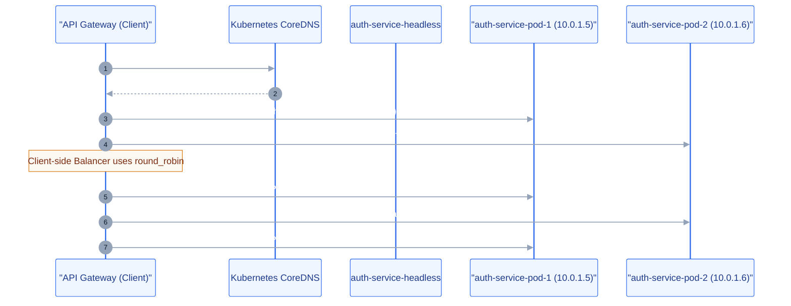
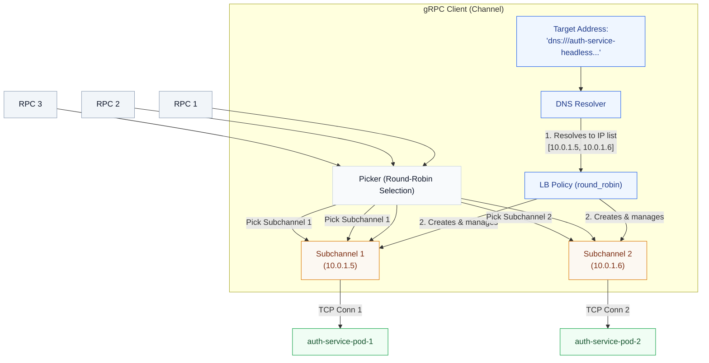
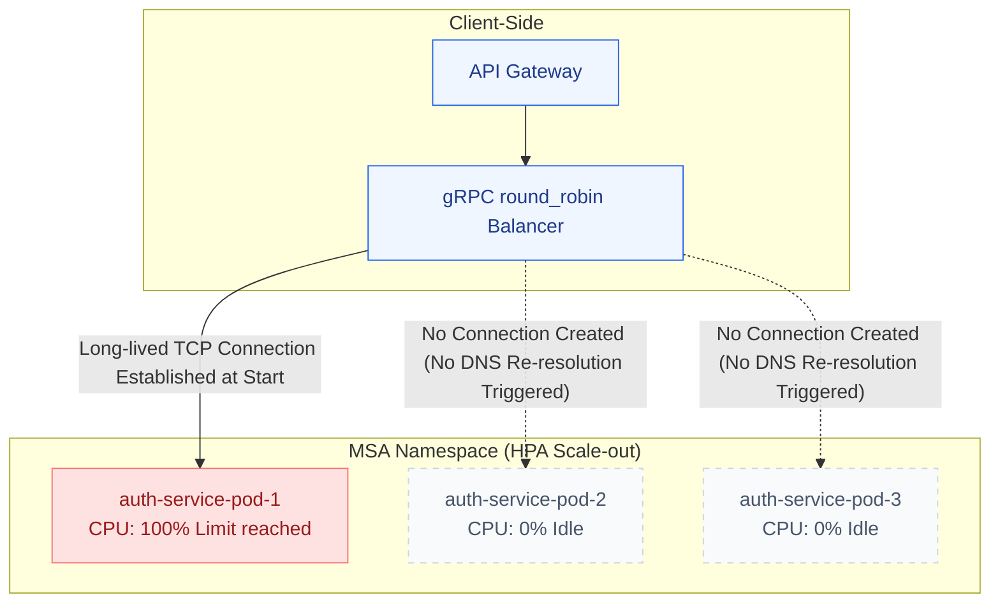
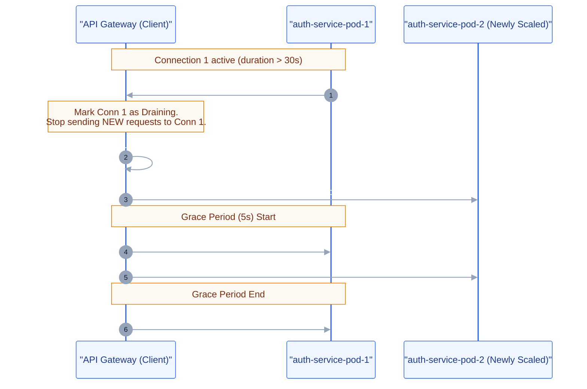
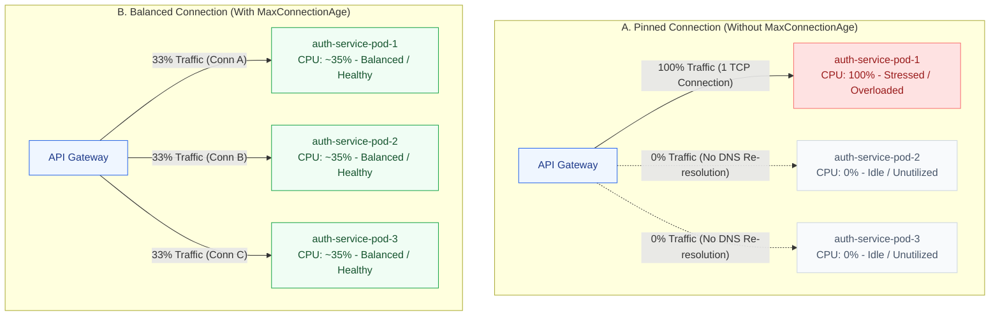

# gRPC Load Balancing and Connection Pinning Mitigation

This document explains the runtime architecture for internal gRPC service discovery, client-side load balancing, the connection pinning issue encountered during Horizontal Pod Autoscaler (HPA) scale-out, and the dynamic connection age refresh policy used to mitigate it.

---

## 1. gRPC Connection Characteristics

Unlike traditional REST APIs that establish short-lived HTTP/1.1 TCP connections per request (or reuse them via keep-alives with head-of-line blocking), gRPC utilizes **HTTP/2 multiplexing**. 

Under HTTP/2, a client establishes a **single long-lived TCP connection** to the server. All remote procedure calls (RPCs) are multiplexed over this single connection as concurrent streams. While this drastically reduces connection establishment overhead (handshakes, TLS negotiation, socket allocation), it presents unique challenges for load balancing.

---

## 2. Client-Side Load Balancing with Headless Services

In Kubernetes, a standard `ClusterIP` Service acts as a reverse proxy, load balancing traffic at the L4 (TCP) layer using `iptables` or `IPVS` (kube-proxy). If a gRPC client connects to a standard `ClusterIP` Service, all requests will stay pinned to the single pod selected during the initial connection handshake.

To achieve proper load balancing, the benchmark application utilizes **Kubernetes Headless Services** combined with **gRPC Client-Side Round-Robin**:

1. **Headless Service**: Defined with `clusterIP: None`. Instead of returning a single proxy IP, a DNS lookup for a headless service (e.g., `auth-service-headless`) returns the A-records (IP addresses) of all ready backend pods directly.
2. **DNS Resolver Scheme**: gRPC clients are configured to use the `dns:///` resolver scheme:
   ```text
   dns:///auth-service-headless.msa.svc.cluster.local:50051
   ```
3. **Round-Robin Balancer**: The client is initialized with the `round_robin` load balancing policy. The resolver queries DNS, obtains the backend pod IPs, and the balancer distributes RPC requests across them.

### 2.1 Why Client-Side Balancing over Proxy-Based Balancing?

In traditional REST architectures, load balancing is handled by a middle proxy (e.g., Nginx, HAProxy, or Kubernetes `ClusterIP` with kube-proxy). However, for gRPC, this proxy-based L4 load balancing fails:

* **The HTTP/2 Multiplexing Problem**: Because gRPC multiplexes all RPCs over a single long-lived TCP connection, a L4 proxy (like `ClusterIP`) only load balances the *connection* itself, not individual *requests*. Once the client connects to the proxy, the proxy binds it to one backend pod, and 100% of subsequent requests flow to that same pod.
* **The L7 Proxy Alternative (Service Mesh)**: To balance individual requests, one could deploy L7 proxies (e.g., Envoy or Istio service meshes). However, this introduces substantial CPU/memory overhead and network latency (due to sidecar proxy hops), which would skew the benchmark results and violate the strict resource ceilings.
* **The Client-Side Solution**: By using a headless service and client-side round-robin, the client queries DNS to discover all ready pod IPs, establishes a separate TCP connection to *each* pod, and balances individual requests locally using the `round_robin` policy. This is the **most lightweight and resource-efficient** approach for high-performance benchmarking.

### Headless Service Load Balancing Flow


### 2.2 Internal gRPC Client Load Balancing Architecture

Under the hood, gRPC client-side load balancing operates through three main internal components:
1. **Resolver**: Resolves the target string (e.g., `dns:///auth-service-headless.msa.svc.cluster.local:50051`) into a set of IP addresses. It triggers on connection initialization and when the load balancer requests re-resolution (such as upon connection draining or failure).
2. **Load Balancing (LB) Policy (Round-Robin)**: The client's load balancer receives the list of IP addresses from the Resolver.
   * For each IP address, the LB policy creates and manages a **Subchannel** (which represents a physical connection to that IP and monitors its health).
   * It tracks connectivity states (`CONNECTING`, `READY`, `TRANSIENT_FAILURE`) of all subchannels.
3. **Picker**: When an RPC request is initiated, the Picker selects one of the connected subchannels in a sequential round-robin cycle (`Subchannel 1` -> `Subchannel 2` -> `Subchannel 1`...) to transmit the RPC stream.

### gRPC Client-Side Round-Robin Internal Flow


### 2.3 `pick_first` vs. `round_robin` Comparison

| Feature / Behavior | Default Policy (`pick_first`) | Configured Policy (`round_robin`) |
| :--- | :--- | :--- |
| **Connection Strategy** | Connects only to the first reachable IP in the resolved list. | Connects to **all** resolved IPs in parallel. |
| **Subchannel Allocation** | Allocates exactly **one active subchannel** at a time. | Allocates **one subchannel per resolved IP**. |
| **Traffic Distribution** | 100% of RPC requests are pinned to the single active connection. | RPC requests are distributed sequentially across all active subchannels. |
| **Autoscaling Synergy** | Fails to utilize horizontal scaling (traffic remains pinned to the first host). | Distributes load evenly across all available replicas once connections are refreshed. |

### 2.4 Code Implementation (Go Client)

In the microservices code (such as in `api-gateway` and `transaction-service`), the round-robin load balancer is configured via `grpc.WithDefaultServiceConfig` using the JSON service configuration string:

```go
// From microservices/api-gateway/internal/bootstrap/bootstrap.go
const grpcRoundRobinServiceConfig = `{"loadBalancingConfig":[{"round_robin":{}}]}`

func grpcClientOptions(serviceName string) []grpc.DialOption {
	return []grpc.DialOption{
		grpc.WithTransportCredentials(insecure.NewCredentials()),
		grpc.WithDefaultServiceConfig(grpcRoundRobinServiceConfig),
		// ... tracer interceptors
	}
}
```

This configuration ensures that the client initializes the load balancing engine with the `round_robin` policy instead of defaulting to `pick_first`.

---


## 3. The Connection Pinning Problem Under HPA

While the headless service and client-side round-robin strategy work perfectly under a static replica set (Fixed Mode), they fail dynamically under Horizontal Pod Autoscaler (HPA) scale-out.

### The Root Cause
1. At the start of the benchmark (low load), the microservice has **1 replica** running (e.g., `Pod 1`).
2. The client (`api-gateway`) resolves DNS, finds only `Pod 1`'s IP, and establishes a long-lived TCP connection to it.
3. As the workload increases, the HPA triggers a scale-out event and provisions additional pods (`Pod 2` and `Pod 3`).
4. However, **Go's gRPC client DNS resolver does not trigger re-resolution** or establish new TCP connections as long as the existing TCP connection to `Pod 1` remains healthy.
5. As a result, the client continues multiplexing 100% of the incoming traffic over the single connection to `Pod 1`. The newly scaled pods (`Pod 2` and `Pod 3`) receive **0% traffic** and sit idle, rendering the HPA scale-out ineffective.

> [!IMPORTANT]
> **The Fallacy of Round-Robin under HPA**: Configuring the gRPC client with `round_robin` only balances requests across **connections it has already established**. If the client only knows about `Pod 1` at startup, its round-robin picker only has one endpoint. When `Pod 2` and `Pod 3` are added later by the HPA, the client's resolver never queries DNS again, meaning `round_robin` remains trapped on the single connection to `Pod 1`. Thus, client-side round-robin is completely blind to dynamic scaling unless paired with a connection age refresh mechanism.

### Connection Pinning Visualized


---

## 4. Mitigation: Server-Side Max Connection Age

To resolve the connection pinning issue while preserving benchmark fairness, a dynamic **Server-Side Max Connection Age** policy is implemented using gRPC keepalive parameters.

### How Connection Refresh Works
Rather than forcing client-side polling or deploying complex service meshes (which introduce benchmark overhead and violate fairness guidelines), the server-side gRPC transport layer controls connection longevity.



1. **`MaxConnectionAge` (30s)**: When a client connection reaches 30 seconds, the microservice server gracefully initiates a shutdown of that connection by sending an HTTP/2 `GOAWAY` frame.
2. **`MaxConnectionAgeGrace` (5s)**: The server keeps the connection alive for an additional 5 seconds. During this grace period:
   * The client immediately stops sending *new* RPCs to this connection and starts establishing a new parallel connection (triggering DNS re-resolution to discover all currently ready pods, including newly scaled ones).
   * Any *in-flight requests* already executing on the old connection are given up to 5 seconds to finish, preventing transaction drops.
3. **Connection Teardown**: After the grace period, the old connection is terminated. The client is now connected to all resolved ready pod IPs and distributes requests evenly.

### Why 30 Seconds?
The value of 30 seconds represents an engineered trade-off:
* **Autoscaling Responsiveness**: The Kubernetes HPA evaluates metrics every 15 seconds by default, and a new pod takes approximately 10 to 30 seconds to boot up and pass readiness probes. A 30s connection age ensures that newly scaled pods receive traffic quickly (within one connection refresh cycle of pod readiness).
* **Connection Overhead Trade-off**: Re-establishing TCP and gRPC/HTTP/2 connections introduces a small CPU and latency handshake overhead. A value shorter than 30s (e.g., 5s or 10s) would cause excessive reconnection churn under high RPS, while a longer value (e.g., 2m or 5m) would leave newly scaled pods idle for too long, delaying the autoscaling benefit.
* **Graceful Transition**: gRPC's server-side MaxConnectionAge triggers a graceful `GoAway` sequence, meaning active requests are allowed to finish over a graceful termination period (controlled by `MaxConnectionAgeGrace`), avoiding request drops.

---

## 5. Traffic Distribution Comparison

The following side-by-side comparison diagram illustrates how the client-to-server traffic is distributed during HPA scale-out before and after the `MaxConnectionAge` refresh policy is applied.



---

## 6. Architectural Scaling Modes and Fairness

To maintain absolute benchmark fairness, the connection refresh policy is applied **dynamically** depending on the scaling mode:

* **HPA Mode (`SCALING_MODE=hpa`)**:
  `GRPC_MAX_CONNECTION_AGE` is set to **`30s`** (injected dynamically via secrets/configs using `GRPC_MAX_CONNECTION_AGE_HPA` from `values.yaml`). This ensures load is balanced properly across all HPA replica pods.
* **Fixed Mode (`SCALING_MODE=fixed`)**:
  `GRPC_MAX_CONNECTION_AGE` is left **unset (infinite)**. This ensures that the fixed-replica baseline runs do not suffer from any reconnect overhead or handshake latency, preserving the integrity of the baseline measurement.


