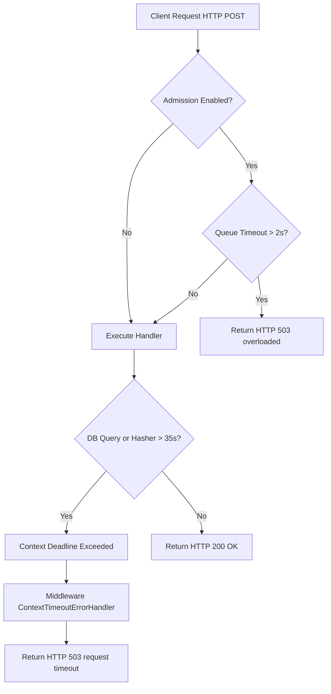
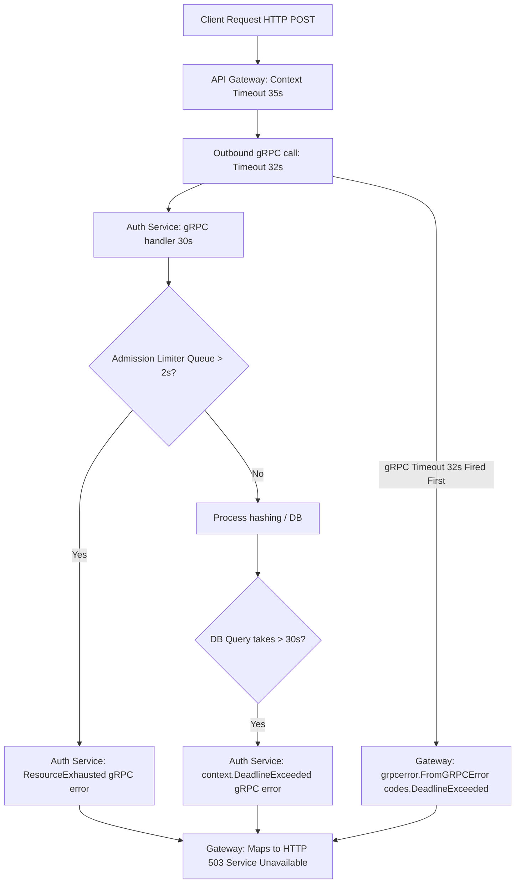

# End-to-End Timeouts Architecture

This document provides a comprehensive blueprint of all timeout parameters, constraints, and error-handling paths implemented across both the Monolithic and Microservices architectures, including the k6 benchmark runner client.

---

## 1. Timeout Precedence Design Principles

To prevent silent failures, false error logging, or connection hangs, the timeout chain is designed as a **layered hierarchy**. The core rule is:
> [!IMPORTANT]
> The innermost layers (e.g., gRPC, database operations) must time out **first** so that the outer layers (handlers, API gateways, HTTP transports, and clients) have enough remaining budget to write clean error responses and close connections gracefully.

If this rule is violated, outer layers will forcefully terminate connections, producing false `HTTP 499 (Client Closed Request)` errors or server crash logs instead of clean `HTTP 503 (Service Unavailable)` responses.

---

## 2. Monolith Timeout Architecture

In the Monolith, all domain modules run in a single process. Concurrency is managed in-process, and calls between handlers and services are direct function invocations.

### Monolith Hierarchy Diagram
```text
  Client (k6)              Echo Middleware             Admission Limiter          Database (PG)
┌─────────────┐             ┌─────────────┐             ┌─────────────┐           ┌─────────────┐
│   HTTP      │             │ Context     │             │    Login    │           │   Query     │
│  Timeout    │             │  Timeout    │             │    Queue    │           │  Timeout    │
│   (60s)     │             │   (35s)     │             │    (2s)     │           │   (5s)      │
└──────┬──────┘             └──────┬──────┘             └──────┬──────┘           └──────┬──────┘
       │                           │                           │                         │
       │     (65s gracefulStop)    │                           │                         │
       └───────────────────────────┼───────────────────────────┼─────────────────────────┘
                                   │                           │
                                   └───────────────────────────┘
```

### Timeout Configuration Parameters

| Parameter | Env Variable | Default | Description |
|---|---|---|---|
| **App Request Timeout** | `APP_REQUEST_TIMEOUT` | `35s` | Applied as a context deadline in Echo middleware. |
| **Login Queue Timeout** | `LOGIN_QUEUE_TIMEOUT` | `2s` | Bounded wait time in the login admission controller queue. |
| **HTTP Write Timeout** | `HTTP_WRITE_TIMEOUT` | `40s` | Transport-level write timeout. Must be $> \text{APP\_REQUEST\_TIMEOUT}$. |
| **DB Ping Timeout** | `DB_PING_TIMEOUT` | `5s` | Deadline for checking database pool health. |

### Monolith Error Flowchart


---

## 3. Microservices Timeout Architecture

In the Microservices architecture, components are decoupled. The API Gateway acts as the REST entry point and communicates with downstream services (Auth, Item, Transaction) via gRPC.

### Microservices Hierarchy Diagram
```text
Client (k6)       API Gateway (REST)         Downstream Services          Database (PG)
┌─────────┐      ┌───────────────────┐      ┌──────────────────┐         ┌─────────────┐
│  HTTP   │      │ Request │  gRPC   │      │   gRPC   │ DB/   │         │    Query    │
│ Timeout │      │ Timeout │ Timeout │      │ Timeout  │ Queue │         │   Timeout   │
│  (60s)  │      │  (35s)  │  (32s)  │      │  (30s)   │ (2s)  │         │    (5s)     │
└────┬────┘      └────┬────┴────┬────┘      └────┬─────┴───┬───┘         └──────┬──────┘
     │                │         │                │         │                    │
     │(65s graceful)  │         │                │         │                    │
     └────────────────┼─────────┼────────────────┼─────────┼────────────────────┘
                      │         │                │         │
                      └─────────┼────────────────┼─────────┘
                                │                │
                                └────────────────┘
```

### Timeout Configuration Parameters

| Service | Parameter | Env Variable | Default | Description |
|---|---|---|---|---|
| **API Gateway** | **Request Timeout** | `REQUEST_TIMEOUT` | `35s` | Context deadline for the incoming REST request. |
| | **gRPC Call Timeout** | `GRPC_CALL_TIMEOUT` | `32s` | Deadline for outbound gRPC client calls. |
| | **HTTP Write Timeout** | `HTTP_WRITE_TIMEOUT` | `40s` | Transport-level HTTP write timeout. |
| **Auth Service** | **gRPC Request Timeout** | `GRPC_REQUEST_TIMEOUT` | `30s` | Handler deadline for incoming gRPC requests. |
| | **Login Queue Timeout** | `LOGIN_QUEUE_TIMEOUT` | `2s` | Admission limiter queue boundary for bcrypt loads. |
| **Item Service** | **gRPC Request Timeout** | `GRPC_REQUEST_TIMEOUT` | `30s` | Handler deadline for incoming gRPC requests. |
| **Transaction** | **gRPC Request Timeout** | `GRPC_REQUEST_TIMEOUT` | `30s` | Handler deadline for incoming gRPC requests. |
| | **Item Validation Timeout**| `ITEM_VALIDATION_TIMEOUT`| `25s` | Outbound gRPC deadline to Item Service. |

### Microservices Error Flowchart


---

## 4. k6 Client Timeout Architecture

The benchmark client (k6) operates outside the server cluster and simulates high concurrency. It must cooperate with the server's timeout design to log benchmark metrics cleanly.

### Configuration Variables
*   `REQUEST_TIMEOUT_MS` (Default: `60000` / 60 seconds): The timeout applied on each HTTP request call in k6.
*   `GRACEFUL_STOP` (Default: `"65s"`): The duration k6 waits for in-flight iterations to finish *after* the active scenario duration ends.

### Precedence Hierarchy Constraint
To ensure that client cancellations do not occur during active server processing:
$$\text{GRPC\_CALL\_TIMEOUT (32s)} < \text{APP\_REQUEST\_TIMEOUT (35s)} < \text{REQUEST\_TIMEOUT\_MS (60s)} < \textbf{GRACEFUL\_STOP (65s)}$$

---

## 5. Classification of Failures (HTTP 499 vs 503)

Our metrics classification strategy relies heavily on distinguishing between client cancellation and server-side overload:

| HTTP Status | Reason Code | Condition | Meaning |
|---|---|---|---|
| **503 Service Unavailable** | `SERVICE_UNAVAILABLE` | Database pool exhausted, bcrypt queue timed out ($>2\text{s}$), or handler execution time exceeded ($>35\text{s}$). | **Server Saturated**: The application is overloaded but safely shed the load using timeouts. |
| **499 Client Closed Request** | `CLIENT_CANCELED` | The client closed the TCP socket before receiving a response from the server. | **Client Aborted**: Either the user manually canceled, or k6's `gracefulStop` forced VU termination. |

> [!WARNING]
> If a test run displays `HTTP 499` in the middle or end of a run without manual cancellation, it indicates a misconfigured k6 client boundary (`gracefulStop` or `REQUEST_TIMEOUT_MS` is too small). In a fair benchmark, all saturated errors must register as `503`.
