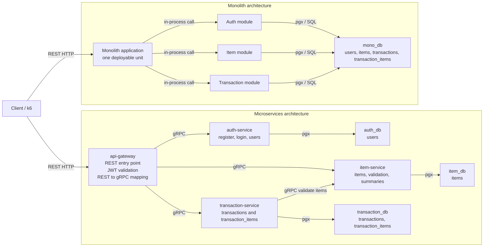

# Architecture Comparison Diagram

This diagram compares the two runtime architectures exposed through the same
external REST API.

## Comparison Points

| Aspect | Monolith | Microservices |
|---|---|---|
| Deployment unit | One application | Four services |
| Internal communication | In-process function calls | gRPC |
| Database ownership | One database | Database per service |
| Create transaction | One database transaction | Transaction service plus item validation over gRPC |
| Enrichment | SQL JOIN | API Gateway distributed join / fan-out |
| Scaling unit | Whole application | Per service |
