# Benchmark Lifecycle Diagram

This diagram captures the operational lifecycle for an EKS benchmark session.

```mermaid
flowchart TB
  start(["Start"])
  persistent["One-time persistent setup<br/>make aws-create-s3<br/>make aws-create-ecr"]
  images["Build and push images<br/>make ecr-push-all IMAGE_TAG=git-sha"]
  renderManifests["Render cloud manifests<br/>make eks-render-manifests<br/>source manifests stay unchanged"]
  env["Render operator env and tfvars<br/>make env-init PLATFORM=eks EXECUTION_MODE=parallel<br/>or make env-init PLATFORM=eks EXECUTION_MODE=sequential<br/>then make eks-render-tfvars"]
  auth["Verify AWS auth for Terraform<br/>make terraform-auth-check"]
  shared["Apply shared Terraform<br/>VPC, subnets, NAT, k6 IAM role"]
  topology{"Choose execution mode"}
  experiment["Apply parallel Terraform<br/>2 EKS clusters, 2 RDS instances"]
  sequentialExperiment["Apply sequential Terraform<br/>1 EKS cluster, 1 RDS instance"]
  contexts["Setup kubectl contexts<br/>monolith, msa"]
  sequentialContext["Setup kubectl context<br/>benchmark"]
  secrets["Create Kubernetes secrets<br/>apps, db bootstrap, k6 runner, Datadog"]
  validate["Validate manifests and cluster access<br/>image tags, contexts, secrets"]
  deploy["Deploy selected runtime mode<br/>fixed suite baseline or arch-suite HPA,<br/>plus migrations and optional Datadog"]
  smoke["Run smoke validation<br/>low RPS, short duration"]
  suite["Run fixed benchmark suite<br/>primary matrix only"]
  matrix["Primary fixed matrix<br/>4 scenarios x 5 RPS levels = 20 cases"]
  resetSeed["Suite reset and seed lifecycle<br/>prepare enrichment data when required"]
  k6{"Run k6 case"}
  parallelK6["Parallel mode<br/>monolith and microservices together"]
  sequentialK6["Sequential mode<br/>one architecture at a time"]
  caseDelay["Inter-case delay<br/>fixed: 60-120s, HPA: 180-300s"]
  upload["Upload artifacts to S3<br/>summary, raw output, metadata, Datadog window"]
  verify["Verify S3 artifacts"]
  hpaFlow["Supplemental single-architecture suite<br/>or one-off HPA case runner"]
  hpaMatrix["Repeat selected HPA scenario x RPS pairs<br/>through arch-suite or single-case command"]
  more{"More fixed attempts or switch workflow?"}
  redeploy{"Switch to supplemental HPA<br/>or back to fixed?"}
  destroyExp["Destroy active experiment stack<br/>make eks-destroy-confirmed or<br/>make eks-sequential-destroy-confirmed"]
  destroyShared{"Done with all experiments?"}
  sharedDestroy["Destroy shared stack<br/>make eks-shared-destroy"]
  done(["Done"])

  start --> persistent --> images --> renderManifests --> env --> auth --> shared --> topology
  topology -- "parallel" --> experiment --> contexts --> secrets
  topology -- "sequential" --> sequentialExperiment --> sequentialContext --> secrets
  secrets --> validate --> deploy --> smoke
  smoke --> suite --> matrix --> resetSeed --> k6
  k6 -- "parallel" --> parallelK6 --> upload
  k6 -- "sequential" --> sequentialK6 --> upload
  upload --> caseDelay --> verify --> more
  more -- "more fixed suite runs" --> suite
  more -- "supplemental HPA" --> hpaFlow --> hpaMatrix --> deploy
  more -- "different fixed setup" --> redeploy --> deploy
  hpaMatrix --> k6
  more -- "no" --> destroyExp --> destroyShared
  destroyShared -- "yes" --> sharedDestroy --> done
  destroyShared -- "no" --> done
```



## Safety Rules

- Do not run migration, reset, or seed during k6 execution.
- Use a new S3 attempt folder for every k6 execution.
- Select either parallel or sequential experiment topology before applying
  cost-heavy resources.
- Treat fixed and HPA as deployment states. Redeploy applications before
  switching modes.
- Use `INTER_CASE_DELAY` between measured suite cases so application pods,
  database pressure, HPA metrics, and Datadog telemetry can stabilize.
- Do not destroy EKS/RDS until benchmark artifacts are verified in S3.
- S3 result bucket and ECR repositories are persistent resources outside
  Terraform.

## Benchmark Matrix

Primary Bab 4 runs use a fixed-mode dual-architecture suite. Supplemental HPA
measurements are collected with the single-architecture suite or the single-case
runners.

| Dimension | Values |
|---|---|
| Fixed suite mode | `fixed` |
| Supplemental HPA mode | `hpa` via `run-benchmark-arch-suite` or single-case runners |
| Primary scenario | `concurrent-mixed-workload` |
| Diagnostic scenarios | `login`, `create-transaction`, `enriched-transactions` |
| Fixed RPS levels | `100`, `200`, `300`, `400`, `500` |
| HPA RPS levels | `100`, `250`, `500` |
| Optional legacy scenario | `mixed-workload` |

This produces the following final fixed suite shape per architecture comparison:

```text
fixed suite:
  4 scenarios x 5 RPS levels = 20 suite cases
```

In parallel mode, each fixed suite case runs monolith and microservices jobs
together. In sequential mode, the fixed suite runs one architecture phase at a
time on the `benchmark` context. Supplemental HPA measurements use the
single-architecture suite or a single-case runner and still require a redeploy
to the matching HPA overlay before the next case starts.
