# Benchmark Lifecycle Diagram

This diagram captures the operational lifecycle for an EKS benchmark session.

```mermaid
flowchart TB
  start(["Start"])
  persistent["One-time persistent setup<br/>make aws-create-s3<br/>make aws-create-ecr"]
  images["Build and push images<br/>make ecr-push-all IMAGE_TAG=git-sha"]
  renderManifests["Render EKS manifests<br/>make eks-render-manifests<br/>source manifests stay unchanged"]
  env["Render operator env and tfvars<br/>make env-init-eks<br/>make eks-render-tfvars"]
  auth["Verify AWS auth for Terraform<br/>make terraform-auth-check"]
  shared["Apply shared Terraform<br/>VPC, subnets, NAT, k6 IAM role"]
  experiment["Apply experiment Terraform<br/>2 EKS clusters, 2 RDS instances"]
  contexts["Setup kubectl contexts<br/>monolith, msa"]
  secrets["Create Kubernetes secrets<br/>apps, db bootstrap, k6 runner, Datadog"]
  validate["Validate manifests and cluster access<br/>image tags, contexts, secrets"]
  deploy["Deploy applications<br/>bootstrap DB, migration, reset, seed, app deploy, optional Datadog"]
  smoke["Run smoke validation<br/>low RPS, short duration"]
  choose["Choose scenario and RPS"]
  resetSeed["Reset and seed data<br/>prepare enrichment data when required"]
  k6["Run parallel k6 jobs<br/>make run-benchmark-parallel"]
  upload["Upload artifacts to S3<br/>summary, raw output, metadata, Datadog window"]
  verify["Verify S3 artifacts"]
  more{"More scenarios / attempts?"}
  destroyExp["Destroy experiment stack<br/>make eks-destroy-confirmed"]
  destroyShared{"Done with all experiments?"}
  sharedDestroy["Destroy shared stack<br/>make eks-shared-destroy"]
  done(["Done"])

  start --> persistent --> images --> renderManifests --> env --> auth --> shared --> experiment --> contexts --> secrets --> validate --> deploy --> smoke
  smoke --> choose --> resetSeed --> k6 --> upload --> verify --> more
  more -- "yes" --> choose
  more -- "no" --> destroyExp --> destroyShared
  destroyShared -- "yes" --> sharedDestroy --> done
  destroyShared -- "no" --> done
```

## Safety Rules

- Do not run migration, reset, or seed during k6 execution.
- Use a new S3 attempt folder for every k6 execution.
- Do not destroy EKS/RDS until benchmark artifacts are verified in S3.
- S3 result bucket and ECR repositories are persistent resources outside
  Terraform.
