# Benchmark Lifecycle Diagram

This diagram captures the operational lifecycle for an EKS benchmark session.

```mermaid
flowchart TB
  start(["Start"])
  persistent["One-time persistent setup<br/>make aws-create-s3<br/>make aws-create-ecr"]
  images["Build and push images<br/>make ecr-push-all IMAGE_TAG=git-sha"]
  renderManifests["Render EKS manifests<br/>make eks-render-manifests<br/>source manifests stay unchanged"]
  env["Render operator env and tfvars<br/>make env-init-eks<br/>make eks-render-tfvars"]
  auth["Verify AWS auth for Terraform<br/>make terraform-auth-check"]
  shared["Apply shared Terraform<br/>VPC, subnets, NAT, k6 IAM role"]
  experiment["Apply experiment Terraform<br/>2 EKS clusters, 2 RDS instances"]
  contexts["Setup kubectl contexts<br/>monolith, msa"]
  secrets["Create Kubernetes secrets<br/>apps, db bootstrap, k6 runner, Datadog"]
  validate["Validate manifests and cluster access<br/>image tags, contexts, secrets"]
  deploy["Deploy selected scaling mode<br/>fixed or HPA apps, migrations, optional Datadog"]
  smoke["Run smoke validation<br/>low RPS, short duration"]
  suite["Run benchmark suite<br/>mode x scenario x RPS matrix"]
  matrix["Primary matrix per mode<br/>3 scenarios x 5 RPS levels = 15 cases"]
  resetSeed["Suite reset and seed lifecycle<br/>prepare enrichment data when required"]
  k6["Run parallel k6 jobs per case<br/>monolith and microservices together"]
  caseDelay["Inter-case delay<br/>fixed: 60-120s, HPA: 180-300s"]
  upload["Upload artifacts to S3<br/>summary, raw output, metadata, Datadog window"]
  verify["Verify S3 artifacts"]
  more{"More attempts or switch scaling mode?"}
  redeploy{"Switch fixed/HPA?"}
  destroyExp["Destroy experiment stack<br/>make eks-destroy-confirmed"]
  destroyShared{"Done with all experiments?"}
  sharedDestroy["Destroy shared stack<br/>make eks-shared-destroy"]
  done(["Done"])

  start --> persistent --> images --> renderManifests --> env --> auth --> shared --> experiment --> contexts --> secrets --> validate --> deploy --> smoke
  smoke --> suite --> matrix --> resetSeed --> k6 --> upload --> caseDelay --> verify --> more
  more -- "same mode" --> suite
  more -- "different mode" --> redeploy --> deploy
  more -- "no" --> destroyExp --> destroyShared
  destroyShared -- "yes" --> sharedDestroy --> done
  destroyShared -- "no" --> done
```



## Safety Rules

- Do not run migration, reset, or seed during k6 execution.
- Use a new S3 attempt folder for every k6 execution.
- Treat fixed and HPA as deployment states. Redeploy applications before
  switching modes.
- Use `INTER_CASE_DELAY` between measured suite cases so application pods,
  database pressure, HPA metrics, and Datadog telemetry can stabilize.
- Do not destroy EKS/RDS until benchmark artifacts are verified in S3.
- S3 result bucket and ECR repositories are persistent resources outside
  Terraform.

## Benchmark Matrix

Primary Bab 4 runs use two deployment modes, three primary workload scenarios,
and five target RPS levels.

| Dimension | Values |
|---|---|
| Scaling modes | `fixed`, `hpa` |
| Primary scenarios | `login`, `create-transaction`, `enriched-transactions` |
| Default RPS levels | `1000`, `2500`, `5000`, `7500`, `10000` |
| Optional exploratory scenario | `mixed-workload` |

This produces `15` suite cases per scaling mode for the primary matrix:

```text
3 scenarios x 5 RPS levels = 15 cases per mode
2 modes x 15 cases = 30 primary suite cases
```

Each suite case runs monolith and microservices jobs together. Switching from
`fixed` to `hpa` is not a runner-only change; redeploy both application stacks
with the matching overlay before starting the next mode.
