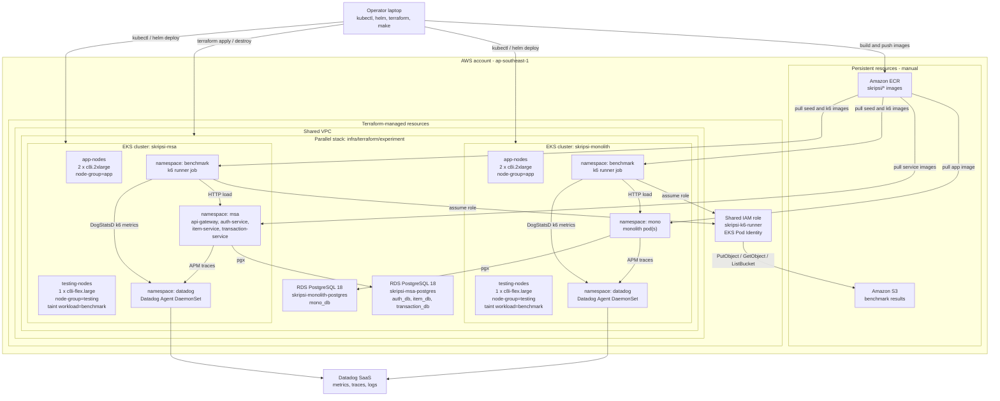
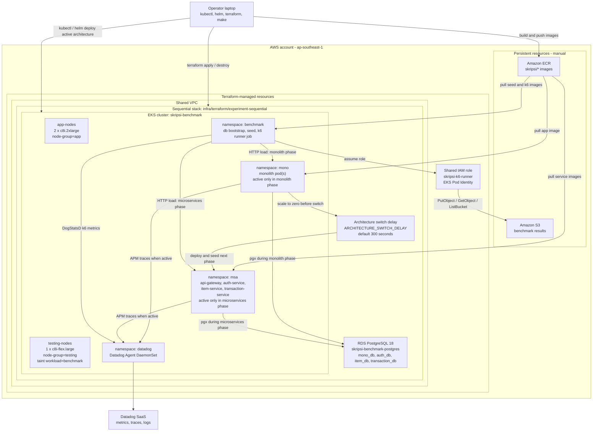

# Cloud Architecture Diagram

This document keeps the AWS topology diagrams for both supported benchmark
execution modes in one place:

- **Parallel mode** provisions two isolated EKS clusters and two isolated RDS
  instances so monolith and microservices can run at the same wall-clock time.
- **Sequential mode** provisions one EKS cluster and one RDS instance, then runs
  monolith and microservices one after another for quota-constrained accounts.

Both modes preserve the same application resource ceiling. The difference is
the execution topology, not the benchmark API contract or workload semantics.

## Parallel Mode

Use this mode when the AWS account has enough vCPU quota for both architecture
stacks to be active together. It gives the cleanest Datadog time-series overlay
because monolith and microservices run during the same time window.

## Sequential Mode

Use this mode when the AWS account cannot keep both full architecture stacks
active at once, for example with a 24 vCPU quota. The same cluster hosts both
namespaces, but only one architecture is active during a benchmark phase. The
runner waits `ARCHITECTURE_SWITCH_DELAY` between phases so Datadog windows are
regular and easier to compare.

## Notes

- S3 and ECR are persistent resources and are not destroyed by Terraform.
- VPC and the k6 IAM role come from the shared Terraform stack.
- Parallel mode uses `infra/terraform/experiment`; sequential mode uses
  `infra/terraform/experiment-sequential`.
- Application pods run on `app-nodes`; k6 runner jobs run on `testing-nodes`.
- Parallel mode isolates monolith and microservices by cluster and RDS instance.
- Sequential mode isolates benchmark phases by scaling the inactive architecture
  to zero before migration, seed, and k6 execution.
- Do not keep both experiment stacks active under a constrained vCPU quota; use
  the switching flow in `docs/diagrams/sequential-parallel-topology.md`.
