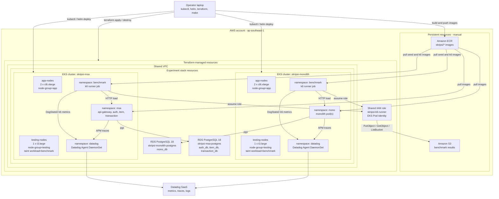

# Cloud Architecture Diagram

This diagram summarizes the final AWS benchmark topology. It focuses on the
resource boundaries that matter for the thesis comparison: isolated runtime
clusters, equivalent app capacity, separate RDS instances, shared persistent
artifacts, and shared observability.

## Notes

- S3 and ECR are persistent resources and are not destroyed by Terraform.
- VPC and the k6 IAM role come from the shared Terraform stack.
- EKS clusters, node groups, and RDS instances come from the experiment
  Terraform stack.
- Application pods run on `app-nodes`; k6 runner jobs run on `testing-nodes`.
- The two clusters are intentionally isolated so monolith and microservices do
  not compete for runtime resources during parallel benchmark runs.
