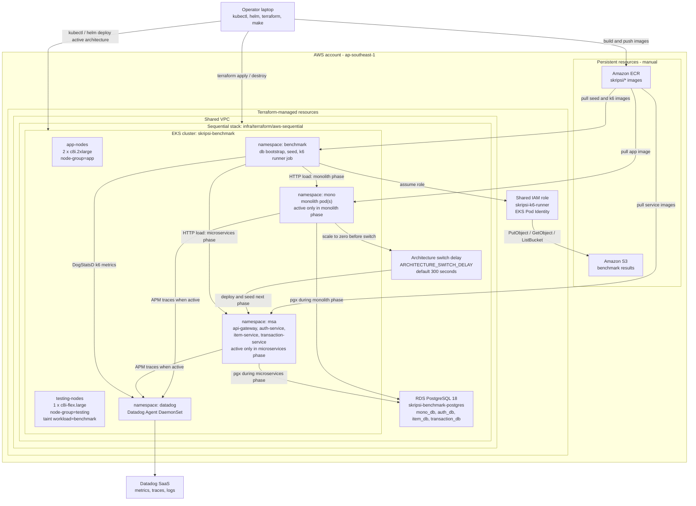
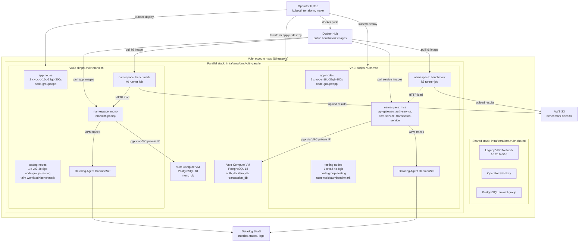
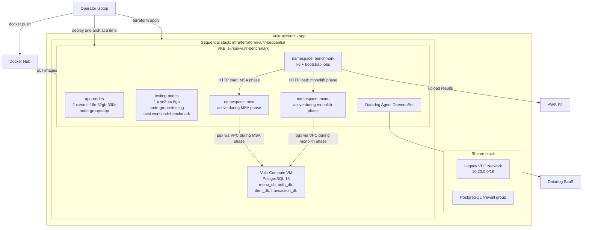

# Cloud Architecture Diagram

This document contains topology diagrams for both the original AWS EKS plan
and the active Vultr implementation.

Both infrastructure paths preserve the same application resource ceiling. The
difference is the hosting platform, not the benchmark API contract or workload
semantics.

---

## AWS EKS — Parallel Mode (Original Plan)

Use this mode when the AWS account has enough vCPU quota for both architecture
stacks to be active together. It gives the cleanest Datadog time-series overlay
because monolith and microservices run during the same time window.

## AWS EKS — Sequential Mode (Original Plan)

Use this mode when the AWS account cannot keep both full architecture stacks
active at once, for example with a 24 vCPU quota. The same cluster hosts both
namespaces, but only one architecture is active during a benchmark phase. The
runner waits `ARCHITECTURE_SWITCH_DELAY` between phases so Datadog windows are
regular and easier to compare.

## AWS Notes

- S3 and ECR are persistent resources and are not destroyed by Terraform.
- VPC and the k6 IAM role come from the shared Terraform stack.
- Parallel mode uses `infra/terraform/aws-parallel`; sequential mode uses
  `infra/terraform/aws-sequential`.
- Application pods run on `app-nodes`; k6 runner jobs run on `testing-nodes`.
- Parallel mode isolates monolith and microservices by cluster and RDS instance.
- Sequential mode isolates benchmark phases by scaling the inactive architecture
  to zero before migration, seed, and k6 execution.
- Do not keep both `aws-parallel` and `aws-sequential` active under a
  constrained vCPU quota; use the switching flow in
  `docs/diagrams/sequential-parallel-topology.md`.

---

## Vultr VKE — Parallel Mode (Active Implementation)

The active implementation uses Vultr VKE instead of Amazon EKS, and
self-managed PostgreSQL on Vultr Compute VM instead of Amazon RDS.

## Vultr VKE — Sequential Mode (Active Fallback)

## Vultr Notes

- Docker Hub replaces Amazon ECR for container images.
- PostgreSQL runs on Vultr Compute VM (self-managed) instead of Amazon RDS.
- Vultr Legacy VPC (not VPC 2.0) is used because VKE requires it.
- PostgreSQL is accessed via VPC private IP only (not publicly exposed).
- AWS S3 and Datadog SaaS remain unchanged.
- For the complete Vultr reference, see `docs/infrastructure/vultr-complete-architecture.md`.
