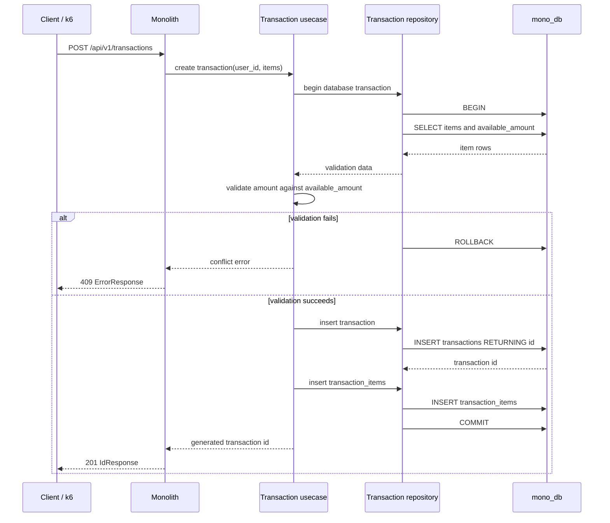
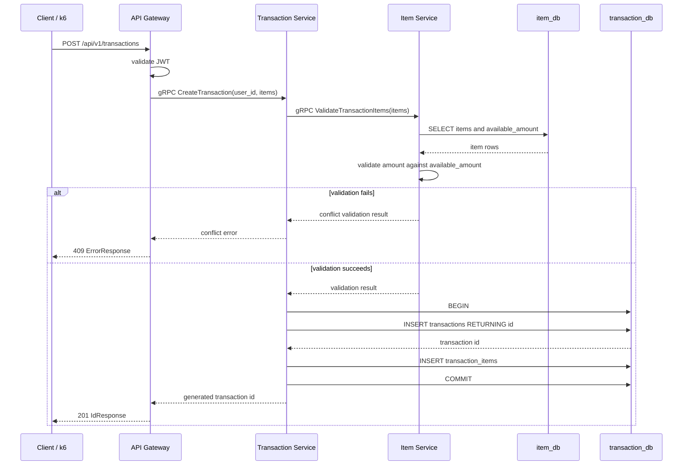

# Create Transaction Sequence Diagram

This sequence diagram shows Benchmark 2, `POST /api/v1/transactions`.

Important semantic rule: this endpoint validates `amount <= available_amount`
but does not deduct `available_amount`.

## Monolith

## Microservices

