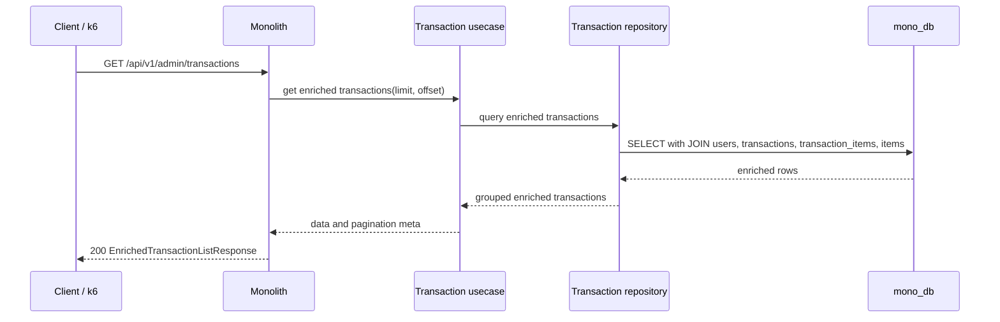
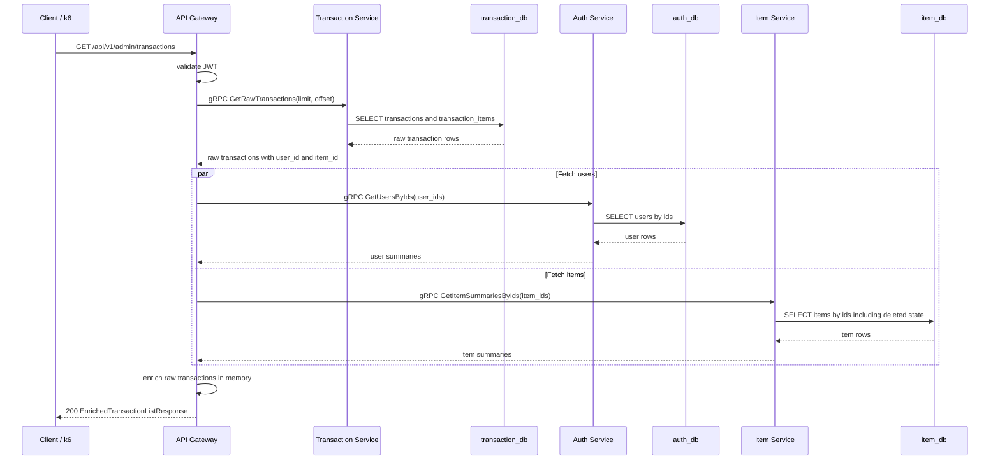

# Enriched Transactions Sequence Diagram

This sequence diagram shows Benchmark 3,
`GET /api/v1/admin/transactions`.

## Monolith

```mermaid
sequenceDiagram
  participant K6 as Client / k6
  participant M as Monolith
  participant U as Transaction usecase
  participant R as Transaction repository
  participant DB as mono_db

  K6->>M: GET /api/v1/admin/transactions
  M->>U: get enriched transactions(limit, offset)
  U->>R: query enriched transactions
  R->>DB: SELECT with JOIN users, transactions, transaction_items, items
  DB-->>R: enriched rows
  R-->>U: grouped enriched transactions
  U-->>M: data and pagination meta
  M-->>K6: 200 EnrichedTransactionListResponse
```

## Microservices

```mermaid
sequenceDiagram
  participant K6 as Client / k6
  participant GW as API Gateway
  participant TS as Transaction Service
  participant TxDB as transaction_db
  participant AS as Auth Service
  participant AuthDB as auth_db
  participant IS as Item Service
  participant ItemDB as item_db

  K6->>GW: GET /api/v1/admin/transactions
  GW->>GW: validate JWT
  GW->>TS: gRPC GetRawTransactions(limit, offset)
  TS->>TxDB: SELECT transactions and transaction_items
  TxDB-->>TS: raw transaction rows
  TS-->>GW: raw transactions with user_id and item_id
  par Fetch users
    GW->>AS: gRPC GetUsersByIds(user_ids)
    AS->>AuthDB: SELECT users by ids
    AuthDB-->>AS: user rows
    AS-->>GW: user summaries
  and Fetch items
    GW->>IS: gRPC GetItemSummariesByIds(item_ids)
    IS->>ItemDB: SELECT items by ids including deleted state
    ItemDB-->>IS: item rows
    IS-->>GW: item summaries
  end
  GW->>GW: enrich raw transactions in memory
  GW-->>K6: 200 EnrichedTransactionListResponse
```

