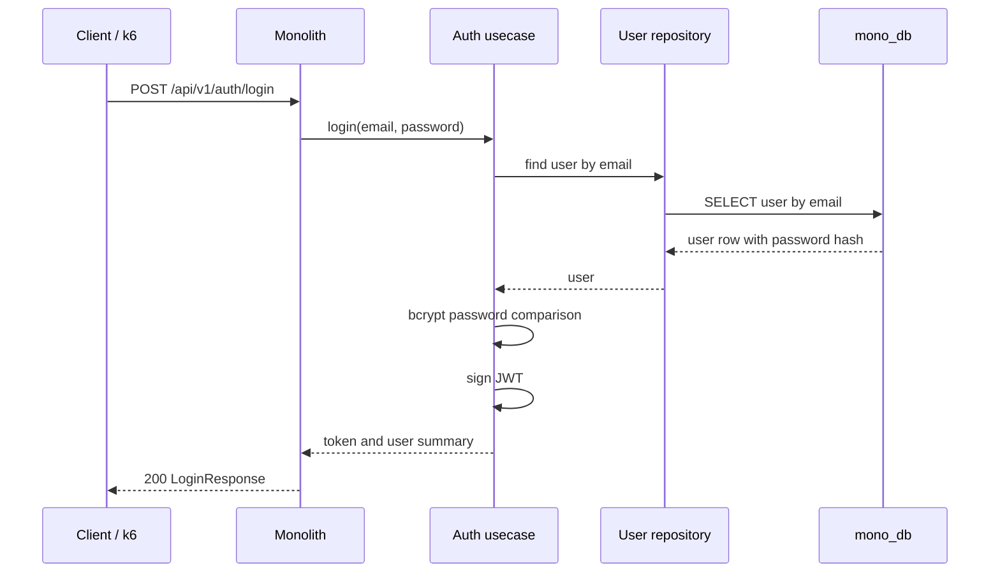
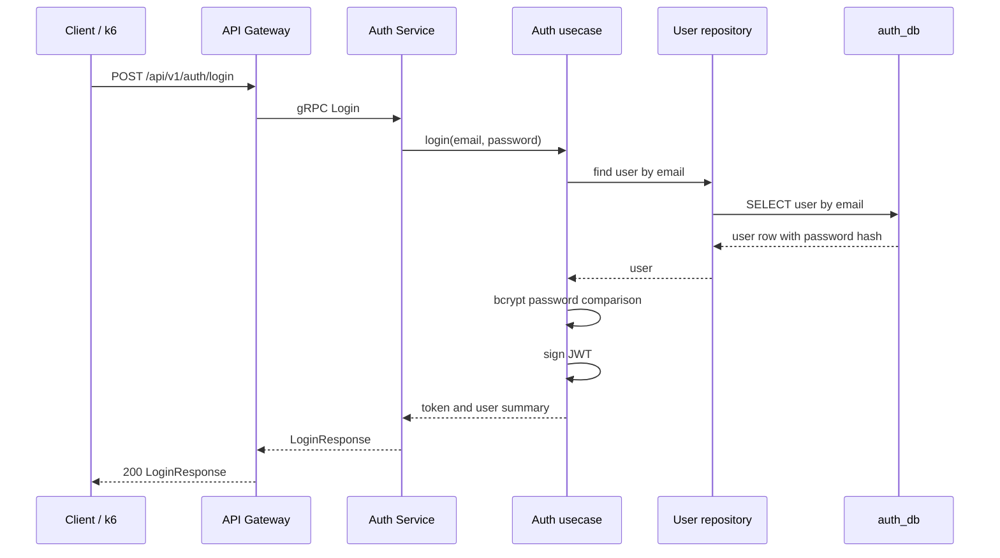

# Login Sequence Diagram

This sequence diagram shows Benchmark 1, `POST /api/v1/auth/login`.

## Monolith

```mermaid
sequenceDiagram
  participant K6 as Client / k6
  participant M as Monolith
  participant U as Auth usecase
  participant R as User repository
  participant DB as mono_db

  K6->>M: POST /api/v1/auth/login
  M->>U: login(email, password)
  U->>R: find user by email
  R->>DB: SELECT user by email
  DB-->>R: user row with password hash
  R-->>U: user
  U->>U: bcrypt password comparison
  U->>U: sign JWT
  U-->>M: token and user summary
  M-->>K6: 200 LoginResponse
```

## Microservices

```mermaid
sequenceDiagram
  participant K6 as Client / k6
  participant GW as API Gateway
  participant AS as Auth Service
  participant UC as Auth usecase
  participant R as User repository
  participant DB as auth_db

  K6->>GW: POST /api/v1/auth/login
  GW->>AS: gRPC Login
  AS->>UC: login(email, password)
  UC->>R: find user by email
  R->>DB: SELECT user by email
  DB-->>R: user row with password hash
  R-->>UC: user
  UC->>UC: bcrypt password comparison
  UC->>UC: sign JWT
  UC-->>AS: token and user summary
  AS-->>GW: LoginResponse
  GW-->>K6: 200 LoginResponse
```

