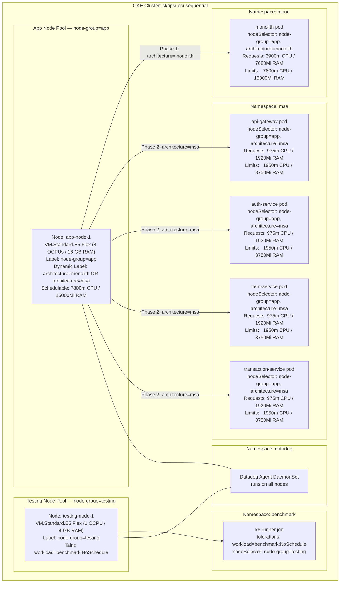
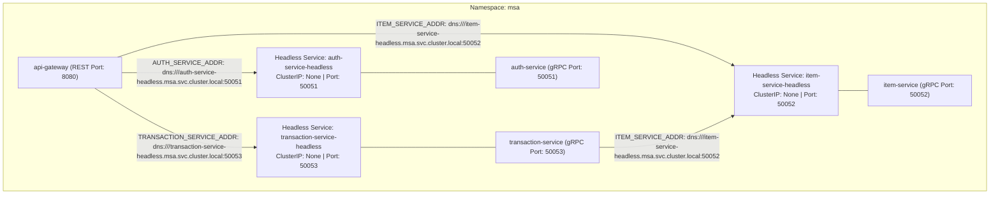

# OCI OKE Internal Kubernetes Topology — Complete Reference

This document describes the **internal Kubernetes architecture** of the OCI sequential deployment. It covers node pools, namespace layout, pod placement rules, Kubernetes resource objects, inter-service gRPC communication, and the Datadog APM telemetry path.

---

## 1. Cluster Overview

Sequential mode uses a single OKE cluster with two node pools. Both benchmark architectures share the same physical nodes — they are isolated at the namespace level and executed sequentially.

```text
OKE Cluster          : skripsi-oci-sequential (kubectl context: monolith)
Region               : ap-kulai-2 (Malaysia)
Kubernetes Version   : v1.36.0

Node Pools:
  app-nodes          : 1 x VM.Standard.E5.Flex (4 OCPUs / 8 vCPUs / 16 GB RAM)
                       Allocatable Capacity: 7800m CPU / 15000Mi RAM
  testing-nodes      : 1 x VM.Standard.E5.Flex (4 OCPUs / 8 vCPUs / 16 GB RAM)
                       Taint: workload=benchmark:NoSchedule

Namespaces:
  mono               : Monolith application deployment (monolith pod)
  msa                : Microservices application deployments (api-gateway, auth-service, item-service, transaction-service)
  benchmark          : One-shot jobs (db-bootstrap-job, migration jobs, seed jobs, k6 runner jobs)
  datadog            : Observability agent DaemonSet and API key secret
```

---

## 2. Dynamic Node Labeling & Pod Scheduling



---

## 3. Microservices Inter-Service Communication & DNS Resolution



---

## 4. Resource Quotas & Scheduling Enforcement

To ensure mathematical equivalence between Monolith and Microservices, a Kubernetes `ResourceQuota` object is applied to namespaces `mono` and `msa`:

```yaml
apiVersion: v1
kind: ResourceQuota
metadata:
  name: mono-resource-quota
  namespace: mono
spec:
  hard:
    limits.cpu: "7800m"
    limits.memory: "15000Mi"
    requests.cpu: "3900m"
    requests.memory: "7680Mi"
```

```yaml
apiVersion: v1
kind: ResourceQuota
metadata:
  name: msa-resource-quota
  namespace: msa
spec:
  hard:
    limits.cpu: "7800m"
    limits.memory: "15000Mi"
    requests.cpu: "3900m"
    requests.memory: "7680Mi"
```

---

## 5. Telemetry & Artifact Lifecycle Pipeline

1. **Load Generation (k6 Job)**:
   - Emits real-time load test metrics via DogStatsD to Datadog Agent (`datadog.datadog.svc.cluster.local:8125`).
   - Writes result JSON files to local job volume (`summary.json`, `raw.json.gz`, `metadata.json`, `thresholds.json`).
2. **AWS S3 Artifact Upload**:
   - Uploads complete result bundle to `s3://skripsi-benchmark-results/experiments/{run_id}/{architecture}/{scenario}/{rps}rps/attempt-01/`.
3. **Datadog Observability**:
   - Application pods emit APM traces to `DD_AGENT_HOST:8126` (`status.hostIP`).
   - Datadog Agent forwards traces, metrics, and logs to `us5.datadoghq.com`.
