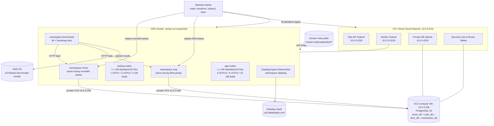
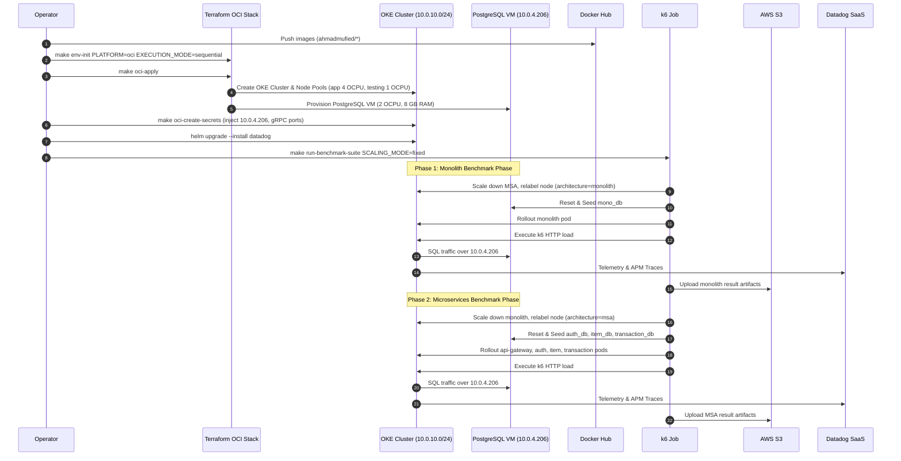

# Oracle Cloud Infrastructure (OCI / OKE) Topology Diagrams

This document contains the complete infrastructure topology diagrams for Oracle Cloud Infrastructure (OCI) using Oracle Container Engine for Kubernetes (OKE).

---

## 1. Sequential Benchmark Topology (Active Implementation)

---

## 2. Component Network Mapping Table

| Component Name | Subnet / Network | Internal IP Range | Security Rules |
|---|---|---|---|
| OKE K8s Control Plane | `k8s-api-subnet` | `10.0.0.0/28` | HTTPS (6443) for kubectl control |
| OKE Worker Nodes (`app-nodes`, `testing-nodes`) | `worker-subnet` | `10.0.10.0/24` | Internal pod overlay traffic & NAT egress |
| Dedicated PostgreSQL VM | `db-subnet` | `10.0.4.206` | Port 5432 ingress from `10.0.10.0/24`, Port 22 SSH |
| Docker Hub Registry | External Public | `docker.io` | Egress HTTPS via NAT Gateway |
| AWS S3 Result Bucket | External Public | `s3.ap-southeast-1.amazonaws.com` | Egress HTTPS via NAT Gateway |
| Datadog Observability SaaS | External Public | `us5.datadoghq.com` | Egress HTTPS via NAT Gateway |

---

## 3. End-to-End Execution Flow Sequence Diagram

