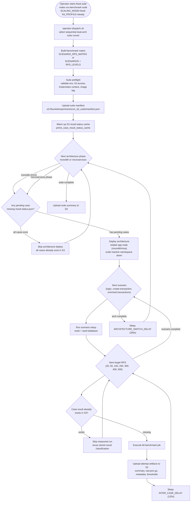
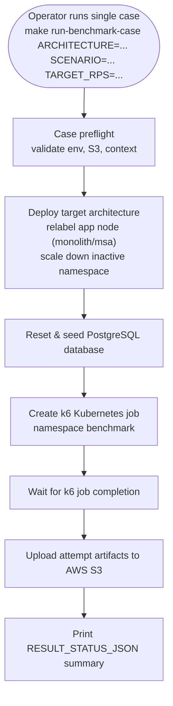

# OCI Sequential Suite Lifecycles & Diagrams — Complete Reference

This document describes the active OCI sequential benchmark suite lifecycles (`make run-benchmark-suite` and `make run-benchmark-case`). It covers lifecycle steps, Mermaid flowcharts, data setup rules, recovery behaviors, and S3 result status caching.

---

## 1. Dual-Architecture Sequential Suite (`make run-benchmark-suite`)

The dual-architecture sequential suite is the primary entry point for comparing Monolith and Microservices under identical resource ceilings on OCI OKE.

### 1.1 Mermaid Lifecycle Flowchart

---

## 2. Single-Case Benchmark Execution (`make run-benchmark-case`)

---

## 3. Recovery & Retry Rules

1. **S3 Result Caching**: If a case's `result-status.json` already exists in S3 under `s3://skripsi-benchmark-results/experiments/{run_id}/{architecture}/{scenario}/{rps}rps/attempt-01/`, the suite runner skips execution to preserve time and compute.
2. **Dynamic Node Relabeling**: Prior to starting workloads for an architecture, nodes labeled `node-group=app` are automatically relabeled with `architecture=monolith` or `architecture=msa` to prevent pod scheduling deadlocks.
3. **Guarded Infrastructure Teardown**: Infrastructure is never destroyed automatically unless `AUTO_DESTROY_CONFIRMED=true` is explicitly provided and all S3 artifacts pass validation checks.
