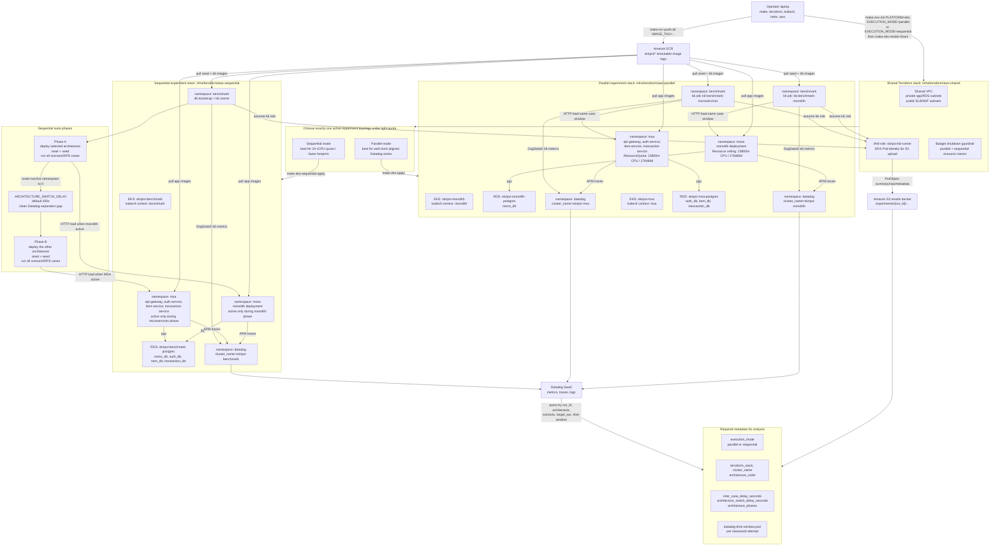

# Sequential and Parallel Benchmark Topology Diagram

This diagram shows how the two benchmark execution modes relate to the same
application architecture comparison. Parallel and sequential are execution
topologies, not new application variants. Both must preserve the same external
API, seed data assumptions, resource ceiling, scaling mode, and k6 workload
scripts.



## Operating Rules

- Parallel mode runs one monolith k6 job and one microservices k6 job together
  for each scenario/RPS case.
- Sequential mode runs one architecture phase at a time on the `benchmark`
  context and records `architecture_phases` in the suite summary.
- `INTER_CASE_DELAY` separates cases inside the same architecture phase.
- `ARCHITECTURE_SWITCH_DELAY` separates monolith and microservices phases for
  cleaner Datadog resource windows.
- Do not keep both `aws-parallel` and `aws-sequential` stacks active under
  tight vCPU quota unless quota and cost have been explicitly reviewed.
- Destroy an active Terraform benchmark stack only after expected S3 artifacts
  have been verified.

## Switching Summary

```text
parallel -> sequential:
  verify S3 artifacts
  make eks-destroy-confirmed
  make terraform-sequential-recovery-check
  make eks-sequential-apply
  make eks-setup-context-sequential
  make eks-create-secrets-sequential

sequential -> parallel:
  verify S3 artifacts
  make eks-sequential-destroy-confirmed
  make terraform-recovery-check
  make eks-apply
  make eks-setup-contexts
  make eks-create-secrets
```
