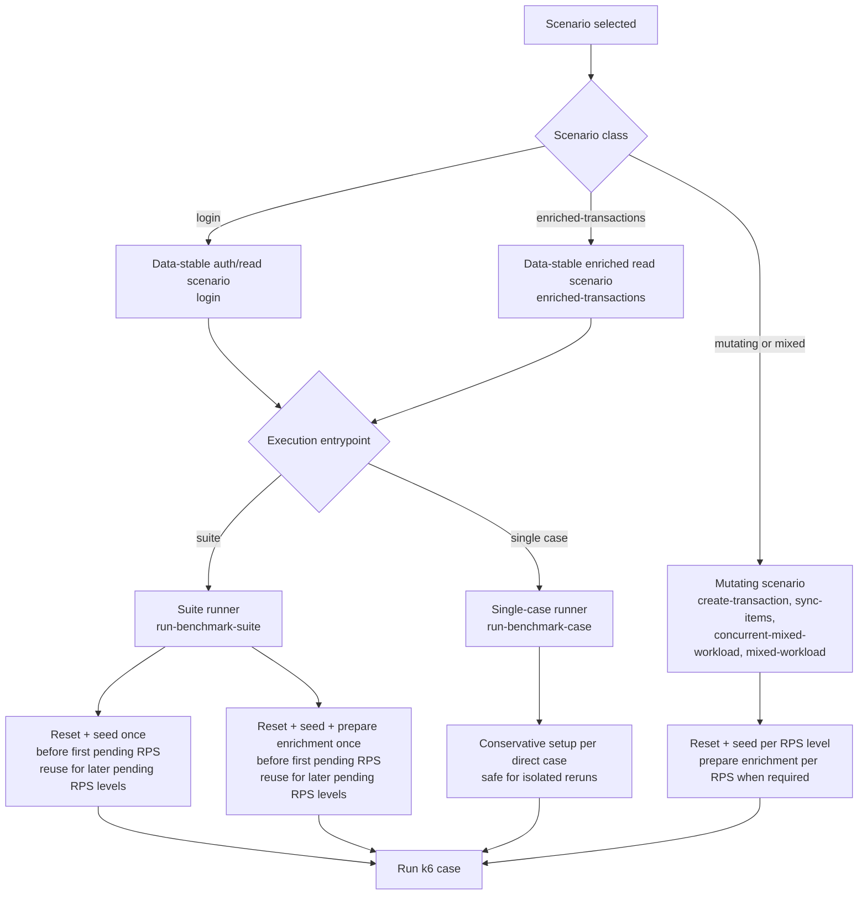

# Vultr Sequential Suite Lifecycle Diagram

This diagram is intended for the thesis methodology chapter and for operator
documentation. It describes the active Vultr sequential benchmark path at a
methodology level, not every shell helper in the implementation.

Sequential mode runs one architecture phase at a time on the same VKE cluster.
The runner uses S3 `result-status.json` markers as the resume source of truth,
then separates measured cases with `INTER_CASE_DELAY` and architecture phases
with `ARCHITECTURE_SWITCH_DELAY`.

```mermaid
flowchart TB
  start(["Operator starts suite<br/>make run-benchmark-suite"])
  dispatch["operator-dispatch.sh<br/>select Vultr sequential runner"]
  matrix["Build benchmark matrix<br/>SCENARIO_RPS_MATRIX or<br/>SCENARIOS + RPS_LEVELS"]
  preflight["Suite preflight<br/>validate env, S3 access,<br/>Kubernetes context, image tag"]
  manifest["Upload suite manifest<br/>s3://bucket/experiments/run_id/_suite/manifest.json"]

  archLoop{"Next architecture phase<br/>monolith or microservices"}
  pendingArch{"Any pending case<br/>missing result-status.json?"}
  skipArch["Skip architecture deploy<br/>all cases already exist in S3"]
  readyArch{"Live architecture already<br/>matches IMAGE_TAG and SCALING_MODE?"}
  deployArch["Deploy or redeploy architecture<br/>scale inactive namespace down<br/>monolith: always fixed overlay<br/>microservices: fixed or HPA overlay"]

  scenarioLoop{"Next scenario"}
  pendingScenario{"Any pending RPS<br/>for this scenario?"}
  setupScope{"Setup scope"}
  setupOnce["Run scenario setup once<br/>reset + seed<br/>prepare enrichment when required"]
  setupEach["Defer setup to each case<br/>mutating workload isolation"]
  reuseFlag["Pass SKIP_SCENARIO_DATA_SETUP=true<br/>to pending cases in this scenario"]

  rpsLoop{"Next target RPS"}
  s3Case{"Case result already<br/>exists in S3?"}
  skipCase["Skip measured run<br/>reuse stored result classification"]
  eta["Print ETA<br/>case, scenario, suite"]
  singleCase["Run sequential single-case runner"]
  caseSetup{"Case-level setup skipped?"}
  conservativeSetup["Run case setup<br/>reset + seed<br/>prepare enrichment when required"]
  k6["Create k6 Kubernetes job<br/>wait for completion"]
  upload["Upload attempt artifacts<br/>summary, raw, metadata,<br/>thresholds, result-status"]
  delay{"More cases in phase?"}
  interDelay["Sleep INTER_CASE_DELAY<br/>fixed: 120s, MSA HPA: 300s"]
  switchDelay["Sleep ARCHITECTURE_SWITCH_DELAY<br/>before next architecture"]
  summary["Upload suite summary<br/>_suite/summary.json"]
  done(["Suite complete"])

  start --> dispatch --> matrix --> preflight --> manifest --> archLoop
  archLoop --> pendingArch
  pendingArch -- "no" --> skipArch --> archLoop
  pendingArch -- "yes" --> readyArch
  readyArch -- "yes" --> scenarioLoop
  readyArch -- "no" --> deployArch --> scenarioLoop
  scenarioLoop --> pendingScenario
  pendingScenario -- "no" --> scenarioLoop
  pendingScenario -- "yes" --> setupScope
  setupScope -- "per_scenario<br/>login, enriched-transactions" --> setupOnce --> reuseFlag --> rpsLoop
  setupScope -- "per_case<br/>mutating scenarios" --> setupEach --> rpsLoop
  rpsLoop --> s3Case
  s3Case -- "yes" --> skipCase --> delay
  s3Case -- "no" --> eta --> singleCase --> caseSetup
  caseSetup -- "yes" --> k6
  caseSetup -- "no" --> conservativeSetup --> k6
  k6 --> upload --> delay
  delay -- "yes" --> interDelay --> rpsLoop
  delay -- "next scenario" --> scenarioLoop
  delay -- "next architecture" --> switchDelay --> archLoop
  archLoop -- "all phases done" --> summary --> done
```

## Data Setup Decision

The data setup policy balances repeatability and runtime efficiency. Mutating
scenarios must start each RPS level from a fresh deterministic dataset. Data
stable scenarios may reuse one prepared dataset across pending RPS levels inside
the same architecture phase because the workload does not consume or modify the
benchmark input dataset.

## Inter-Case Gap Components

The observed wall-clock gap between one completed k6 job and the next measured
load window is the sum of multiple orchestration steps. `INTER_CASE_DELAY` is
only one part of that gap.

| Component | Applies when | Purpose |
|---|---|---|
| Result inspection and classification | Every case | Read k6 exit status, thresholds, and upload result markers to S3. |
| S3 resume check | Before each candidate case | Skip cases with existing `result-status.json`. |
| Data reset/seed/setup | Mutating cases, and first pending case of reusable scenarios | Ensure deterministic starting data for the measured workload. |
| Kubernetes rollout/job startup | Every measured case, plus setup jobs when needed | Reconcile manifests, create k6 job, and wait for pods to start. |
| `INTER_CASE_DELAY` | Between cases inside one architecture phase | Let pods, PostgreSQL, HPA metrics, and Datadog telemetry stabilize. |
| `ARCHITECTURE_SWITCH_DELAY` | Between monolith and microservices phases | Separate Datadog windows and reduce cross-phase noise. |

For the final fixed-mode suite, the recommended `INTER_CASE_DELAY` is `120`
seconds. HPA runs use a longer delay, usually `300` seconds, because autoscaler
metrics and replica state need more time to settle.
