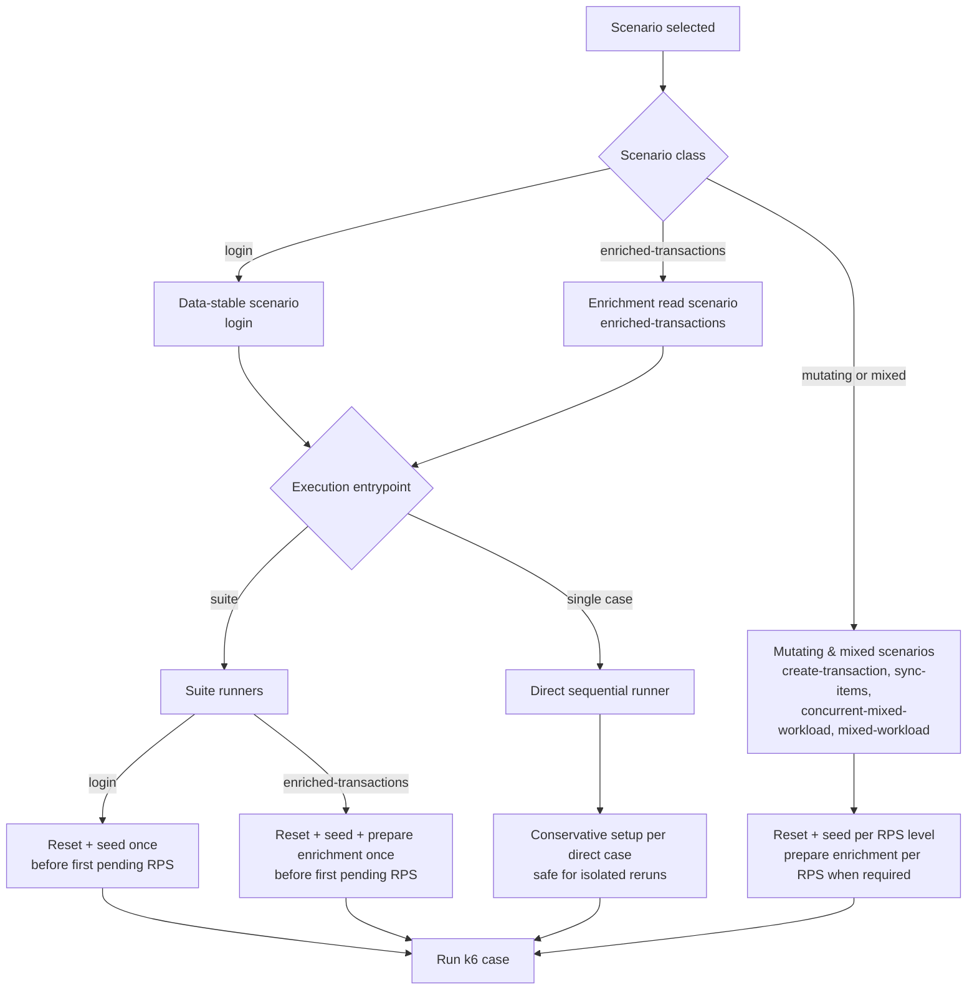

# Vultr Sequential Suite Lifecycles & Diagrams

This document describes the active Vultr sequential benchmark suite lifecycles. It is divided into separate sections for the two primary runner commands, detailing their individual lifecycle steps, Mermaid flowcharts, data setup rules, and recovery behaviors.

---

## 1. Dual-Architecture Sequential Suite (`make run-benchmark-suite`)

The dual-architecture sequential suite is the primary entry point for comparing the monolith and microservices architectures under equivalent fixed resource ceilings (`SCALING_MODE=fixed`). 

### 1.1 Mermaid Lifecycle Flowchart

```mermaid
flowchart TB
  start(["Operator starts fixed suite<br/>make run-benchmark-suite<br/>SCALING_MODE=fixed K6_PROFILE=steady|ramp-up"])
  dispatch["operator-dispatch.sh<br/>select sequential dual-arch suite runner"]
  matrix["Build benchmark matrix<br/>SCENARIO_RPS_MATRIX or<br/>SCENARIOS + RPS_LEVELS"]
  preflight["Suite preflight<br/>validate env, S3 access,<br/>Kubernetes context, image tag"]
  manifest["Upload suite manifest<br/>s3://bucket/experiments/run_id/_suite/manifest.json"]
  s3Cache["Warm up S3 result-status cache<br/>prime_case_result_status_cache"]

  archLoop{"Next architecture phase<br/>monolith or microservices"}
  pendingArch{"Any pending case<br/>missing result-status.json?"}
  skipArch["Skip architecture deploy<br/>all cases already exist in S3"]
  readyArch{"Live architecture already<br/>matches IMAGE_TAG and fixed suite baseline?"}
  deployArch["Deploy or redeploy architecture<br/>scale inactive namespace down<br/>monolith: fixed overlay<br/>microservices: fixed overlay"]

  scenarioLoop{"Next scenario"}
  pendingScenario{"Any pending RPS<br/>for this scenario?"}
  setupScope{"Setup scope"}
  setupOnce["Run scenario setup once<br/>reset + seed<br/>prepare enrichment when required"]
  setupEach["Defer setup to each case<br/>mutating workload isolation"]
  reuseFlag["Pass SKIP_SCENARIO_DATA_SETUP=true<br/>to pending cases in this scenario"]

  rpsLoop{"Next target RPS"}
  s3Case{"Case result already<br/>exists in S3?"}
  skipCase["Skip measured run<br/>reuse stored result classification"]
  checkNext{"Next step?<br/>(after skipped case)"}
  eta["Print ETA<br/>case, scenario, suite"]
  singleCase["Run sequential single-case runner"]
  casePreflight["Case preflight<br/>validate S3 & Kubernetes context"]
  caseSetup{"Case-level setup skipped?"}
  conservativeSetup["Run case setup<br/>reset + seed<br/>prepare enrichment when required"]
  k6["Create k6 Kubernetes job<br/>wait for completion"]
  upload["Upload attempt artifacts<br/>summary, raw, metadata,<br/>thresholds, result-status"]
  delay{"More cases in phase?<br/>(after measured run)"}
  interDelay["Sleep INTER_CASE_DELAY<br/>fixed suite: typically 120s"]
  switchDelay["Sleep ARCHITECTURE_SWITCH_DELAY<br/>before next architecture"]
  summary["Upload suite summary<br/>_suite/summary.json"]
  autoDestroy{"AUTO_DESTROY_CONFIRMED?"}
  destroy["Run terraform destroy target"]
  done(["Suite complete"])

  start --> dispatch --> matrix --> preflight --> manifest --> s3Cache --> archLoop
  archLoop --> pendingArch
  pendingArch -- "no" --> skipArch --> scenarioLoop
  pendingArch -- "yes" --> readyArch
  readyArch -- "yes" --> scenarioLoop
  readyArch -- "no" --> deployArch --> scenarioLoop
  scenarioLoop --> pendingScenario
  pendingScenario -- "no" --> rpsLoop
  pendingScenario -- "yes" --> setupScope
  setupScope -- "per_scenario<br/>login, enriched-transactions" --> setupOnce --> reuseFlag --> rpsLoop
  setupScope -- "per_case<br/>mutating scenarios" --> setupEach --> rpsLoop
  rpsLoop --> s3Case
  s3Case -- "yes" --> skipCase --> checkNext
  checkNext -- "next RPS" --> rpsLoop
  checkNext -- "next scenario" --> scenarioLoop
  checkNext -- "next architecture" --> archLoop
  s3Case -- "no" --> eta --> singleCase --> casePreflight --> caseSetup
  caseSetup -- "yes" --> k6
  caseSetup -- "no" --> conservativeSetup --> k6
  k6 --> upload --> delay
  delay -- "yes" --> interDelay --> rpsLoop
  delay -- "next scenario" --> scenarioLoop
  delay -- "next architecture" --> switchDelay --> archLoop
  archLoop -- "all phases done" --> summary --> autoDestroy
  autoDestroy -- "yes" --> destroy --> done
  autoDestroy -- "no" --> done
```



### 1.2 Step-by-Step Lifecycle Stages

1. **Dispatching, Bootstrapping & Cache Warmup**:
   - The operator starts the run using `make run-benchmark-suite`. The central dispatcher (`operator-dispatch.sh`) detects the sequential mode (`EXECUTION_MODE=sequential`) and routes execution to the sequential suite runner (`run-benchmark-suite-sequential.sh`).
   - The workload matrix is validated and parsed from `SCENARIO_RPS_MATRIX` (or falls back to `SCENARIOS` and `RPS_LEVELS`).
   - The runner renders provider Kubernetes manifests, synchronizes execution secrets, and uploads the suite manifest (`_suite/manifest.json`) to S3.
   - It warms the local S3 cache by executing `prime_case_result_status_cache`, which lists the S3 directory recursively once. This stores all completed run statuses in local shell memory to avoid slow on-demand S3 API round-trips.
2. **Architecture Phase Transitioning**:
   - The suite sequentially loops over architectures (`monolith` then `microservices`).
   - If an architecture has pending cases, it checks if the live cluster deployment (image tag, active HPAs, config checksums) already matches the target. If yes, it skips redeployment (`skip deploy`); if not, it scales down the inactive namespace and deploys the target configuration.
3. **Data Setup Policies (Read-Only vs. Mutating)**:
   - **Data-stable scenarios** (e.g., `login`): The database is reset and seeded **once per scenario**. Subsequent RPS levels run against this baseline.
     - *Deployment Optimization*: Because the deployment script (`deploy-sequential-architecture.sh`) already runs a complete reset and seed, the suite runner skips seeding for the very first scenario of a fresh deployment. If the first scenario requires enrichment (e.g., `enriched-transactions`), it runs only the enrichment script. For subsequent data-stable scenarios, it triggers a clean reset and seed before their first pending case.
   - **Mutating scenarios** (e.g., `create-transaction`, `sync-items`, `concurrent-mixed-workload`, `mixed-workload`): The runner resets and seeds the database **at every target RPS level** (before each case runs) to ensure balance depletion or inventory exhaustion does not skew results.
4. **Case Execution & Caching**:
   - Before executing any test case, the runner checks the local status cache.
   - If the case already exists in S3, it downloads `result-status.json` and `thresholds.json` directly, records the reused status, and continues instantly without delay or sleep.
   - If missing, it prints the case ETA and invokes the single-case runner (`run-benchmark-sequential.sh`). The single-case runner performs an active **case-level preflight check** (verifying Kubernetes context and S3 credentials), executes case-level data setup if required, launches the k6 Kubernetes job, waits for container completion, classifies results, uploads S3 artifacts, and updates the local S3 status cache.
5. **Phase Switching Cooldown**:
   - Between measured runs within the same architecture, the runner sleeps for `INTER_CASE_DELAY` (120 seconds). Skipped/reused runs do not trigger this delay.
   - When a phase completes, if the phase was active (meaning cases were run/pending) and it is not the last architecture, the runner sleeps for `ARCHITECTURE_SWITCH_DELAY` (300 seconds) before mendeploying the next architecture. This allows Datadog telemetry windows and DB connection pools to stabilize.
6. **Infrastructure Teardown**:
   - Once all architecture phases and scenarios are complete, the runner compiles the final suite summary (`summary.json`) and uploads it to S3.
   - If `AUTO_DESTROY_CONFIRMED` is set to `true`, the runner automatically calls the terraform destroy target to clean up sequential cluster resources and save costs.

### 1.3 Inter-Case Gap Components

The observed wall-clock gap between one completed k6 job and the next measured load window is the sum of multiple orchestration steps. `INTER_CASE_DELAY` is only one part of that gap.

| Component | Applies when | Purpose |
|---|---|---|
| Result inspection and classification | Every case | Read k6 exit status, thresholds, and upload result markers to S3. |
| S3 resume check | Before each candidate case | Skip cases with existing `result-status.json`. |
| Data reset/seed/setup | Mutating cases, and first pending case of reusable scenarios | Ensure deterministic starting data for the measured workload. |
| Kubernetes rollout/job startup | Every measured case, plus setup jobs when needed | Reconcile manifests, create k6 job, and wait for pods to start. |
| `INTER_CASE_DELAY` | Between cases inside one architecture phase | Let pods, PostgreSQL, HPA metrics, and Datadog telemetry stabilize. |
| `ARCHITECTURE_SWITCH_DELAY` | Between monolith and microservices phases | Separate Datadog windows and reduce cross-phase noise. |

For the final fixed-mode suite, the recommended `INTER_CASE_DELAY` is `120` seconds.

---

## 2. Single-Architecture Suite (`make run-benchmark-arch-suite`)

The single-architecture suite is a **derivative of the main sequential suite**. It is designed for focused analysis—most notably for Horizontal Pod Autoscaling (`SCALING_MODE=hpa`) on the microservices architecture, preventing the need to deploy and rerun the monolith fixed baseline.

### 2.1 Supplemental HPA Architecture Suite Diagram

The sequential dual-architecture suite is fixed-only. Supplemental HPA measurements that need many scenario/RPS combinations use the single-architecture suite so the primary fixed matrix stays separate from the autoscaling analysis and the monolith fixed baseline is not rerun.

```mermaid
flowchart TB
  startHpa(["Operator starts single-arch suite<br/>make run-benchmark-arch-suite<br/>ARCHITECTURE=microservices<br/>SCALING_MODE=hpa K6_PROFILE=ramp-up"])
  dispatchHpa["operator-dispatch.sh<br/>select sequential single-arch suite runner"]
  matrixHpa["Build benchmark matrix<br/>SCENARIO_RPS_MATRIX or<br/>SCENARIOS + RPS_LEVELS"]
  preflightHpa["Suite preflight<br/>validate env, S3 access,<br/>Kubernetes context, image tag"]
  manifestHpa["Upload suite manifest<br/>s3://bucket/experiments/run_id/_arch_suite/manifest.json"]
  s3CacheHpa["Warm up S3 result-status cache<br/>prime_case_result_status_cache"]

  pendingArchHpa{"Any pending case<br/>missing result-status.json?"}
  skipArchHpa["Skip architecture deploy<br/>all cases already exist in S3"]
  readyArchHpa{"Live architecture already<br/>matches IMAGE_TAG and scaling mode?"}
  deployArchHpa["Deploy or redeploy architecture once<br/>scale inactive namespace down<br/>apply architecture scaling overlay (fixed/hpa)"]

  scenarioLoopHpa{"Next scenario"}
  pendingScenarioHpa{"Any pending RPS<br/>for this scenario?"}
  setupScopeHpa{"Setup scope"}
  setupOnceHpa["Run scenario setup once<br/>reset + seed<br/>prepare enrichment when required"]
  setupEachHpa["Defer setup to each case<br/>mutating workload isolation"]
  reuseFlagHpa["Pass SKIP_SCENARIO_DATA_SETUP=true<br/>to pending cases in this scenario"]

  rpsLoopHpa{"Next target RPS"}
  s3CaseHpa{"Case result already<br/>exists in S3?"}
  skipCaseHpa["Skip measured run<br/>reuse stored result classification"]
  checkNextHpa{"Next step?<br/>(after skipped case)"}
  etaHpa["Print ETA<br/>case, scenario, suite"]
  singleCaseHpa["Run sequential single-case runner"]
  casePreflightHpa["Case preflight<br/>validate S3 & Kubernetes context"]
  caseSetupHpa{"Case-level setup skipped?"}
  conservativeSetupHpa["Run case setup<br/>reset + seed<br/>prepare enrichment when required"]
  k6Hpa["Create k6 Kubernetes job<br/>wait for completion"]
  uploadHpa["Upload attempt artifacts<br/>summary, raw, metadata,<br/>thresholds, result-status"]
  delayHpa{"More cases in suite?<br/>(after measured run)"}
  interDelayHpa["Sleep INTER_CASE_DELAY<br/>HPA suite: typically 300s"]
  summaryHpa["Upload suite summary<br/>_arch_suite/summary.json"]
  autoDestroyHpa{"AUTO_DESTROY_CONFIRMED?"}
  destroyHpa["Run terraform destroy target"]
  doneHpa(["Suite complete"])

  startHpa --> dispatchHpa --> matrixHpa --> preflightHpa --> manifestHpa --> s3CacheHpa --> pendingArchHpa
  pendingArchHpa -- "no" --> skipArchHpa --> scenarioLoopHpa
  pendingArchHpa -- "yes" --> readyArchHpa
  readyArchHpa -- "yes" --> scenarioLoopHpa
  readyArchHpa -- "no" --> deployArchHpa --> scenarioLoopHpa

  scenarioLoopHpa --> pendingScenarioHpa
  pendingScenarioHpa -- "no" --> rpsLoopHpa
  pendingScenarioHpa -- "yes" --> setupScopeHpa
  setupScopeHpa -- "per_scenario<br/>login, enriched-transactions" --> setupOnceHpa --> reuseFlagHpa --> rpsLoopHpa
  setupScopeHpa -- "per_case<br/>mutating scenarios" --> setupEachHpa --> rpsLoopHpa

  rpsLoopHpa --> s3CaseHpa
  s3CaseHpa -- "yes" --> skipCaseHpa --> checkNextHpa
  checkNextHpa -- "next RPS" --> rpsLoopHpa
  checkNextHpa -- "next scenario" --> scenarioLoopHpa
  checkNextHpa -- "done" --> summaryHpa
  s3CaseHpa -- "no" --> etaHpa --> singleCaseHpa --> casePreflightHpa --> caseSetupHpa
  caseSetupHpa -- "yes" --> k6Hpa
  caseSetupHpa -- "no" --> conservativeSetupHpa --> k6Hpa
  k6Hpa --> uploadHpa --> delayHpa

  delayHpa -- "yes" --> interDelayHpa --> rpsLoopHpa
  delayHpa -- "next scenario" --> scenarioLoopHpa
  delayHpa -- "done" --> summaryHpa
  summaryHpa --> autoDestroyHpa
  autoDestroyHpa -- "yes" --> destroyHpa --> doneHpa
  autoDestroyHpa -- "no" --> doneHpa
```



Recommended sequential supplemental HPA arch-suite example:

```bash
ARCHITECTURE=microservices \
SCALING_MODE=hpa \
EXPERIMENT_NAME=vultr-sequential-hpa-rq2 \
TEST_DURATION=5m \
INTER_CASE_DELAY=300 \
SCENARIO_RPS_MATRIX="login:100,250,500;create-transaction:100,250,500;enriched-transactions:100,250,500;concurrent-mixed-workload:100,250,500" \
make run-benchmark-arch-suite
```

### 2.2 Lifecycle Derivation & Differences

Because the single-architecture suite is a simplified derivative of the dual-architecture runner, it shares the same core mechanisms but differs in the following ways:

* **Single-Architecture Dispatching**:
  - The operator starts the run via `make run-benchmark-arch-suite`. The dispatcher (`operator-dispatch.sh`) validates inputs (e.g., rejecting unsupported HPA for monolith) and routes the execution to `run-benchmark-arch-suite.sh`.
* **No Architecture Switching**:
  - It does not loop over multiple architectures or scale down other namespaces. It deploys the selected architecture **once** at the start of the run and tears it down only when the operator manually runs the destroy commands.
  - There is no `ARCHITECTURE_SWITCH_DELAY` overhead.
* **Static Deployment Baseline**:
  - The single architecture remains active throughout all scenarios, which is critical for evaluating HPA scaling stabilization across multiple scenarios without breaking pod history.
* **HPA Scaling Cooldown Considerations**:
  - Under `SCALING_MODE=hpa`, **`INTER_CASE_DELAY` must be set to at least `300s` (5 minutes)**.
  - *Rationale*: Kubernetes HPA uses a default 5-minute stabilization window to scale down replicas after traffic subsides. A delay shorter than 300 seconds would start the next test while the pod replica count is still bloated from the previous run, corrupting the scalability metrics.

---

## 3. Scenario Data Setup Rules

The data setup policy balances reproducibility and execution speed across both runners:



### 3.1 Setup Class & Scope Classifications

The setup behaviors are dictated by two classifications defined in [sequential-benchmark-setup.sh](file:///mnt/Cons/Amikom/semester/Semester%207/Skrips/experimen/april/code/monolith-vs-microservice-thesis/scripts/lib/sequential-benchmark-setup.sh):

1. **Scenario Setup Class** (`scenario_setup_class`):
   - **`readonly`** (`login`): Performs a basic PostgreSQL data reset and seeds the baseline `benchmark` dataset.
   - **`mutating`** (`create-transaction`, `sync-items`): Also performs a basic PostgreSQL data reset and seeds the baseline `benchmark` dataset.
   - **`enrichment`** (`enriched-transactions`, `concurrent-mixed-workload`, `mixed-workload`): Performs a PostgreSQL reset and seed, followed by running an enrichment generation job to populate transaction history.
2. **Setup Reuse Scope** (`scenario_setup_reuse_scope`):
   - **`per_scenario`** (`login`, `enriched-transactions`): Data is stable during execution. The runner resets and seeds the database once before the first target RPS level, and subsequent cases reuse this baseline.
   - **`per_case`** (`create-transaction`, `sync-items`, `concurrent-mixed-workload`, `mixed-workload`): Data is modified during execution. To prevent database saturation or depletion from skewing subsequent tests, the runner performs a full database reset and seed before *every* target RPS level.

### 3.2 Runner Behaviors

* **Suite Runners (`make run-benchmark-suite` & `make run-benchmark-arch-suite`)**:
  - Automatically enforce the reuse scope. Data-stable scenarios run setup once and pass `SKIP_SCENARIO_DATA_SETUP=true` to subsequent cases. Mutating/mixed scenarios skip scenario-level setup and delegate it to the single-case runner to execute per case.
* **Direct Sequential Runner (`make run-benchmark-case` / `run-benchmark-sequential.sh`)**:
  - Always executes in a "conservative" mode. Since it is run in isolation, it always performs a full scenario-appropriate setup (reset+seed, plus enrichment when required) before the k6 workload starts, ensuring a clean and reproducible database state.

---

## 4. Fault Tolerance & Recovery Matrix

Both runners utilize the same resilience engine to handle infrastructure disruptions:

| Fault Type | Script Detection Mechanism | Automated Recovery / Mitigation | Recommended Operator Action |
|---|---|---|---|
| **Kubectl API Server Timeout** | Command exit code = 1 (e.g., TLS Handshake Timeout). | Retries the `kubectl` command automatically up to 10 times with a 3-second delay (via the robust `kubectl` wrapper function in `shared-env.sh`). | None. The script self-heals transient network hiccups. |
| **K6 Threshold Failure** | `thresholds.json` contains failed items. exit code = 0 (processed successfully but failed metrics). | Case is uploaded as complete with a `threshold_failed` status in `result-status.json`. The suite proceeds to the next case. | Allow the suite to complete. Review the S3 thresholds artifact and the Datadog logs to analyze resource exhaustion. |
| **K6 Job Crash / Pod Eviction** | K6 container exits with non-zero exit code. | Script flags the case as `runtime_failed` and records the failure in S3. | Resolve the underlying cluster issue (e.g., node resource constraints). Rerun the suite command using the **same `RUN_ID`**; the suite skips completed cases and retries the crashed one automatically. |
| **S3 Upload Interruption** | `s3 cp` command fails. | Script flags the case status as `missing` locally and does not mark it complete. | Check AWS credentials/Internet connectivity. Rerun the suite with the same `RUN_ID` to pick up immediately from the failed upload step. |
| **Bcrypt CPU Bottleneck (Login Overload)** | K6 report shows high p99 latency or `http_req_duration` threshold failures on `/api/v1/auth/login`. Datadog metrics show 100% CPU saturation. | The application's **Admission Limiter** limits concurrent bcrypt comparisons using a semaphore. Requests exceeding capacity queue or are rejected (returning `admission.ErrRejected`, mapped to **HTTP 503 Service Unavailable** via `apperror.ServiceUnavailable` in monolith, or gRPC `codes.ResourceExhausted` mapped to **HTTP 503** in microservices), protecting pods from CPU thrashing. | Expected architectural bottleneck under heavy load (Bab 4 analysis). Allow the test to complete. Analyze Datadog logs to confirm limiter operation and queue behaviors. |
| **Database Connection Pool Exhaustion** | Application logs show `driver: bad connection` or `conn pool exhausted`. K6 logs show HTTP 500 errors on transactional endpoints. | The application relies on configured `pgx` connection pool limits. Requests exceeding limits block waiting for a connection rather than crashing PostgreSQL. | Allow the test to complete. Check active session limits and pgx connection pool metrics in Datadog to verify saturation levels. |


---

## 5. S3 Artifact Schema & Datadog Time-Window Correlation

Every test case attempt produces the following structured artifacts in S3 under `s3://{bucket}/experiments/{run_id}/{architecture}/{scenario}/{rps}rps/{attempt}/`:

* **`result-status.json`**: Tracks metrics like `k6_exit_code` and `classification_hint` (`passed`, `threshold_failed`, `runtime_failed`).
* **`thresholds.json`**: An exact breakdown of k6 threshold achievements (e.g., `http_req_duration{p99} <= 1000ms`).
* **`datadog-time-window.json`**: Contains `started_at_utc` and `finished_at_utc` ISO timestamps.
  - *Datadog Correlation*: When query-mapping metrics (like CPU, memory, or thread pools) in Datadog for Bab 4 analysis, use these exact timestamps to isolate the 13-minute workload execution window and avoid averaging in setup and teardown overhead.
* **`summary.json`**: Standard aggregated k6 report.
* **`raw.json.gz`**: Gzipped raw metric log of all iterations.
* **`stdout.log`**: Console outputs from the k6-runner container.
