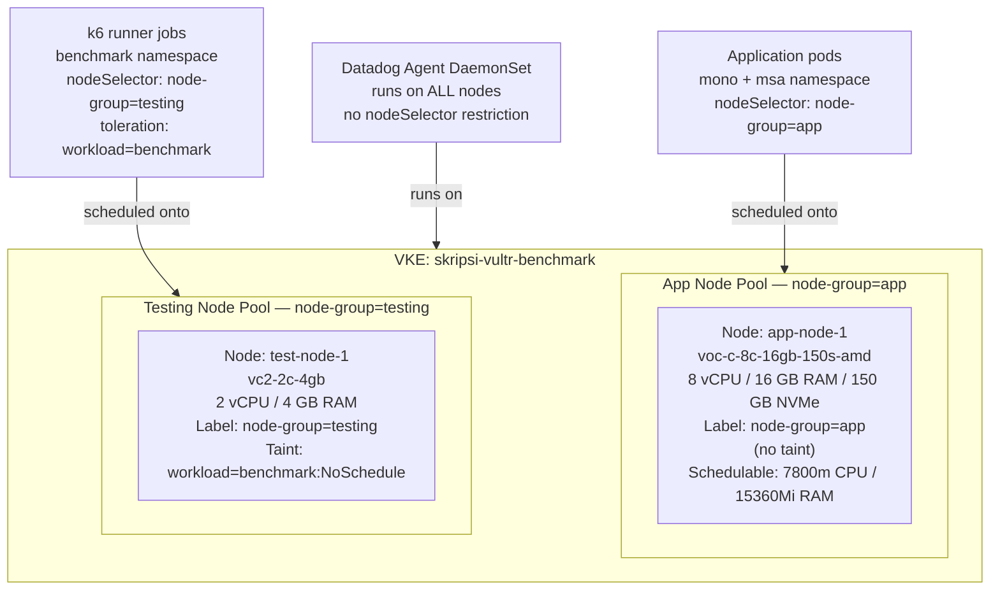
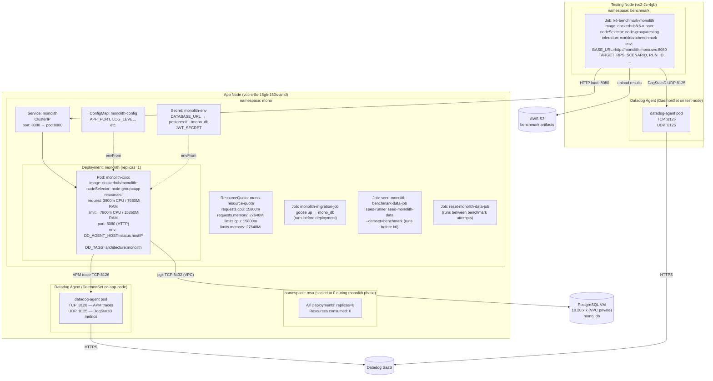
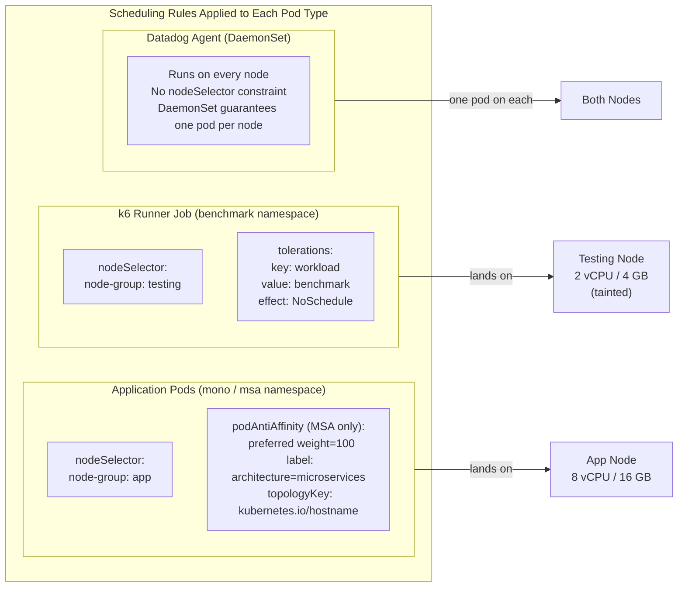
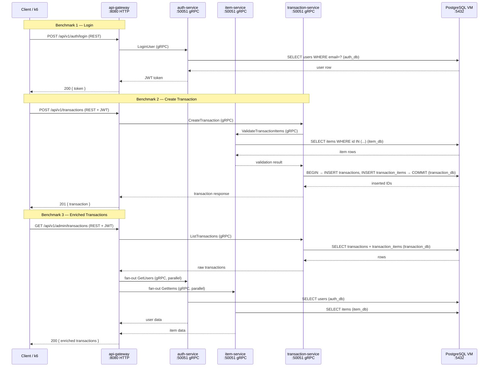
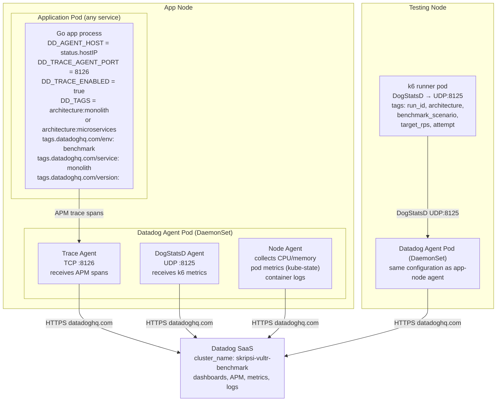
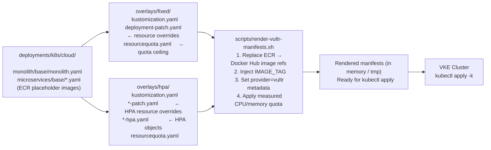

# Vultr VKE Internal Kubernetes Topology

This document describes the **internal Kubernetes architecture** of the Vultr
sequential deployment. It covers node pools, namespace layout, pod placement
rules, Kubernetes resource objects, and the Datadog APM telemetry path.

For the higher-level infrastructure view (VPC, Terraform stacks, PostgreSQL VM),
see `docs/diagrams/vultr-vke-topology.md` and
`docs/infrastructure/vultr-complete-architecture.md`.

---

## 1. Cluster Overview

Sequential mode uses a single VKE cluster with two node pools. Both benchmark
architectures share the same nodes — they are isolated at the namespace level,
not at the cluster level.

```text
VKE Cluster: skripsi-vultr-benchmark   (kubectl context: benchmark)
Region: mia
Kubernetes: v1.36.1+3

Node Pools:
  app-nodes      1 x voc-c-8c-16gb-150s-amd   8 vCPU  16 GB   Dedicated CPU
  testing-nodes  1 x vc2-2c-4gb               2 vCPU   4 GB   Shared CPU

Namespaces:
  mono       application workload — monolith phase
  msa        application workload — microservices phase
  benchmark  one-shot jobs (migration, seed, k6 runner)
  datadog    observability agent
```

---

## 2. Node Pool Layout



---

## 3. Namespace Layout — Full Internal Topology

### 3.1 Monolith Phase (namespace: mono active, namespace: msa scaled to 0)



### 3.2 Microservices Phase (namespace: msa active, namespace: mono scaled to 0)

```mermaid
flowchart TB
  subgraph app_node["App Node (voc-c-8c-16gb-150s-amd)"]

    subgraph mono_ns_inactive["namespace: mono (scaled to 0 during MSA phase)"]
      mono_zero["All Deployments: replicas=0
Resources consumed: 0"]
    end

    subgraph msa_ns["namespace: msa"]
      direction TB

      msa_rq["ResourceQuota: msa-resource-quota
requests.cpu: 15800m
requests.memory: 27648Mi
limits.cpu: 15800m
limits.memory: 27648Mi"]

      subgraph gw_deploy["Deployment: api-gateway (replicas=1)"]
        gw_pod["Pod: api-gateway-xxxx
port: 8080 (HTTP/REST → gRPC)
Anti-affinity: prefer spread
resources (fixed):
  request: 980m CPU / 1920Mi
  limit:  1950m CPU / 3840Mi
resources (hpa):
  request: 500m CPU / 960Mi
  limit:   975m CPU / 1920Mi"]
      end
      gw_svc["Service: api-gateway
ClusterIP :8080"]

      subgraph auth_deploy["Deployment: auth-service (replicas=1)"]
        auth_pod["Pod: auth-service-xxxx
port: 50051 (gRPC)
Anti-affinity: prefer spread
resources (fixed):
  request: 980m CPU / 1920Mi
  limit:  1950m CPU / 3840Mi
resources (hpa):
  request: 500m CPU / 960Mi
  limit:   975m CPU / 1920Mi"]
      end
      auth_svc["Service: auth-service
ClusterIP :50051"]
      auth_svc_hl["Service: auth-service-headless
clusterIP: None :50051"]

      subgraph item_deploy["Deployment: item-service (replicas=1)"]
        item_pod["Pod: item-service-xxxx
port: 50051 (gRPC)
Anti-affinity: prefer spread
resources (fixed):
  request: 980m CPU / 1920Mi
  limit:  1950m CPU / 3840Mi"]
      end
      item_svc["Service: item-service
ClusterIP :50051"]
      item_svc_hl["Service: item-service-headless
clusterIP: None :50051"]

      subgraph tx_deploy["Deployment: transaction-service (replicas=1)"]
        tx_pod["Pod: transaction-service-xxxx
port: 50051 (gRPC)
Anti-affinity: prefer spread
resources (fixed):
  request: 980m CPU / 1920Mi
  limit:  1950m CPU / 3840Mi"]
      end
      tx_svc["Service: transaction-service
ClusterIP :50051"]
      tx_svc_hl["Service: transaction-service-headless
clusterIP: None :50051"]

      msa_auth_mig["Job: auth-migration-job → auth_db"]
      msa_item_mig["Job: item-migration-job → item_db"]
      msa_tx_mig["Job: transaction-migration-job → transaction_db"]
      msa_seed["Job: seed-microservices-benchmark-data-job"]
    end

    subgraph dd_on_app["Datadog Agent (DaemonSet)"]
      dd_app_agent["datadog-agent
TCP :8126 / UDP :8125"]
    end

  end

  subgraph test_node["Testing Node (vc2-2c-4gb)"]
    subgraph bench_ns["namespace: benchmark"]
      k6_job["Job: k6-benchmark-microservices
BASE_URL=http://api-gateway.msa.svc:8080"]
    end
    subgraph dd_on_test["Datadog Agent (DaemonSet)"]
      dd_test_agent["datadog-agent"]
    end
  end

  pg_vm[("PostgreSQL VM
10.20.x.x (VPC private)
auth_db / item_db / transaction_db")]

  s3[("AWS S3")]
  dd_saas[("Datadog SaaS")]

  k6_job -->|"HTTP REST :8080"| gw_svc
  gw_svc --> gw_pod
  gw_pod -->|"gRPC :50051"| auth_svc
  gw_pod -->|"gRPC :50051"| item_svc
  gw_pod -->|"gRPC :50051"| tx_svc
  tx_pod -->|"gRPC validate items :50051"| item_svc

  auth_pod -->|"pgx → auth_db"| pg_vm
  item_pod -->|"pgx → item_db"| pg_vm
  tx_pod   -->|"pgx → transaction_db"| pg_vm

  gw_pod   -->|"APM TCP:8126"| dd_app_agent
  auth_pod -->|"APM TCP:8126"| dd_app_agent
  item_pod -->|"APM TCP:8126"| dd_app_agent
  tx_pod   -->|"APM TCP:8126"| dd_app_agent
  k6_job   -->|"DogStatsD UDP:8125"| dd_test_agent
  k6_job   -->|"upload results"| s3
  dd_app_agent -->|"HTTPS"| dd_saas
  dd_test_agent -->|"HTTPS"| dd_saas
```



---

## 4. Pod Scheduling Rules



---

## 5. Resource Allocation Per Scaling Mode

### 5.1 Fixed Mode (SCALING_MODE=fixed)

```text
namespace: mono
┌─────────────────────────────────────────────────────────────────┐
│ Deployment: monolith (1 pod)                                    │
│   request: 3900m CPU  / 7680Mi RAM                              │
│   limit:   7800m CPU  / 15360Mi RAM                             │
│                                                                  │
│ ResourceQuota (ceiling):                                         │
│   requests.cpu: 15800m  limits.cpu: 15800m                      │
│   requests.mem: 27648Mi limits.mem: 27648Mi                     │
└─────────────────────────────────────────────────────────────────┘

namespace: msa
┌─────────────────────────────────────────────────────────────────┐
│ Deployment: api-gateway     (1 pod)                             │
│   request: 980m CPU  / 1920Mi RAM                               │
│   limit:  1950m CPU  / 3840Mi RAM                               │
│                                                                  │
│ Deployment: auth-service    (1 pod)                             │
│   request: 980m CPU  / 1920Mi RAM                               │
│   limit:  1950m CPU  / 3840Mi RAM                               │
│                                                                  │
│ Deployment: item-service    (1 pod)                             │
│   request: 980m CPU  / 1920Mi RAM                               │
│   limit:  1950m CPU  / 3840Mi RAM                               │
│                                                                  │
│ Deployment: transaction-service (1 pod)                         │
│   request: 980m CPU  / 1920Mi RAM                               │
│   limit:  1950m CPU  / 3840Mi RAM                               │
│                                                                  │
│ Total used: 3920m CPU req / 7680Mi RAM req                      │
│             7800m CPU lim / 15360Mi RAM lim                     │
│                                                                  │
│ ResourceQuota (ceiling):                                         │
│   requests.cpu: 15800m  limits.cpu: 15800m                      │
│   requests.mem: 27648Mi limits.mem: 27648Mi                     │
└─────────────────────────────────────────────────────────────────┘

Fairness: monolith limit == msa total limit (7800m CPU / 15360Mi RAM)
```

### 5.2 HPA Mode (SCALING_MODE=hpa)

```text
namespace: mono (fixed baseline — HPA disabled for monolith)
┌─────────────────────────────────────────────────────────────────┐
│ Deployment: monolith (1 pod, no HPA)                            │
│   request: 3900m CPU  / 7680Mi RAM                              │
│   limit:   7800m CPU  / 15360Mi RAM                             │
└─────────────────────────────────────────────────────────────────┘

namespace: msa (HPA enabled per service)
┌─────────────────────────────────────────────────────────────────┐
│ Deployment: api-gateway                                         │
│   HPA: min=1 max=5 target=40% CPU                               │
│   scaleDown stabilizationWindowSeconds: 60                      │
│   per-pod request: 500m CPU / 960Mi RAM                         │
│   per-pod limit:   975m CPU / 1920Mi RAM                        │
│                                                                  │
│ Deployment: auth-service                                        │
│   HPA: min=1 max=5 target=40% CPU                               │
│   scaleDown stabilizationWindowSeconds: 60                      │
│   per-pod request: 500m CPU / 960Mi RAM                         │
│   per-pod limit:   975m CPU / 1920Mi RAM                        │
│                                                                  │
│ Deployment: item-service                                        │
│   HPA: min=1 max=5 target=40% CPU                               │
│   scaleDown stabilizationWindowSeconds: 60                      │
│   per-pod request: 500m CPU / 960Mi RAM                         │
│   per-pod limit:   975m CPU / 1920Mi RAM                        │
│                                                                  │
│ Deployment: transaction-service                                 │
│   HPA: min=1 max=5 target=40% CPU                               │
│   scaleDown stabilizationWindowSeconds: 60                      │
│   per-pod request: 500m CPU / 960Mi RAM                         │
│   per-pod limit:   975m CPU / 1920Mi RAM                        │
│                                                                  │
│ Baseline (4 pods × 500m CPU): 2000m CPU request                 │
│ At full scale (20 pods × 975m CPU): ~19500m CPU limit           │
│ Namespace quota ceiling acts as hard stop                       │
└─────────────────────────────────────────────────────────────────┘
```

---

## 6. Internal Service Communication



---

## 7. Datadog APM Telemetry Path



**Correlation tags used in Datadog:**

| Tag | Source | Used for |
|---|---|---|
| `cluster_name` | Helm values (`clusterName`) | Identify cluster in Datadog |
| `architecture` | Pod label + `DD_TAGS` | Filter monolith vs microservices |
| `env` | Pod label `tags.datadoghq.com/env` | APM environment filter |
| `service` | Pod label `tags.datadoghq.com/service` | Per-service APM view |
| `version` | Pod label `tags.datadoghq.com/version` | Image tag traceability |
| `run_id` | k6 CLI tags | Correlate S3 artifacts with Datadog windows |
| `benchmark_scenario` | k6 CLI tags | Per-scenario analysis |
| `target_rps` | k6 CLI tags | Per-RPS analysis |
| `attempt` | k6 CLI tags | Multi-attempt comparison |

---

## 8. Kubernetes Object Inventory (Sequential Cluster)

| Kind | Name | Namespace | Purpose |
|---|---|---|---|
| `Deployment` | `monolith` | `mono` | Monolith application |
| `Service` | `monolith` | `mono` | ClusterIP :8080 |
| `ResourceQuota` | `mono-resource-quota` | `mono` | CPU/memory ceiling |
| `ConfigMap` | `monolith-config` | `mono` | App environment config |
| `Secret` | `monolith-env` | `mono` | DATABASE_URL, JWT_SECRET |
| `Job` | `monolith-migration-job` | `mono` | Goose up → mono_db |
| `Job` | `seed-monolith-benchmark-data-job` | `mono` | Insert benchmark dataset |
| `Job` | `reset-monolith-data-job` | `mono` | Reset between attempts |
| `Deployment` | `api-gateway` | `msa` | REST → gRPC proxy |
| `Deployment` | `auth-service` | `msa` | User auth + JWT |
| `Deployment` | `item-service` | `msa` | Item CRUD + validation |
| `Deployment` | `transaction-service` | `msa` | Transaction write/read |
| `Service` | `api-gateway` | `msa` | ClusterIP :8080 |
| `Service` | `auth-service` | `msa` | ClusterIP :50051 |
| `Service` | `auth-service-headless` | `msa` | Headless :50051 |
| `Service` | `item-service` | `msa` | ClusterIP :50051 |
| `Service` | `item-service-headless` | `msa` | Headless :50051 |
| `Service` | `transaction-service` | `msa` | ClusterIP :50051 |
| `Service` | `transaction-service-headless` | `msa` | Headless :50051 |
| `ResourceQuota` | `msa-resource-quota` | `msa` | CPU/memory ceiling |
| `HPA` | `api-gateway` | `msa` | HPA mode only — min=1 max=5 |
| `HPA` | `auth-service` | `msa` | HPA mode only — min=1 max=5 |
| `HPA` | `item-service` | `msa` | HPA mode only — min=1 max=5 |
| `HPA` | `transaction-service` | `msa` | HPA mode only — min=1 max=5 |
| `Job` | `auth-migration-job` | `msa` | Goose up → auth_db |
| `Job` | `item-migration-job` | `msa` | Goose up → item_db |
| `Job` | `transaction-migration-job` | `msa` | Goose up → transaction_db |
| `Job` | `seed-microservices-benchmark-data-job` | `msa` | Insert benchmark dataset |
| `Job` | `reset-microservices-data-job` | `msa` | Reset between attempts |
| `Job` | `k6-benchmark-*` | `benchmark` | k6 load runner |
| `DaemonSet` | `datadog-agent` | `datadog` | Observability on all nodes |

---

## 9. Manifest Rendering Pipeline

Base manifests use placeholder image names (`REPLACE_WITH_*_ECR_IMAGE`).
The `render-vultr-manifests.sh` script patches them before applying:



---

## 10. Sequential Phase Transition

```mermaid
stateDiagram-v2
  [*] --> ClusterReady: terraform apply vultr-sequential

  ClusterReady --> MonolithPhase: kubectl apply migration-job\nseed-job\nmonolith deployment

  state MonolithPhase {
    [*] --> MigrationRunning
    MigrationRunning --> MigrationDone: goose up mono_db
    MigrationDone --> SeedRunning
    SeedRunning --> SeedDone: benchmark dataset inserted
    SeedDone --> BenchmarkRunning
    BenchmarkRunning --> BenchmarkDone: all scenarios + RPS cases
    BenchmarkDone --> ArtifactsUploaded: S3 upload
  }

  MonolithPhase --> SwitchDelay: scale monolith to 0\nARCHITECTURE_SWITCH_DELAY (300s)

  SwitchDelay --> MsaPhase: kubectl apply migration-jobs (×3)\nseed-job\nMSA deployments

  state MsaPhase {
    [*] --> MsaMigrationsRunning
    MsaMigrationsRunning --> MsaMigrationsDone: goose up auth_db, item_db, transaction_db
    MsaMigrationsDone --> MsaSeedRunning
    MsaSeedRunning --> MsaSeedDone: benchmark dataset inserted
    MsaSeedDone --> MsaBenchmarkRunning
    MsaBenchmarkRunning --> MsaBenchmarkDone: all scenarios + RPS cases
    MsaBenchmarkDone --> MsaArtifactsUploaded: S3 upload
  }

  MsaPhase --> Teardown: S3_BENCHMARK_DATA_VERIFIED=true

  Teardown --> [*]: terraform destroy
```


