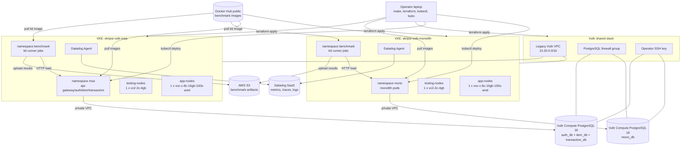
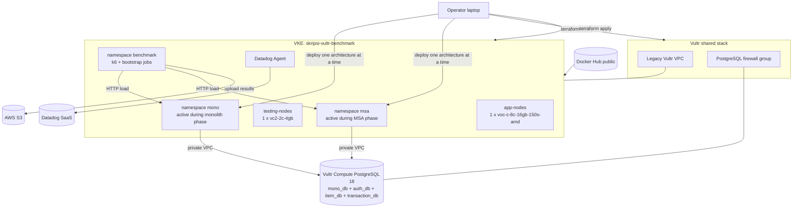
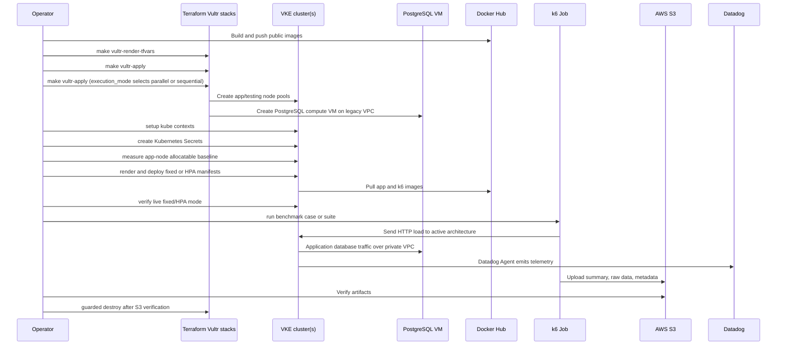

# Vultr VKE Topology

These diagrams describe the Vultr Kubernetes Engine infrastructure path for the
thesis benchmark.

## Parallel Benchmark Topology

## Sequential Fallback Topology

## End-to-End Execution Flow

