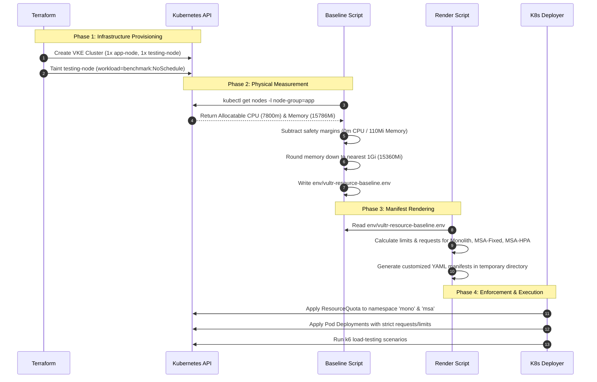

# Unified Resource Lifecycle and Mapping Guide (Vultr VKE Sequential)

This document provides a single, coherent source of truth for how the physical capacity of the cluster node pool translates into Kubernetes resource limits and quotas, ensuring experimental fairness and correctness for both Monolith and Microservices architectures.

---

## 1. Core Concepts & Definitions

To understand the resource allocation model, we must distinguish between three distinct resource layers:

```text
+------------------------------------------------------------+
| 1. RESOURCE BASELINE (Physical Node Capacity)              |
|    - Actual Allocatable CPU/Memory on app-nodes.           |
|    - Measured dynamically via Kubernetes API.              |
+-----------------------------+------------------------------+
                              |
                              v (Subtract Safety Margin & Round)
+-----------------------------+------------------------------+
| 2. RESOURCE QUOTA (Namespace Hard Fence)                   |
|    - Enforced via ResourceQuota objects in K8s.            |
|    - Equal for both architectures (mono & msa).            |
+-----------------------------+------------------------------+
                              |
                              v (Divide & Allocate per Pod)
+-----------------------------+------------------------------+
| 3. RESOURCE LIMITS & REQUESTS (Pod-level settings)         |
|    - Monolith: Gets 100% of namespace quota.               |
|    - MSA Fixed: Gets 25% per service (Equal-Split).        |
|    - MSA HPA: Base 12.5% per pod + Shared Headroom burst.  |
+------------------------------------------------------------+
```

1. **Resource Baseline:** The physical capacity of the hardware dedicated to target workloads. It is defined as the aggregate **Allocatable** resources of the node group labeled `node-group=app`, minus a stability safety margin, rounded down to clean mathematical segments.
2. **Resource Quota:** A logical Kubernetes policy (`ResourceQuota` object) applied to the namespaces (`mono` and `msa`). It establishes a hard ceiling preventing pods inside the namespace from collectively requesting or limiting more resources than the physical baseline.
3. **Resource Limits & Requests:** The fine-grained CPU and Memory bounds configured on the individual container/pod definitions.

---

## 2. Resource Lifecycle & Rendering Flow

This Mermaid diagram shows how the system progresses from provisioning nodes to enforcing resource constraints in live benchmarks:



---

## 3. Node Slices & Allocation Architecture

The following ASCII diagram illustrates how a single 8 vCPU / 16 GB physical node maps its resources to the virtual boundaries.

```text
========================================================================================
                                PHYSICAL NODE: APP-NODE
========================================================================================
[  System Overhead (200m CPU / 426Mi Mem) - Reserved for OS, Kubelet, Daemonsets, etc. ]
----------------------------------------------------------------------------------------
[                     ALLOCATABLE CAPACITY: 7800m CPU / 15786Mi Memory                 ]
========================================================================================
                                           │
                                           │ (Minus 110Mi Memory Safety Margin)
                                           ▼
========================================================================================
                        FINAL SHARED CEILING / RESOURCE QUOTA
                              7800m CPU / 15360Mi Memory
========================================================================================
          │                                                │
          ▼ (MONOLITH NAMESPACE)                           ▼ (MICROSERVICES NAMESPACE)
┌──────────────────────────────────┐             ┌──────────────────────────────────┐
│ mono-resource-quota              │             │ msa-resource-quota               │
│ CPU Limit: 7800m                 │             │ CPU Limit: 7800m                 │
│ Memory Limit: 15360Mi            │             │ Memory Limit: 15360Mi            │
└────────────────┬─────────────────┘             └────────────────┬─────────────────┘
                 │                                                │
                 ▼                                                ├─► api-gateway pod:
┌──────────────────────────────────┐                              │   limit: 1950m CPU / 3840Mi Mem
│ monolith pod:                    │                              │
│ limit: 7800m CPU / 15360Mi Mem   │                              ├─► auth-service pod:
│ req:   3900m CPU / 7680Mi Mem    │                              │   limit: 1950m CPU / 3840Mi Mem
└──────────────────────────────────┘                              │
                                                                  ├─► item-service pod:
                                                                  │   limit: 1950m CPU / 3840Mi Mem
                                                                  │
                                                                  └─► transaction-service pod:
                                                                      limit: 1950m CPU / 3840Mi Mem
========================================================================================
```

---

## 4. Comprehensive Mapping Matrix

This table summarizes the precise configuration values applied in the current Vultr VKE sequential implementation, resolving discrepancies between base source code placeholders and the final rendered values:

| Architecture | Scaling Mode | Component | Replicas | CPU Request (Per Pod) | CPU Limit (Per Pod) | Memory Request (Per Pod) | Memory Limit (Per Pod) | HPA Configuration |
| :--- | :--- | :--- | :---: | :---: | :---: | :---: | :---: | :--- |
| **Monolith** | `fixed` & `hpa` | `monolith` | 1 | `3900m` | `7800m` | `7680Mi` | `15360Mi` | *HPA Disabled* |
| **Microservices** | `fixed` | `api-gateway` | 1 | `975m`[^1] | `1950m` | `1920Mi` | `3840Mi` | *HPA Disabled* |
| | | `auth-service` | 1 | `975m`[^1] | `1950m` | `1920Mi` | `3840Mi` | *HPA Disabled* |
| | | `item-service` | 1 | `975m`[^1] | `1950m` | `1920Mi` | `3840Mi` | *HPA Disabled* |
| | | `transaction-service` | 1 | `975m`[^1] | `1950m` | `1920Mi` | `3840Mi` | *HPA Disabled* |
| **Microservices** | `hpa` | `api-gateway` | 1 - 5 | `500m` | `975m` | `960Mi` | `1920Mi` | Target CPU: `40%`[^2] |
| | | `auth-service` | 1 - 5 | `500m` | `975m` | `960Mi` | `1920Mi` | Target CPU: `40%`[^2] |
| | | `item-service` | 1 - 5 | `500m` | `975m` | `960Mi` | `1920Mi` | Target CPU: `40%`[^2] |
| | | `transaction-service` | 1 - 5 | `500m` | `975m` | `960Mi` | `1920Mi` | Target CPU: `40%`[^2] |

[^1]: **CPU Request Resolution**: The source placeholders in `deployments/` hardcode `980m` as the CPU request. However, during manifest compilation, the script `render-vultr-manifests.sh` overwrites this with `975m` (exactly 50% of the `1950m` limit) to maintain mathematical symmetry.
[^2]: **HPA Target CPU Resolution**: Some documentation files historically list `50%` target utilization for HPA. The active Vultr VKE runtime implementation enforces a strict target of **`40%`** CPU utilization to ensure responsive scaling under ramping arrival rates.

---

## 5. Summary of Sequential Execution Integration

The script [run-benchmark-suite-sequential.sh](file:///mnt/Cons/Amikom/semester/Semester%207/Skrips/experimen/april/code/monolith-vs-microservice-thesis/scripts/run-benchmark-suite-sequential.sh) handles the end-to-end execution lifecycle in the following sequence:

1. **Verify Baseline existence:** Ensures `env/vultr-resource-baseline.env` is populated.
2. **Compile Rendered Manifests:** Runs the manifest renderer which injects the quota ceilings and dynamic replica templates.
3. **Execute Monolith Cycle:** Deploys monolith $\rightarrow$ executes all k6 test scenarios $\rightarrow$ collects metrics and saves them to AWS S3 $\rightarrow$ scales deployment down to 0 replicas.
4. **Enforce Cooldown (300s):** Delays execution to clear active connection tracking and flush Datadog metric windows.
5. **Execute Microservices Cycle:** Deploys gateway and all 4 services $\rightarrow$ executes k6 tests $\rightarrow$ uploads data $\rightarrow$ teardown cluster.

