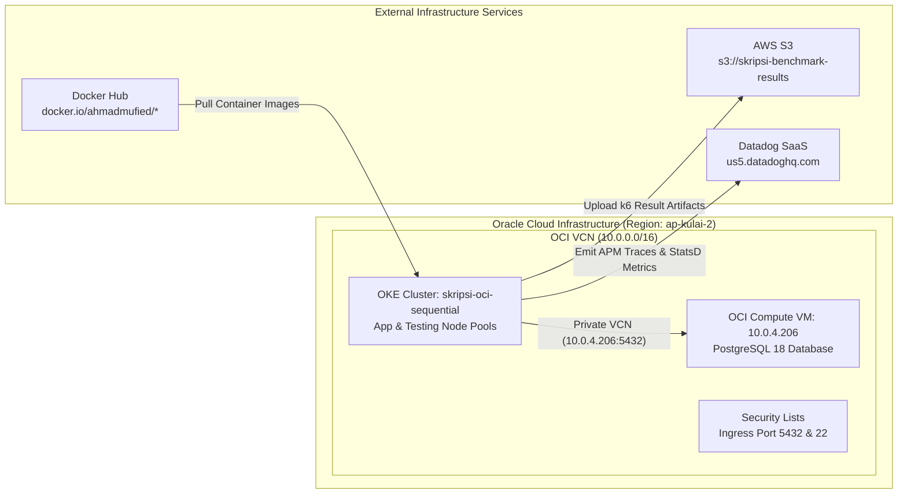
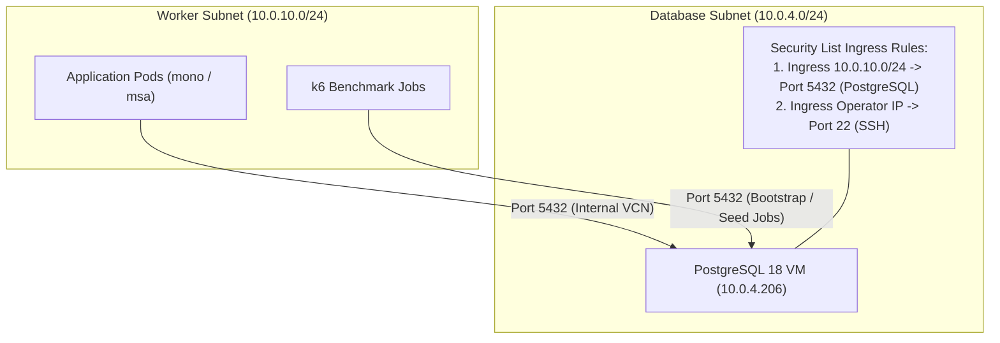
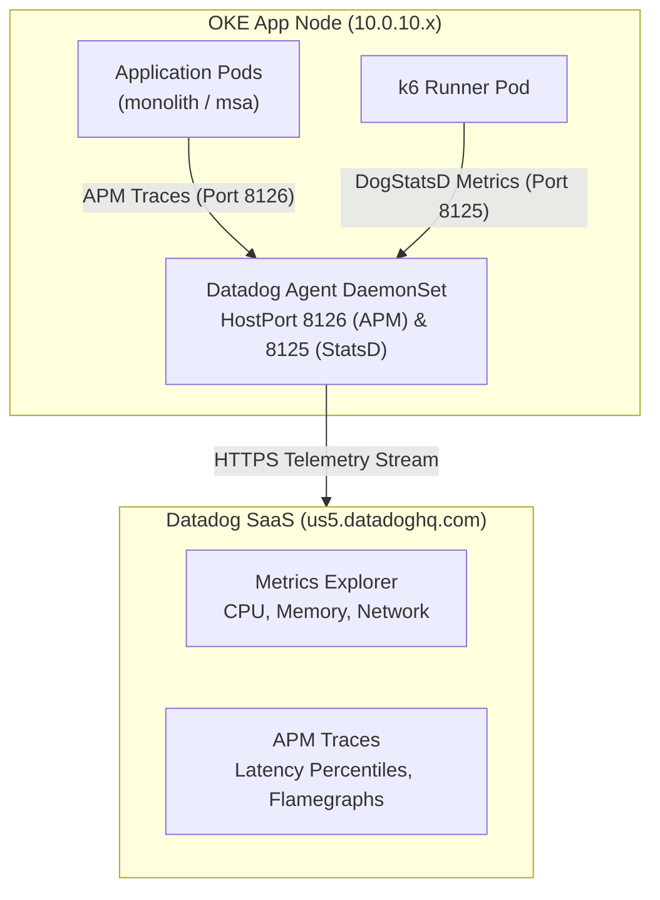

# Oracle Cloud Infrastructure (OCI / OKE) Architecture — Complete Reference

## 1. Purpose

This document provides the complete end-to-end architecture reference for the
Oracle Cloud Infrastructure (OCI / OKE) benchmark infrastructure used in this thesis. It is written as the authoritative infrastructure documentation for OCI deployment, complementing the AWS EKS and Vultr VKE architecture references.

The research compares monolithic and microservices architectures in a cloud-native environment under equivalent resource ceilings. The OCI infrastructure is designed for execution in **Sequential Mode** to strictly respect OCI Free Tier resource constraints (such as block storage limits and per-instance OCPU caps) while guaranteeing identical workload execution, metric collection, and experimental validity.

---

## 2. Why OCI & Execution Mode Selection

The thesis benchmark supports multiple cloud execution targets (AWS EKS, Vultr VKE, and Oracle Cloud OKE). The OCI implementation operates under the following design considerations:

| Architectural Factor | AWS EKS (Reference Plan) | Vultr VKE (Active Plan) | OCI OKE (Active Implementation) | Rationale |
|---|---|---|---|---|
| **Kubernetes Engine** | Amazon EKS | Vultr Kubernetes Engine | Oracle Container Engine for K8s (OKE) | Managed K8s control plane |
| **Execution Mode** | Parallel / Sequential | Parallel / Sequential | **Sequential Only (`skripsi-oci-sequential`)** | Strictly respects 200 GB block storage & OCPU limits |
| **App Node VM** | `c8i.2xlarge` | `voc-c-8c-16gb-150s-amd` | `VM.Standard.E5.Flex` (4 OCPUs / 8 vCPUs / 16 GB) | Dedicated CPU allocation per active workload |
| **Database Instance** | Amazon RDS PostgreSQL | Vultr Compute VM | OCI Compute VM (`VM.Standard.E5.Flex`, 2 OCPUs / 8 GB) | Dedicated PostgreSQL 18 with private VCN IP |
| **Testing Node (k6)** | Dedicated EC2 Node | Dedicated VKE Node | Dedicated OKE Node (`VM.Standard.E5.Flex`, 4 OCPUs / 8 vCPUs / 16 GB) | Tainted node (`workload=benchmark:NoSchedule`) |
| **Container Registry** | Amazon ECR | Docker Hub Public | Docker Hub Public (`docker.io/ahmadmufied/*`) | Centralized public image registry |
| **Result Storage** | AWS S3 | AWS S3 | AWS S3 (`s3://skripsi-benchmark-results`) | Unified multi-cloud S3 result repository |
| **Observability** | Datadog SaaS | Datadog SaaS | Datadog SaaS (`us5.datadoghq.com`) | Unified APM, DogStatsD, and system metrics |

---

## 3. Infrastructure Component Mapping

This table details the allocation of OCI cloud resources and their mapping to external benchmark services:

| Component | Provider | Resource / Service | Configuration & Details |
|---|---|---|---|
| **Kubernetes Cluster** | **Oracle Cloud (OCI)** | OKE (`skripsi-oci-sequential`) | Managed OKE Cluster, K8s v1.36.0, single-region deployment |
| **App Node Pool** | **Oracle Cloud (OCI)** | Node Pool (`app-nodes`) | 1 x `VM.Standard.E5.Flex` (4 OCPUs / 8 vCPUs / 16 GB RAM) |
| **Testing Node Pool** | **Oracle Cloud (OCI)** | Node Pool (`testing-nodes`) | 1 x `VM.Standard.E5.Flex` (4 OCPUs / 8 vCPUs / 16 GB RAM), Tainted |
| **PostgreSQL Database** | **Oracle Cloud (OCI)** | OCI Compute VM (Dedicated) | 1 x `VM.Standard.E5.Flex` (2 OCPUs / 4 vCPUs / 8 GB RAM, PG 18) |
| **Virtual Cloud Network** | **Oracle Cloud (OCI)** | OCI VCN (`10.0.0.0/16`) | Subnets: API (`10.0.0.0/28`), Worker (`10.0.10.0/24`), DB (`10.0.4.0/24`) |
| **Firewall & Security** | **Oracle Cloud (OCI)** | OCI Security Lists | Port 5432 (Internal VCN ingress), Port 22 (SSH Ingress) |
| **Container Registry** | **Docker Hub** | Public Registry | `ahmadmufied/{monolith,api-gateway,auth-service,item-service,transaction-service,seed-runner,k6-runner}` |
| **Benchmark Artifacts** | **AWS S3** | `s3://skripsi-benchmark-results` | Stores `summary.json`, `raw.json.gz`, `metadata.json`, `result-status.json` |
| **Observability** | **Datadog SaaS** | Datadog Agent DaemonSet | Site `us5.datadoghq.com`, APM tracing (port 8126) & StatsD (port 8125) |
| **IaC Provisioning** | **Terraform** | Stack `infra/terraform/oci` | Provider `oracle/oci ~> 6.0` |



---

## 4. Cloud Architecture Overview & Compute Specifications

### 4.1 Capacity Ceilings & Allocatable Hardware

In OCI Sequential Mode, both architectures run on the same physical OKE app node pool sequentially. The resource ceiling is measured directly from Kubernetes API:

```text
App Node Hardware       : VM.Standard.E5.Flex (4 OCPUs AMD E5, 16 GB RAM)
Total vCPUs             : 8 vCPUs
Raw Allocatable Capacity: 7800m CPU / 15000Mi RAM

Namespace Resource Quota:
  CPU Hard Limit        : 7800m
  Memory Hard Limit     : 15000Mi
```

### 4.2 Compute Resource Allocation Breakdown

| Architecture | Component | Replicas | CPU Request | CPU Limit | RAM Request | RAM Limit |
|---|---|---|---|---|---|---|
| **Monolith** | `monolith` | 1 | 3900m | 7800m | 7680Mi | 15000Mi |
| **Microservices** | `api-gateway` | 1 | 975m | 1950m | 1920Mi | 3750Mi |
| **Microservices** | `auth-service` | 1 | 975m | 1950m | 1920Mi | 3750Mi |
| **Microservices** | `item-service` | 1 | 975m | 1950m | 1920Mi | 3750Mi |
| **Microservices** | `transaction-service` | 1 | 975m | 1950m | 1920Mi | 3750Mi |

---

## 5. Terraform Infrastructure Architecture

The OCI Terraform stack is located under `infra/terraform/oci`. It provisions the complete cloud footprint using the official `oracle/oci` Terraform provider.

### 5.1 Directory Structure & Files

```text
infra/terraform/oci/
├── main.tf           # VCN, Subnets, Gateways, OKE Cluster, Node Pools, DB VM, Security Lists
├── variables.tf      # Region, Compartment OCID, Node Shapes, OCPU counts, DB credentials
├── outputs.tf        # Kubeconfig, Private DB IP (10.0.4.206), Public DB IP, VCN ID
├── versions.tf       # Provider oracle/oci ~> 6.0, Terraform >= 1.6
└── terraform.tfvars  # Target compartment, region, SSH public key, DB password
```

### 5.2 Provisioned Resources Summary

1. **Virtual Cloud Network (VCN)**: `10.0.0.0/16`.
2. **Subnets**:
   - `k8s-api-subnet`: `10.0.0.0/28` (Public or Private OKE Control Plane Endpoint).
   - `worker-subnet`: `10.0.10.0/24` (Private subnet for OKE Worker Node Pools).
   - `db-subnet`: `10.0.4.0/24` (Private subnet for PostgreSQL VM).
3. **Gateways**:
   - Internet Gateway for egress/ingress.
   - NAT Gateway for private worker node internet access.
   - Service Gateway for internal Oracle Cloud Services access.
4. **Compute Instance (PostgreSQL)**:
   - Shape: `VM.Standard.E5.Flex` (2 OCPUs, 8 GB RAM).
   - OS: Ubuntu 24.04 LTS with automated cloud-init installation of PostgreSQL 18.
   - Private IP: Assigned dynamically in `10.0.4.0/24` (typically `10.0.4.206`).

---

## 6. Network & Security Architecture

### 6.1 Private Database Connectivity

The PostgreSQL database VM resides inside `db-subnet` (`10.0.4.0/24`). It is isolated from the public internet. Access is strictly controlled via OCI Security Lists:



---

## 7. Database Architecture & Bootstrap Lifecycle

### 7.1 Multi-Database Layout

A single PostgreSQL 18 instance running on the dedicated OCI VM manages separate logical databases to maintain clear boundary rules:

- **Monolith Database**: `mono_db` (Contains all tables; foreign keys & JOINs allowed).
- **Microservices Databases**:
  - `auth_db`: Users table (`users`).
  - `item_db`: Items table (`items`).
  - `transaction_db`: Transactions header & detail tables (`transactions`, `transaction_items`).

### 7.2 Database Migration & Seed Pipeline

Before running a benchmark scenario:
1. **DB Bootstrap**: `db-bootstrap-job` creates `mono_db`, `auth_db`, `item_db`, and `transaction_db` if they do not exist.
2. **Goose Migrations**: Goose SQL migrations apply schema migrations for the target architecture (`auth-migration-job`, `item-migration-job`, `transaction-migration-job`).
3. **Data Reset & Seeding**: The seed runner (`cmd/seed-runner/main.go`) clears old transactional data and seeds stable benchmark identities (users and items) for k6 scenario consistency.

---

## 8. Kubernetes Architecture & Workload Isolation

### 8.1 Namespace Organization

The single OKE cluster uses four dedicated namespaces:

- `mono`: Monolith application deployment (`monolith`).
- `msa`: Microservices application deployments (`api-gateway`, `auth-service`, `item-service`, `transaction-service`).
- `benchmark`: One-shot jobs (`db-bootstrap-job`, migration jobs, seed jobs, `k6-runner`).
- `datadog`: Datadog Agent DaemonSet and secrets.

### 8.2 Dynamic Node Selector Relabeling

In sequential mode, worker nodes in the `app-nodes` pool carry the initial label `node-group=app`. To satisfy Kubernetes deployment manifests without manual manifest editing, `scripts/deploy-sequential-architecture.sh` dynamically relabels the app node before each architecture phase:

```bash
label_arch="monolith"
if [ "$ARCHITECTURE" = "microservices" ]; then
  label_arch="msa"
fi
$K8S label nodes -l node-group=app "architecture=$label_arch" --overwrite
```

This guarantees that pods with `nodeSelector: architecture: monolith` or `nodeSelector: architecture: msa` immediately schedule on the worker node without pending deadlocks.

---

## 9. Microservices Communication & gRPC DNS Resolution

### 9.1 Network Ports & Environment Variables

Microservices communicate internally via gRPC over Kubernetes Headless Services. The configuration mapping in `scripts/create-oci-secrets.sh` enforces standard Kubernetes container ports and address resolution:

```text
Service               Internal REST Port   Internal gRPC Port   Headless DNS Address Target
---------------------------------------------------------------------------------------------------------
api-gateway           8080                 —                    —
auth-service          8081                 50051                dns:///auth-service-headless.msa.svc.cluster.local:50051
item-service          8082                 50052                dns:///item-service-headless.msa.svc.cluster.local:50052
transaction-service   8083                 50053                dns:///transaction-service-headless.msa.svc.cluster.local:50053
```

Environment variables injected into `api-gateway` and `transaction-service`:
- `AUTH_SERVICE_ADDR`: `dns:///auth-service-headless.msa.svc.cluster.local:50051`
- `ITEM_SERVICE_ADDR`: `dns:///item-service-headless.msa.svc.cluster.local:50052`
- `TRANSACTION_SERVICE_ADDR`: `dns:///transaction-service-headless.msa.svc.cluster.local:50053`

---

## 10. Observability Architecture (Datadog APM & Metrics)

Datadog is integrated as the primary telemetry engine for root-cause analysis and system metrics.

### 10.1 DaemonSet Architecture

- **Helm Chart**: `datadog/datadog` release `3.134.0`.
- **Target Namespace**: `datadog`.
- **Site Target**: `us5.datadoghq.com`.
- **APM Listener**: Port `8126` (`DD_AGENT_HOST` injected via `fieldRef: metadata.hostIP`).
- **StatsD Listener**: Port `8125` for k6 real-time metric collection.



---

## 11. Benchmark Result Artifact Storage (AWS S3 Integration)

Result files are uploaded directly to AWS S3 before infrastructure teardown.

### 11.1 S3 Directory Layout

```text
s3://skripsi-benchmark-results/experiments/{run_id}/{architecture}/{scenario}/{rps}rps/attempt-01/
├── summary.json                  # k6 aggregate statistics (RPS, latency, errors)
├── raw.json.gz                   # Compressed point-in-time metrics
├── metadata.json                 # Experiment metadata (commit hash, scaling mode, node specs)
├── thresholds.json               # SLA threshold validation results
├── datadog-time-window.json      # Start and end timestamps for Datadog query alignment
├── stdout.log                    # Complete k6 execution output log
└── result-status.json            # Final status classification (pass / invalid / fail)
```

---

## 12. Summary & Reproducibility Matrix

The OCI sequential implementation provides 100% functional, metric, and API parity with the AWS EKS and Vultr VKE infrastructure baselines, enabling reproducible, cloud-agnostic thesis benchmarking.
