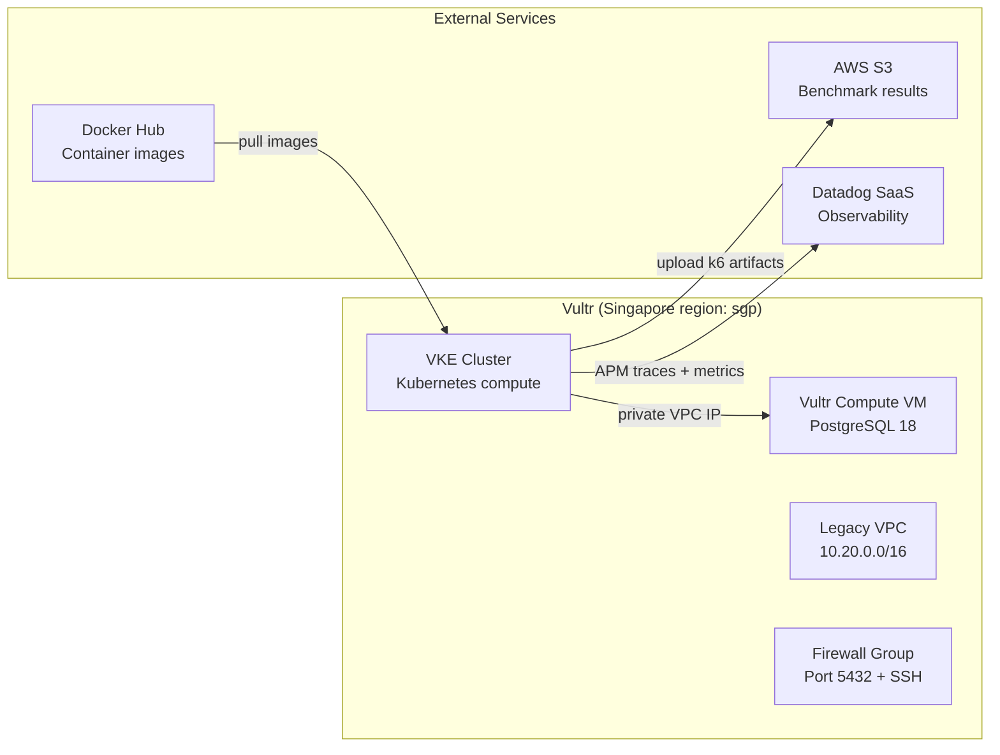
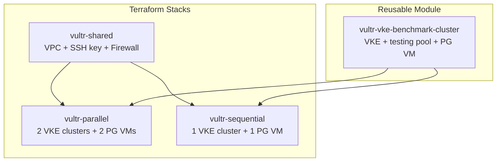
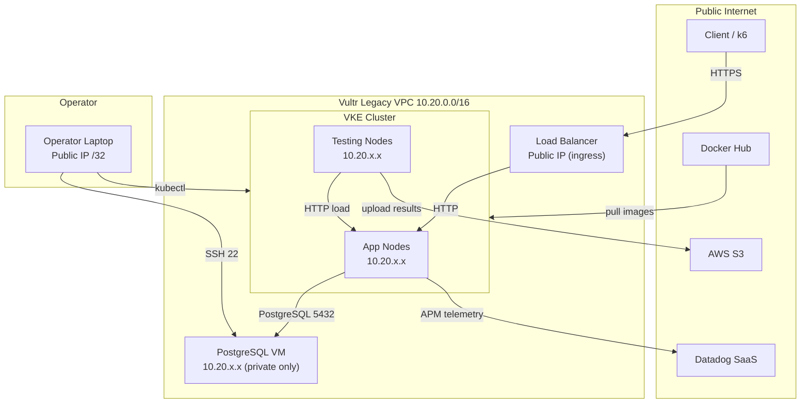
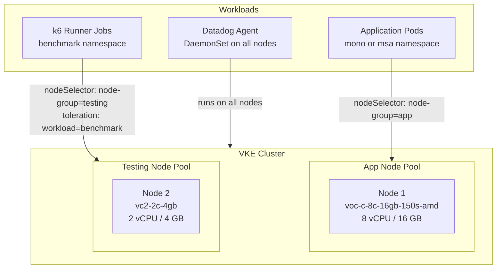
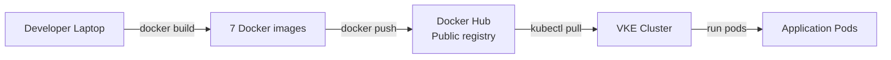
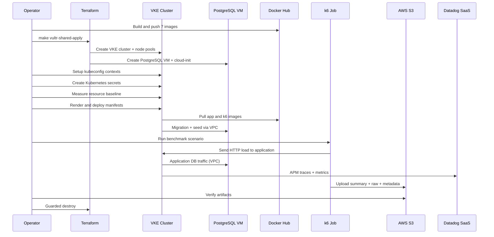
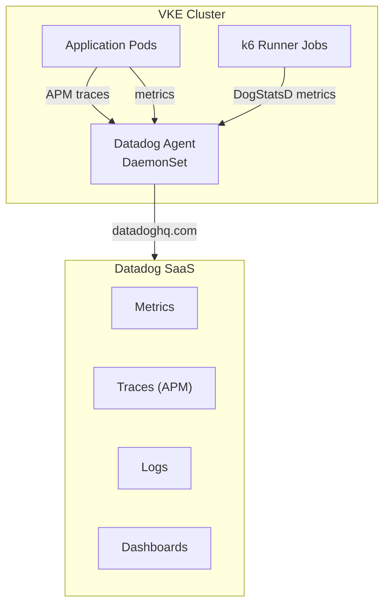
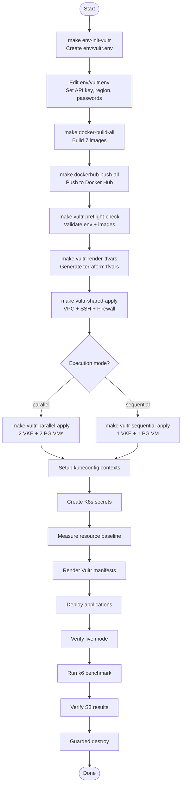
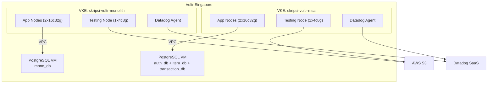
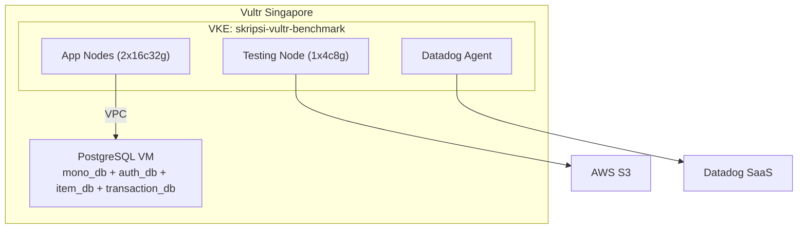

# Vultr Infrastructure Architecture — Complete Reference

## 1. Purpose

This document provides the complete end-to-end architecture reference for the
Vultr-based benchmark infrastructure used in this thesis. It is written as the
primary infrastructure documentation for the skripsi (thesis) report, replacing
the previously planned AWS EKS + Amazon RDS architecture.

The thesis compares monolithic and microservices architectures in a cloud-native
environment. The infrastructure must provide equivalent compute, networking,
database, and observability resources for both architectural variants while
remaining simple enough for thesis reproducibility.

---

## 2. Why Vultr Instead of AWS

The original infrastructure plan used Amazon EKS for Kubernetes and Amazon RDS
for PostgreSQL. The active implementation uses Vultr instead, for these reasons:

| Factor | AWS (Original Plan) | Vultr (Active Implementation) |
|---|---|---|
| Kubernetes | Amazon EKS | Vultr Kubernetes Engine (VKE) |
| Database | Amazon RDS PostgreSQL 18 | PostgreSQL 18 on Vultr Compute VM |
| Container Registry | Amazon ECR | Docker Hub Public |
| Cost model | EKS control plane fee + EC2 + RDS | VKE included + Compute instances |
| Complexity | VPC, subnets, NAT, security groups, IAM | Legacy VPC, firewall group, SSH key |
| Dedicated CPU | c8i.2xlarge (expensive) | voc-c-8c-16gb-150s-amd (single app node) |
| Provisioning | Terraform AWS provider | Terraform Vultr provider |

The Vultr path provides sufficient CPU capacity for high-throughput benchmark
workloads at lower cost and operational complexity, while keeping the
application code, benchmark scripts, and external API contract identical.

---

## 3. Infrastructure Component Mapping

This table shows what Vultr provides and what remains with external services:

| Component | Provider | Service/Resource |
|---|---|---|
| Kubernetes cluster | **Vultr** | Vultr Kubernetes Engine (VKE) |
| Application nodes | **Vultr** | VKE node pool (voc-c-8c-16gb-150s-amd) |
| Testing nodes (k6) | **Vultr** | VKE node pool (vc2-2c-4gb) |
| PostgreSQL database | **Vultr** | Vultr Compute VM (self-managed) |
| Private networking | **Vultr** | Legacy VPC Network (10.20.0.0/16) |
| Firewall rules | **Vultr** | Vultr Firewall Group |
| SSH access | **Vultr** | Vultr SSH Keys |
| Container images | **Docker Hub** | Public images (7 deployables) |
| Benchmark artifacts | **AWS S3** | summary.json, raw.json.gz, metadata |
| Observability | **Datadog SaaS** | Metrics, traces, logs, HPA behavior |
| IaC provisioning | **Terraform** | vultr/vultr provider ~> 2.31 |



---

## 4. Cloud Architecture Overview

### 4.1 Design Summary

```text
Provider                : Vultr
Region                  : sgp (Singapore)
Kubernetes              : Vultr Kubernetes Engine (VKE) v1.33.0+1
Application nodes       : 1 x voc-c-8c-16gb-150s-amd per active architecture
Testing nodes           : 1 x vc2-2c-4gb per active architecture
Database                : PostgreSQL 18 on Vultr Compute VM (self-managed)
Container registry      : Docker Hub public
Benchmark result store  : AWS S3
Observability           : Datadog SaaS
Provisioning            : Terraform (vultr/vultr ~> 2.31)
Deployment              : kubectl + rendered Kubernetes manifests
Networking              : Legacy Vultr VPC (not VPC 2.0)
```

### 4.2 Compute Specifications

| Resource | Plan | vCPU | RAM | Storage | Type |
|---|---|---|---|---|---|
| App node | voc-c-8c-16gb-150s-amd | 8 | 16 GB | 150 GB NVMe | Dedicated CPU |
| Testing node | vc2-2c-4gb | 2 | 4 GB | — | Shared CPU |
| PostgreSQL VM | voc-c-2c-4gb-50s-amd | 2 | 4 GB | 50 GB NVMe | Dedicated CPU |

Per-architecture nominal capacity:

```text
App node        : 1 x 8 vCPU = 8 vCPU, 16 GB RAM
Testing node    : 1 x 2 vCPU = 2 vCPU, 4 GB RAM
PostgreSQL VM   : 1 x 2 vCPU = 2 vCPU, 4 GB RAM
```

---

## 5. Terraform Architecture

The Vultr infrastructure is organized into three Terraform stacks with one
reusable module:

### 5.1 Stack Organization



### 5.2 Stack Details

| Stack | Path | Resources Created |
|---|---|---|
| **Shared** | `infra/terraform/vultr-shared/` | Legacy VPC (10.20.0.0/16), SSH key, PostgreSQL firewall group with 3 rules |
| **Parallel** | `infra/terraform/vultr-parallel/` | 2 VKE clusters + 2 PostgreSQL VMs (one per architecture) |
| **Sequential** | `infra/terraform/vultr-sequential/` | 1 VKE cluster + 1 PostgreSQL VM (shared, one arch at a time) |

### 5.3 Reusable Module: vultr-vke-benchmark-cluster

Each cluster instance creates:

- `vultr_kubernetes` — VKE cluster with app node pool (labeled `node-group=app`)
- `vultr_kubernetes_node_pools` — Testing node pool (labeled `node-group=testing`, tainted `workload=benchmark:NoSchedule`)
- `vultr_instance` — PostgreSQL Compute VM with cloud-init provisioning

### 5.4 Shared Stack Resources

```text
infra/terraform/vultr-shared/
├── main.tf           # Legacy VPC, SSH key, firewall group
├── variables.tf      # VULTR_VPC_CIDR, OPERATOR_CIDRS, SSH public key
├── outputs.tf        # network_id, ssh_key_ids, firewall_group_id
└── versions.tf       # vultr/vultr ~> 2.31, terraform >= 1.6
```

Resources:

- **Legacy VPC Network**: CIDR 10.20.0.0/16, used by all VKE clusters and PostgreSQL VMs
- **SSH Key**: Operator's public key for PostgreSQL VM access
- **Firewall Group**: PostgreSQL access rules:
  - Rule 1: VPC CIDR → port 5432 (PostgreSQL)
  - Rule 2: Operator CIDR → port 22 (SSH)
  - Rule 3: VPC CIDR → port 22 (SSH from VKE nodes)

### 5.5 Parallel Stack Resources

```text
infra/terraform/vultr-parallel/
├── main.tf           # 2x vultr-vke-benchmark-cluster module instances
├── variables.tf      # Cluster names, node plans, region
├── outputs.tf        # Kubeconfig, PostgreSQL IPs for both clusters
└── versions.tf
```

Creates:

```text
VKE: skripsi-vultr-monolith
  ├── app-nodes: 1 x voc-c-8c-16gb-150s-amd
  ├── testing-nodes: 1 x vc2-2c-4gb
  └── PostgreSQL VM: mono_db

VKE: skripsi-vultr-msa
  ├── app-nodes: 1 x voc-c-8c-16gb-150s-amd
  ├── testing-nodes: 1 x vc2-2c-4gb
  └── PostgreSQL VM: auth_db, item_db, transaction_db
```

### 5.6 Sequential Stack Resources

```text
infra/terraform/vultr-sequential/
├── main.tf           # 1x vultr-vke-benchmark-cluster module instance
├── variables.tf
├── outputs.tf
└── versions.tf
```

Creates:

```text
VKE: skripsi-vultr-benchmark
  ├── app-nodes: 1 x voc-c-8c-16gb-150s-amd
  ├── testing-nodes: 1 x vc2-2c-4gb
  └── PostgreSQL VM: mono_db, auth_db, item_db, transaction_db
```

---

## 6. Network Architecture

### 6.1 Network Model

The Vultr implementation uses a **legacy Vultr VPC network** (not VPC 2.0)
because VKE support in the Terraform provider expects that model.

```text
Legacy Vultr VPC: 10.20.0.0/16
├── VKE cluster nodes     : assigned from VPC pool
├── PostgreSQL VM         : static private VPC IP
└── All inter-service traffic uses VPC private IPs
```

### 6.2 Network Topology



### 6.3 Network Rules

| Traffic | Source | Destination | Port | Protocol |
|---|---|---|---|---|
| External ingress | Internet | Load Balancer | 443/80 | HTTPS/HTTP |
| Application → DB | VKE app nodes | PostgreSQL VM | 5432 | TCP (VPC) |
| k6 → Application | VKE testing nodes | VKE app nodes | via K8s service | HTTP |
| k6 → S3 | VKE testing nodes | AWS S3 | 443 | HTTPS (public) |
| SSH | Operator CIDR | PostgreSQL VM | 22 | TCP |
| Image pull | VKE nodes | Docker Hub | 443 | HTTPS (public) |
| Datadog | VKE nodes | Datadog SaaS | 443 | HTTPS (public) |

Key security rules:

- PostgreSQL is **not exposed publicly** — accessible only via VPC private IP
- SSH to PostgreSQL VM is restricted to `OPERATOR_CIDRS` (no `0.0.0.0/0`)
- Firewall group blocks all other inbound traffic to PostgreSQL VM

---

## 7. Database Architecture

### 7.1 PostgreSQL on Vultr Compute VM

Unlike the original AWS RDS plan, PostgreSQL runs on a **self-managed Vultr
Compute VM**. This keeps the benchmark portable and avoids introducing a managed
database feature.

```text
Vultr Compute VM
├── OS: Ubuntu (cloud-init provisioned)
├── PostgreSQL 18 (official apt repository)
├── listen_addresses = '*'
├── pg_hba.conf: VPC CIDR access with SCRAM-SHA-256
├── postgres_admin role (SUPERUSER)
└── UFW: ports 22 (SSH) and 5432 (PostgreSQL)
```

### 7.2 Cloud-Init Provisioning

The PostgreSQL VM is provisioned automatically via cloud-init template:

```text
infra/terraform/modules/vultr-vke-benchmark-cluster/templates/postgres-cloud-init.yaml.tftpl
```

Cloud-init performs:

1. Install PostgreSQL 18 from official apt repository
2. Configure `postgresql.conf` for remote access
3. Configure `pg_hba.conf` for VPC CIDR with SCRAM-SHA-256
4. Create `postgres_admin` superuser role
5. Open firewall ports (22, 5432)
6. Set generated `POSTGRES_PASSWORD`

### 7.3 Database Layout — Parallel Mode

```text
Monolith PostgreSQL VM (10.20.x.x)
└── mono_db
    ├── users
    ├── items
    ├── transactions
    └── transaction_items

MSA PostgreSQL VM (10.20.x.x)
├── auth_db
│   └── users
├── item_db
│   └── items
└── transaction_db
    ├── transactions
    └── transaction_items
```

### 7.4 Database Layout — Sequential Mode

```text
Shared PostgreSQL VM (10.20.x.x)
├── mono_db
│   ├── users
│   ├── items
│   ├── transactions
│   └── transaction_items
├── auth_db
│   └── users
├── item_db
│   └── items
└── transaction_db
    ├── transactions
    └── transaction_items
```

### 7.5 Application → Database Connection

The application connects to PostgreSQL using the **private VPC IP** from
Terraform output, injected via Kubernetes secrets:

```text
Terraform output: postgres_private_ip = "10.20.x.x"
                ↓
Kubernetes secret: DATABASE_URL = "postgres://postgres_admin:<password>@10.20.x.x:5432/mono_db"
                ↓
Application (pgx): connects via VPC private IP
```

### 7.6 AWS RDS vs Vultr Compute VM — Thesis Context

| Aspect | AWS RDS (Original) | Vultr Compute VM (Active) |
|---|---|---|
| Management | Fully managed by AWS | Self-managed (cloud-init) |
| Engine | PostgreSQL 18 | PostgreSQL 18 |
| High availability | Multi-AZ option | Single VM (no HA) |
| Backups | Automated by RDS | Not configured (benchmark only) |
| Monitoring | CloudWatch + Datadog | Datadog only |
| Scaling | RDS instance resize | VM plan change |
| Networking | RDS security group | Vultr firewall group |
| Connection | Private RDS endpoint | Private VPC IP |
| Schema migration | Goose via K8s Job | Goose via K8s Job (same) |

For thesis purposes, the database engine and schema are identical. The
difference is only the hosting platform. The benchmark does not evaluate
managed-vs-unmanaged database performance.

---

## 8. Kubernetes Architecture

### 8.1 VKE Cluster Design

Each VKE cluster contains two node pools:

```text
VKE Cluster
├── App Node Pool (node-group=app)
│   ├── 1 x voc-c-8c-16gb-150s-amd
│   ├── Label: node-group=app
│   └── Runs: application pods (mono or msa namespace)
│
└── Testing Node Pool (node-group=testing)
    ├── 1 x vc2-2c-4gb
    ├── Label: node-group=testing
    ├── Taint: workload=benchmark:NoSchedule
    └── Runs: k6 runner jobs (benchmark namespace)
```

### 8.2 Namespace Layout — Parallel Mode

```text
VKE: skripsi-vultr-monolith
├── namespace: mono
│   └── monolith deployment (1-N pods)
├── namespace: benchmark
│   ├── k6 runner job
│   ├── migration job
│   └── seed job
└── namespace: datadog
    └── Datadog Agent DaemonSet

VKE: skripsi-vultr-msa
├── namespace: msa
│   ├── api-gateway deployment
│   ├── auth-service deployment
│   ├── item-service deployment
│   └── transaction-service deployment
├── namespace: benchmark
│   ├── k6 runner job
│   ├── migration jobs (3x)
│   └── seed job
└── namespace: datadog
    └── Datadog Agent DaemonSet
```

### 8.3 Namespace Layout — Sequential Mode

```text
VKE: skripsi-vultr-benchmark
├── namespace: mono
│   └── monolith deployment (active during monolith phase)
├── namespace: msa
│   └── microservices (active during MSA phase)
├── namespace: benchmark
│   ├── k6 runner job
│   ├── migration jobs
│   └── seed job
└── namespace: datadog
    └── Datadog Agent DaemonSet
```

### 8.4 Kubernetes Contexts

| Mode | Context | Namespace | Workload |
|---|---|---|---|
| Parallel | `monolith` | `mono` | Monolith app, migrations, seed |
| Parallel | `monolith` | `benchmark` | Monolith k6 jobs |
| Parallel | `msa` | `msa` | API Gateway, auth, item, transaction services |
| Parallel | `msa` | `benchmark` | MSA k6 jobs |
| Sequential | `benchmark` | `mono` | Monolith phase |
| Sequential | `benchmark` | `msa` | Microservices phase |
| Sequential | `benchmark` | `benchmark` | k6 jobs |

### 8.5 Node Placement



---

## 9. Container Image Strategy

### 9.1 Docker Hub (Replaces Amazon ECR)

The Vultr path uses Docker Hub public images instead of Amazon ECR.

| Image | Purpose |
|---|---|
| `DOCKERHUB_NAMESPACE/monolith` | Monolith application |
| `DOCKERHUB_NAMESPACE/api-gateway` | API Gateway |
| `DOCKERHUB_NAMESPACE/auth-service` | Auth Service |
| `DOCKERHUB_NAMESPACE/item-service` | Item Service |
| `DOCKERHUB_NAMESPACE/transaction-service` | Transaction Service |
| `DOCKERHUB_NAMESPACE/seed-runner` | Database seeder |
| `DOCKERHUB_NAMESPACE/k6-runner` | k6 load testing |

### 9.2 Image Flow



### 9.3 CI/CD Pipeline

GitHub Actions automatically builds and pushes all 7 images on every merge to
`main`, using the Git short commit SHA as the image tag.

```text
GitHub push to main
    → GitHub Actions workflow
    → docker build (7 images)
    → docker push to Docker Hub
    → tag: git-short-sha
```

---

## 10. Resource Fairness Model

### 10.1 Fairness Rule

```text
monolith application ceiling == microservices namespace ceiling
```

Both architectures must use equivalent total resource budgets.

### 10.2 Vultr Measurement-Derived Quotas

Unlike AWS where resource ceilings are hardcoded, Vultr derives quotas from
**live measured** app-node allocatable capacity:

```text
VULTR_APP_CPU_QUOTA    = total app-node allocatable CPU - safety CPU margin
VULTR_APP_MEMORY_QUOTA = total app-node allocatable memory - safety memory margin
```

Measurement is performed by:

```bash
VULTR_CONTEXT=monolith make vultr-measure-resource-baseline
```

Output example:

```text
VULTR_RESOURCE_BASELINE_PROVIDER=vultr
VULTR_REGION=sgp
VULTR_APP_NODE_PLAN=voc-c-8c-16gb-150s-amd
VULTR_APP_CPU_QUOTA=7800m
VULTR_APP_MEMORY_QUOTA=15360Mi
VULTR_APP_NODE_COUNT=1
VULTR_APP_ALLOCATABLE_CPU=7800m
VULTR_APP_ALLOCATABLE_MEMORY=15800Mi
VULTR_RESOURCE_SAFETY_CPU=0m
VULTR_RESOURCE_SAFETY_MEMORY=110Mi
```

### 10.3 Why Measurement-Derived?

Nominal plan capacity (e.g., 8 vCPU) is not the same as Kubernetes schedulable
capacity. The kubelet, system processes, and Kubernetes components consume some
CPU and memory. Using nominal values would cause ResourceQuota to exceed actual
capacity, leading to pod scheduling failures.

### 10.4 Resource Quota Application

The measured quota is applied equally to both architectures via manifest
rendering:

```text
env/vultr-resource-baseline.env
    ↓
scripts/render-vultr-manifests.sh
    ↓
ResourceQuota in mono namespace:  CPU=7800m, Memory=15360Mi
ResourceQuota in msa namespace:   CPU=7800m, Memory=15360Mi
```

---

## 11. Benchmark Data Flow

### 11.1 End-to-End Data Flow



### 11.2 Benchmark Artifact Storage

k6 uploads results to AWS S3 using dedicated credentials:

```text
S3 prefix: s3://{bucket}/experiments/{run_id}/{architecture}/{scenario}/{target_rps}rps/{attempt}/
```

Required files per attempt:

- `summary.json` — k6 summary statistics
- `raw.json.gz` — raw k6 metrics
- `stdout.log` — k6 console output
- `metadata.json` — benchmark metadata (provider, region, cluster, etc.)
- `k6-options.json` — k6 configuration used
- `thresholds.json` — threshold results
- `datadog-time-window.json` — Datadog query window (when enabled)

### 11.3 S3 Upload Credentials

The Vultr k6 runner uses AWS credentials from:

1. **Primary**: Terraform `aws-s3-writer` stack output (scoped IAM user)
2. **Fallback**: Manual `AWS_ACCESS_KEY_ID` / `AWS_SECRET_ACCESS_KEY` in env

The writer policy is limited to `s3://{bucket}/experiments/*`.

---

## 12. Observability Architecture

### 12.1 Datadog Integration



### 12.2 Collected Metrics

| Metric Category | Source | Examples |
|---|---|---|
| Application latency | Datadog AM | p50, p95, p99 latency per endpoint |
| Throughput | Datadog APM | Requests per second |
| Error rate | Datadog APM | HTTP 5xx rate |
| CPU usage | Datadog Agent | Per-pod, per-node CPU |
| Memory usage | Datadog Agent | Per-pod, per-node memory |
| Replica count | Datadog Agent | HPA replica count |
| gRPC latency | Datadog APM | Inter-service call duration |
| k6 metrics | DogStatsD | Custom k6 counters/gauges |

### 12.3 Expected Trace Shapes

**Login (Benchmark 1):**

```text
HTTP → api-gateway → auth-service → PostgreSQL
```

**Create Transaction (Benchmark 2):**

```text
HTTP → api-gateway → transaction-service → item-service → PostgreSQL
                                                ↓
                                          transaction-service → PostgreSQL
```

**Enriched Transactions (Benchmark 3):**

```text
HTTP → api-gateway → transaction-service → transaction_db
         ↓
         api-gateway (fan-out, parallel)
         ├── auth-service → auth_db
         └── item-service → item_db
```

---

## 13. Deployment Flow

### 13.1 Complete Deployment Sequence



### 13.2 Key Make Targets

| Phase | Target | Purpose |
|---|---|---|
| Init | `env-init-vultr` | Create env template |
| Build | `docker-build-all` | Build all 7 images |
| Push | `dockerhub-push-all` | Push to Docker Hub |
| Validate | `vultr-preflight-check` | Validate everything |
| Terraform | `vultr-render-tfvars` | Generate tfvars |
| Terraform | `vultr-shared-apply` | Apply shared infra |
| Terraform | `vultr-parallel-apply` | Apply parallel stack |
| K8s | `vultr-setup-contexts-parallel` | Write kubeconfig |
| K8s | `vultr-create-secrets` | Create K8s secrets |
| K8s | `vultr-measure-resource-baseline` | Measure node capacity |
| K8s | `vultr-render-manifests` | Patch manifests for Vultr |
| Deploy | `vultr-deploy-all` | Deploy applications |
| Verify | `vultr-verify-live-mode` | Verify fixed/HPA mode |
| Benchmark | `run-benchmark-suite-vultr` | Run full benchmark suite |
| Destroy | `vultr-parallel-destroy-confirmed` | Destroy (S3 verified) |

---

## 14. Parallel vs Sequential Topology

### 14.1 Parallel Mode (Preferred)



**Advantages:**

- Same wall-clock benchmark window for both architectures
- Cleanest Datadog time-series comparison
- Full resource isolation between architectures

**Requirements:**

- Sufficient Vultr instance quota (2 app nodes + 2 testing nodes + 2 PG VMs)
- Higher cost

### 14.2 Sequential Mode (Fallback)



**Advantages:**

- Lower cost (one cluster instead of two)
- Lower quota requirements

**Limitations:**

- Different wall-clock windows
- Must use recorded Datadog time windows for comparison
- Requires `ARCHITECTURE_SWITCH_DELAY` between phases

---

## 15. Scaling Modes

### 15.1 Fixed Mode

Application runs with fixed replica count, no autoscaling.

```text
Monolith: 1 pod (fixed)
Microservices: api-gateway=1, auth-service=1, item-service=1, transaction-service=1
```

### 15.2 HPA Mode

Application uses Kubernetes Horizontal Pod Autoscaler.

```text
Monolith: 1-4 pods, HPA target CPU 70%
Microservices:
  api-gateway: 1-5 pods
  auth-service: 1-2 pods
  item-service: 1-5 pods
  transaction-service: 1-2 pods
  HPA target CPU: 70%
```

### 15.3 Mode Switching

Switching between fixed and HPA requires **redeployment**:

```bash
# Deploy fixed mode
SCALING_MODE=fixed make vultr-deploy-all IMAGE_TAG=<tag>

# Switch to HPA (requires redeploy)
SCALING_MODE=hpa make vultr-deploy-all IMAGE_TAG=<tag>
```

---

## 16. Scripts Reference

### 16.1 Dedicated Vultr Scripts

| Script | Purpose |
|---|---|
| `scripts/env-init-vultr.sh` | Create/refresh `env/vultr.env` |
| `scripts/terraform-vultr.sh` | Terraform wrapper for all Vultr stacks |
| `scripts/render-vultr-tfvars.sh` | Generate `terraform.tfvars` from env |
| `scripts/render-vultr-manifests.sh` | Patch K8s manifests for Vultr |
| `scripts/vultr-preflight-check.sh` | Validate env, credentials, images |
| `scripts/setup-vultr-contexts.sh` | Write kubeconfig contexts |
| `scripts/create-vultr-secrets-monolith.sh` | Create monolith K8s secrets |
| `scripts/create-vultr-secrets-microservices.sh` | Create MSA K8s secrets |
| `scripts/create-vultr-secrets-sequential.sh` | Create secrets for sequential mode |
| `scripts/measure-vultr-resource-baseline.sh` | Measure live node capacity |
| `scripts/lib/vultr-s3-credentials.sh` | Load S3 credentials |
| `scripts/lib/cloud-provider.sh` | Multi-provider abstraction |

### 16.2 Manifest Rendering

The Vultr manifest renderer (`scripts/render-vultr-manifests.sh`) patches
EKS-based base manifests for Vultr:

1. Replace ECR image references → Docker Hub references
2. Apply measured ResourceQuota CPU/memory ceilings
3. Set benchmark metadata (provider=vultr, region, cluster)
4. Remove stale AWS/ECR metadata annotations
5. Configure Datadog version tags

---

## 17. Cost Model

### 17.1 Vultr Pricing (Approximate)

| Resource | Plan | Monthly Cost (approx) |
|---|---|---|
| App node (dedicated) | voc-c-8c-16gb-150s-amd | provider-listed regional price |
| Testing node (shared) | vc2-2c-4gb | provider-listed regional price |
| PostgreSQL VM (dedicated) | voc-c-2c-4gb-50s-amd | provider-listed regional price |
| VKE control plane | — | Included |
| VPC | — | Included |
| Firewall | — | Included |

### 17.2 Parallel Mode Cost (per hour)

```text
2 clusters x (1 app node + 1 testing node + 1 PG VM)
= 2 app nodes + 2 testing nodes + 2 PG VMs
Use the current Vultr pricing page for the selected region before applying.
```

### 17.3 Cost Guardrails

- Destroy infrastructure immediately after S3 verification
- Use sequential mode for smoke tests and iteration
- Use parallel mode only for final thesis runs
- Do not keep both parallel and sequential stacks active simultaneously

---

## 18. Guardrails and Safety

### 18.1 Pre-Deployment Checks

The `vultr-preflight-check` validates:

- `env/vultr.env` exists and has no placeholders
- `VULTR_API_KEY` is set
- `DOCKERHUB_NAMESPACE` is set
- S3 credentials are available
- Docker Hub images are accessible for the selected tag
- Resource baseline measurement exists

### 18.2 Destroy Safety

Destroy requires explicit S3 verification:

```bash
S3_BENCHMARK_DATA_VERIFIED=true make vultr-parallel-destroy-confirmed
```

Without `S3_BENCHMARK_DATA_VERIFIED=true`, destroy commands are blocked.

### 18.3 Ordered Destroy

```text
1. Destroy experiment stack (parallel or sequential)
2. Verify no remaining resources in Vultr dashboard
3. Destroy shared stack (VPC, SSH, firewall)
```

---

## 19. Benchmark Metadata

Every Vultr benchmark run must record:

```json
{
  "provider": "vultr",
  "region": "sgp",
  "execution_mode": "parallel",
  "terraform_stack": "vultr-parallel",
  "cluster": "skripsi-vultr-monolith",
  "app_node_pool": "app-nodes",
  "testing_node_pool": "testing-nodes",
  "postgres_version": 18,
  "resource_profile": "vultr-measurement-derived",
  "app_resource_quota": "7800m CPU / 15360Mi memory",
  "image_tag": "thesis-vultr-20260602",
  "scaling_mode": "fixed",
  "kubernetes_version": "v1.33.0+1"
}
```

---

## 20. Migration from AWS Documentation

For thesis documents that originally referenced AWS, use this mapping:

| Original (AWS) | Replacement (Vultr) |
|---|---|
| Amazon EKS | Vultr Kubernetes Engine (VKE) |
| Amazon RDS PostgreSQL 18 | PostgreSQL 18 on Vultr Compute VM |
| Amazon ECR | Docker Hub Public |
| AWS VPC | Vultr Legacy VPC Network |
| AWS Security Groups | Vultr Firewall Group |
| AWS Key Pairs | Vultr SSH Keys |
| EKS Managed Node Groups | VKE Node Pools |
| c8i.2xlarge-class app capacity | voc-c-8c-16gb-150s-amd |
| c8i-flex.large-class testing capacity | vc2-2c-4gb |
| EKS Pod Identity | Not applicable (direct credentials) |
| AWS region ap-southeast-1 | Vultr region sgp |
| Terraform AWS provider | Terraform Vultr provider |

**What stays the same:**

- Application code (Go) — zero changes
- REST API (OpenAPI) — identical
- gRPC contracts — identical
- Database schema — identical (PostgreSQL 18)
- Seed data — logically equivalent
- k6 scripts — identical
- HPA behavior — identical (70% CPU target)
- Datadog integration — identical
- AWS S3 for benchmark artifacts — same bucket
- Terraform IaC approach — same pattern, different provider

---

## 21. Summary

The Vultr infrastructure provides a cost-effective, reproducible cloud-native
environment for the thesis benchmark. The key architectural decisions are:

```text
Kubernetes provider   : Vultr Kubernetes Engine (VKE)
Database hosting      : Self-managed PostgreSQL 18 on Vultr Compute VM
Networking            : Legacy Vultr VPC with private IP database access
Container registry    : Docker Hub public images
Benchmark storage     : AWS S3 (unchanged)
Observability         : Datadog SaaS (unchanged)
Resource fairness     : Measurement-derived quotas from live node capacity
Execution modes       : Parallel (preferred) and Sequential (fallback)
Scaling modes         : Fixed replicas and HPA (70% CPU target)
```

The infrastructure is designed to be:

- **Fair**: both architectures use equivalent resource ceilings
- **Reproducible**: all provisioning is automated via Terraform and scripts
- **Observable**: Datadog captures internal behavior; k6 captures client-perceived performance
- **Cost-controlled**: guarded destroy, sequential fallback, short-lived infrastructure
- **Thesis-ready**: metadata, S3 artifacts, and Datadog windows support final analysis
